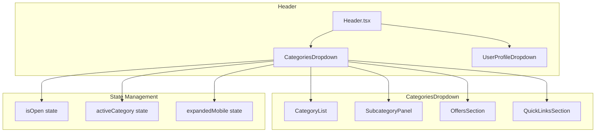
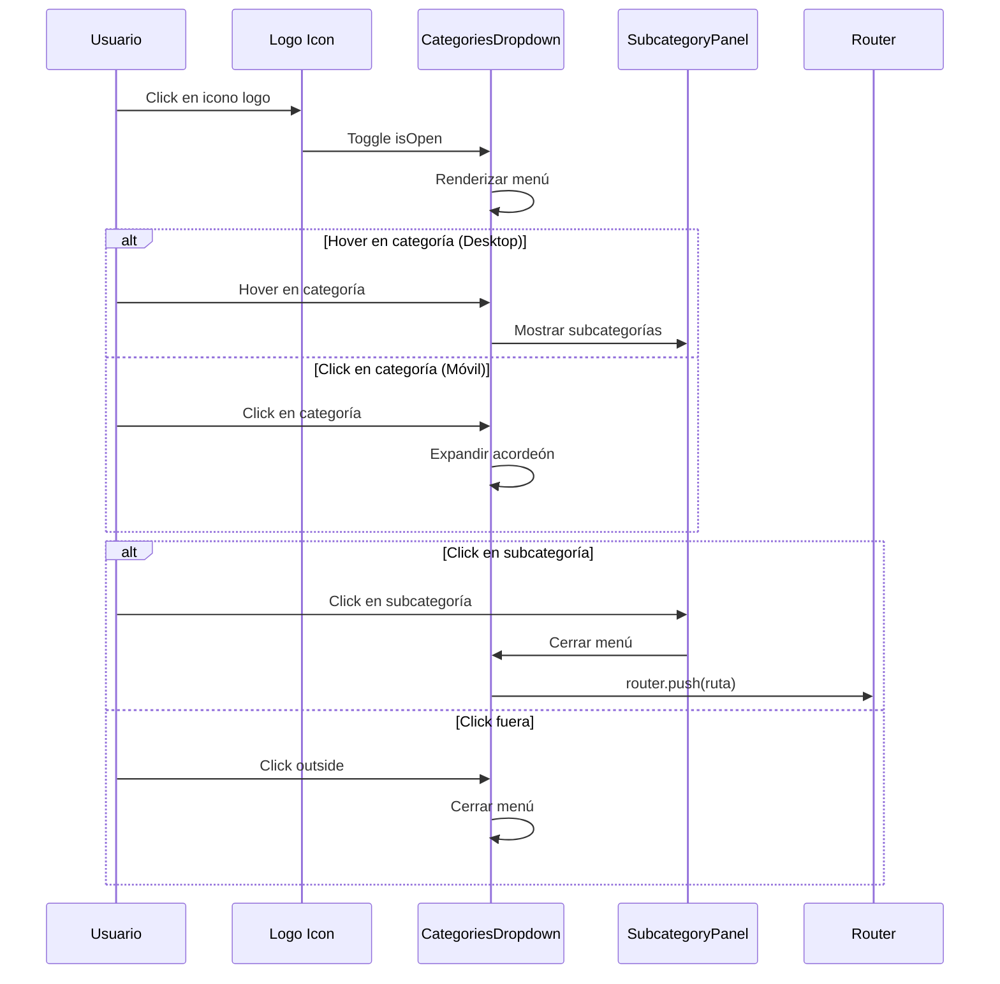

# Documento de Diseño - Menú Desplegable de Categorías y Ofertas

## Overview

Este documento describe el diseño técnico para implementar un menú desplegable de categorías y ofertas en el Header de TechNovaStore. El componente se inspira en PCComponentes, con un panel lateral que muestra categorías principales y subcategorías expandibles.

El componente `CategoriesDropdown` se activará al hacer clic en el icono del logo (SVG con 3 líneas), mientras que el texto "TechNovaStore" seguirá redirigiendo a la página de inicio.

## Architecture

### Diagrama de Componentes



### Flujo de Interacción



## Components and Interfaces

### 1. CategoriesDropdown (Componente Principal)

```typescript
// Ubicación: domains/platform/frontend/src/shared/components/layout/CategoriesDropdown.tsx

interface CategoriesDropdownProps {
  isOpen: boolean;
  onClose: () => void;
  onToggle: () => void;
}

interface DropdownState {
  activeCategory: string | null;  // Categoría con hover/activa
  expandedCategories: Set<string>; // Categorías expandidas en móvil
}
```

### 2. Configuración de Categorías

```typescript
// Configuración de categorías para TechNovaStore

interface Category {
  id: string;
  name: string;
  icon: string; // Nombre del icono de Lucide
  href: string;
  subcategories?: Subcategory[];
}

interface Subcategory {
  id: string;
  name: string;
  href: string;
}

const CATEGORIES: Category[] = [
  {
    id: 'ordenadores',
    name: 'Ordenadores',
    icon: 'Monitor',
    href: '/categorias/ordenadores',
    subcategories: [
      { id: 'portatiles', name: 'Portátiles', href: '/categorias/ordenadores/portatiles' },
      { id: 'sobremesa', name: 'Sobremesa', href: '/categorias/ordenadores/sobremesa' },
      { id: 'workstations', name: 'Workstations', href: '/categorias/ordenadores/workstations' },
      { id: 'all-in-one', name: 'All-in-One', href: '/categorias/ordenadores/all-in-one' },
    ]
  },
  {
    id: 'componentes',
    name: 'Componentes',
    icon: 'Cpu',
    href: '/categorias/componentes',
    subcategories: [
      { id: 'procesadores', name: 'Procesadores', href: '/categorias/componentes/procesadores' },
      { id: 'tarjetas-graficas', name: 'Tarjetas Gráficas', href: '/categorias/componentes/tarjetas-graficas' },
      { id: 'memoria-ram', name: 'Memoria RAM', href: '/categorias/componentes/memoria-ram' },
      { id: 'almacenamiento', name: 'Almacenamiento', href: '/categorias/componentes/almacenamiento' },
      { id: 'placas-base', name: 'Placas Base', href: '/categorias/componentes/placas-base' },
      { id: 'fuentes-alimentacion', name: 'Fuentes de Alimentación', href: '/categorias/componentes/fuentes-alimentacion' },
      { id: 'cajas', name: 'Cajas/Torres', href: '/categorias/componentes/cajas' },
      { id: 'refrigeracion', name: 'Refrigeración', href: '/categorias/componentes/refrigeracion' },
    ]
  },
  {
    id: 'perifericos',
    name: 'Periféricos',
    icon: 'Keyboard',
    href: '/categorias/perifericos',
    subcategories: [
      { id: 'teclados', name: 'Teclados', href: '/categorias/perifericos/teclados' },
      { id: 'ratones', name: 'Ratones', href: '/categorias/perifericos/ratones' },
      { id: 'monitores', name: 'Monitores', href: '/categorias/perifericos/monitores' },
      { id: 'auriculares', name: 'Auriculares', href: '/categorias/perifericos/auriculares' },
      { id: 'webcams', name: 'Webcams', href: '/categorias/perifericos/webcams' },
      { id: 'altavoces', name: 'Altavoces', href: '/categorias/perifericos/altavoces' },
    ]
  },
  {
    id: 'smartphones-tablets',
    name: 'Smartphones y Tablets',
    icon: 'Smartphone',
    href: '/categorias/smartphones-tablets',
    subcategories: [
      { id: 'smartphones', name: 'Smartphones', href: '/categorias/smartphones-tablets/smartphones' },
      { id: 'tablets', name: 'Tablets', href: '/categorias/smartphones-tablets/tablets' },
      { id: 'accesorios-movil', name: 'Accesorios Móvil', href: '/categorias/smartphones-tablets/accesorios' },
      { id: 'smartwatches', name: 'Smartwatches', href: '/categorias/smartphones-tablets/smartwatches' },
    ]
  },
  {
    id: 'gaming',
    name: 'Gaming',
    icon: 'Gamepad2',
    href: '/categorias/gaming',
    subcategories: [
      { id: 'consolas', name: 'Consolas', href: '/categorias/gaming/consolas' },
      { id: 'videojuegos', name: 'Videojuegos', href: '/categorias/gaming/videojuegos' },
      { id: 'accesorios-gaming', name: 'Accesorios Gaming', href: '/categorias/gaming/accesorios' },
      { id: 'sillas-gaming', name: 'Sillas Gaming', href: '/categorias/gaming/sillas' },
      { id: 'streaming', name: 'Streaming', href: '/categorias/gaming/streaming' },
    ]
  },
  {
    id: 'redes',
    name: 'Redes y Conectividad',
    icon: 'Wifi',
    href: '/categorias/redes',
    subcategories: [
      { id: 'routers', name: 'Routers', href: '/categorias/redes/routers' },
      { id: 'switches', name: 'Switches', href: '/categorias/redes/switches' },
      { id: 'adaptadores', name: 'Adaptadores de Red', href: '/categorias/redes/adaptadores' },
      { id: 'cables-red', name: 'Cables de Red', href: '/categorias/redes/cables' },
    ]
  },
  {
    id: 'software',
    name: 'Software y Licencias',
    icon: 'Package',
    href: '/categorias/software',
    subcategories: [
      { id: 'sistemas-operativos', name: 'Sistemas Operativos', href: '/categorias/software/sistemas-operativos' },
      { id: 'antivirus', name: 'Antivirus', href: '/categorias/software/antivirus' },
      { id: 'ofimatica', name: 'Ofimática', href: '/categorias/software/ofimatica' },
    ]
  },
  {
    id: 'accesorios',
    name: 'Accesorios y Cables',
    icon: 'Cable',
    href: '/categorias/accesorios',
    subcategories: [
      { id: 'cables-hdmi', name: 'Cables HDMI', href: '/categorias/accesorios/cables-hdmi' },
      { id: 'cables-usb', name: 'Cables USB', href: '/categorias/accesorios/cables-usb' },
      { id: 'hubs', name: 'Hubs y Docks', href: '/categorias/accesorios/hubs' },
      { id: 'fundas-mochilas', name: 'Fundas y Mochilas', href: '/categorias/accesorios/fundas-mochilas' },
    ]
  },
];

// Enlaces rápidos / Trending
const QUICK_LINKS = [
  { id: 'ofertas', name: 'Ofertas', href: '/ofertas', icon: 'Tag', highlight: true },
  { id: 'novedades', name: 'Novedades', href: '/novedades', icon: 'Sparkles' },
  { id: 'mas-vendidos', name: 'Más Vendidos', href: '/mas-vendidos', icon: 'TrendingUp' },
  { id: 'reacondicionados', name: 'Reacondicionados', href: '/reacondicionados', icon: 'RefreshCw' },
  { id: 'outlet', name: 'Outlet', href: '/outlet', icon: 'Percent' },
];
```

## Data Models

### Estructura de Navegación

```typescript
// Ya definido en la configuración de categorías arriba
// Las rutas siguen el patrón: /categorias/{categoria}/{subcategoria}
```

## Correctness Properties

*A property is a characteristic or behavior that should hold true across all valid executions of a system-essentially, a formal statement about what the system should do. Properties serve as the bridge between human-readable specifications and machine-verifiable correctness guarantees.*

### Property 1: Toggle del menú
*For any* estado del menú (abierto o cerrado), al hacer clic en el botón de toggle, el estado debe cambiar al opuesto.
**Validates: Requirements 1.1, 1.3**

### Property 2: Todas las categorías se renderizan
*For any* configuración de categorías definida, todas las categorías principales deben renderizarse en el menú.
**Validates: Requirements 3.1**

### Property 3: Categorías con subcategorías muestran indicador
*For any* categoría que tiene subcategorías definidas, debe mostrar un indicador de flecha ">".
**Validates: Requirements 4.1**

### Property 4: Navegación correcta de subcategorías
*For any* subcategoría, al hacer clic debe navegar a la ruta correcta definida en la configuración.
**Validates: Requirements 4.4**

### Property 5: Cierre con Escape
*For any* estado donde el menú está abierto, al presionar Escape el menú debe cerrarse.
**Validates: Requirements 6.2**

### Property 6: Cierre al hacer clic fuera
*For any* estado donde el menú está abierto, al hacer clic fuera del menú debe cerrarse.
**Validates: Requirements 6.1**

### Property 7: Atributos ARIA presentes
*For any* elemento interactivo del menú, debe tener los atributos ARIA apropiados (aria-expanded, role, etc.).
**Validates: Requirements 9.2**

### Property 8: Exclusión mutua de dropdowns
*For any* momento donde CategoriesDropdown está abierto, UserProfileDropdown debe estar cerrado y viceversa.
**Validates: Requirements 11.2, 11.3**

## Error Handling

### Errores de Navegación

| Error | Causa | Manejo |
|-------|-------|--------|
| Ruta no encontrada | Categoría no existe | Redirigir a página de categorías con mensaje |
| Error de red | Sin conexión | Mostrar toast de error |

## Testing Strategy

### Unit Tests
- Verificar que el menú se abre/cierra correctamente
- Verificar que todas las categorías se renderizan
- Verificar que las subcategorías se muestran al hover/clic
- Verificar navegación por teclado

### Property-Based Tests
- Usar fast-check para generar estados aleatorios del menú
- Verificar invariantes de estado (toggle, exclusión mutua)
- Verificar que todas las rutas son válidas

### Integration Tests
- Verificar integración con Header
- Verificar que no interfiere con UserProfileDropdown
- Verificar comportamiento responsivo
