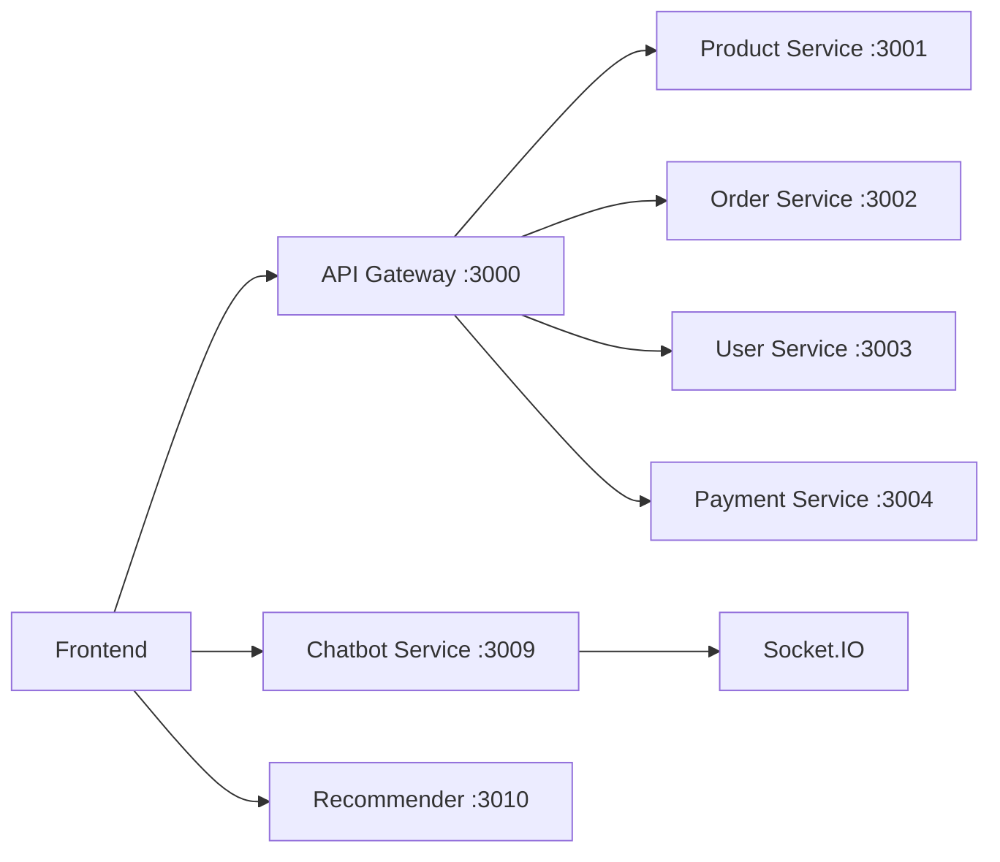

# Documento de Diseño - Rediseño Espectacular del Frontend TechNovaStore

## Overview

Este documento describe el diseño técnico y visual del frontend de TechNovaStore, una plataforma de e-commerce especializada en tecnología e informática. El diseño se enfoca en crear una experiencia moderna, rápida y profesional que integre perfectamente con la arquitectura de microservicios existente.

### Objetivos de Diseño

1. **Rendimiento**: Carga de páginas < 2 segundos, optimización con Next.js SSR/SSG
2. **Experiencia de Usuario**: Diseño intuitivo, mobile-first, accesible (WCAG 2.1 AA)
3. **Modernidad Visual**: Estética limpia, profesional, adecuada para tecnología
4. **Integración Perfecta**: Comunicación fluida con microservicios backend
5. **Escalabilidad**: Arquitectura de componentes reutilizables y mantenibles

## Arquitectura

### Stack Tecnológico

```
Frontend Stack:
├── React 18 (UI Library)
├── Next.js 14 (Framework con SSR/SSG)
├── TypeScript (Type Safety)
├── Tailwind CSS (Styling)
├── React Query (Server State Management)
├── Zustand (Client State Management)
├── Socket.IO Client (Real-time Communication)
├── Axios (HTTP Client)
├── React Hook Form (Form Management)
├── Zod (Schema Validation)
└── Framer Motion (Animations)
```

### Arquitectura de Carpetas

```
frontend/
├── src/
│   ├── app/                    # Next.js App Router
│   │   ├── (auth)/            # Grupo de rutas autenticadas
│   │   ├── (public)/          # Grupo de rutas públicas
│   │   ├── admin/             # Dashboard de administración
│   │   ├── dashboard/         # Dashboard de usuario
│   │   └── layout.tsx         # Layout principal
│   ├── components/            # Componentes reutilizables
│   │   ├── ui/               # Componentes base (Button, Input, etc.)
│   │   ├── layout/           # Componentes de layout (Header, Footer)
│   │   ├── product/          # Componentes de productos
│   │   ├── cart/             # Componentes de carrito
│   │   ├── chat/             # ChatWidget y relacionados
│   │   └── admin/            # Componentes de administración
│   ├── hooks/                # Custom React Hooks
│   ├── lib/                  # Utilidades y configuraciones
│   ├── services/             # Servicios de API
│   ├── store/                # Estado global (Zustand)
│   ├── types/                # Definiciones de TypeScript
│   └── styles/               # Estilos globales
├── public/                   # Assets estáticos
└── next.config.js           # Configuración de Next.js
```


### Patrón de Arquitectura

El frontend sigue una arquitectura de **Feature-Based Components** con separación clara de responsabilidades:

1. **Presentational Components**: Componentes puros de UI sin lógica de negocio
2. **Container Components**: Componentes que manejan lógica y estado
3. **Custom Hooks**: Lógica reutilizable extraída en hooks
4. **Services Layer**: Capa de abstracción para comunicación con APIs
5. **State Management**: Estado global con Zustand, estado del servidor con React Query

### Comunicación con Backend



**Estrategia de Comunicación:**
- **REST API**: Para operaciones CRUD estándar (productos, pedidos, usuarios)
- **Socket.IO**: Para chat en tiempo real con streaming
- **React Query**: Para caché inteligente y sincronización de datos
- **JWT**: Para autenticación y autorización

## Estilo Visual y Branding

### Paleta de Colores

**Tema Claro (Principal):**
```css
/* Colores Primarios */
--primary-50: #eff6ff;    /* Azul muy claro */
--primary-100: #dbeafe;   /* Azul claro */
--primary-500: #3b82f6;   /* Azul principal */
--primary-600: #2563eb;   /* Azul hover */
--primary-700: #1d4ed8;   /* Azul activo */

/* Colores de Acento */
--accent-500: #8b5cf6;    /* Púrpura para CTAs especiales */
--accent-600: #7c3aed;    /* Púrpura hover */

/* Colores Neutros */
--gray-50: #f9fafb;       /* Fondo claro */
--gray-100: #f3f4f6;      /* Fondo alternativo */
--gray-200: #e5e7eb;      /* Bordes */
--gray-500: #6b7280;      /* Texto secundario */
--gray-900: #111827;      /* Texto principal */

/* Colores Semánticos */
--success: #10b981;       /* Verde - éxito */
--warning: #f59e0b;       /* Amarillo - advertencia */
--error: #ef4444;         /* Rojo - error */
--info: #3b82f6;          /* Azul - información */
```

**Tema Oscuro (Opcional):**
```css
/* Colores Primarios Oscuros */
--dark-bg-primary: #0f172a;    /* Fondo principal */
--dark-bg-secondary: #1e293b;  /* Fondo secundario */
--dark-bg-tertiary: #334155;   /* Fondo terciario */

/* Texto en Oscuro */
--dark-text-primary: #f1f5f9;  /* Texto principal */
--dark-text-secondary: #cbd5e1; /* Texto secundario */

/* Acentos mantienen colores vibrantes */
--dark-primary: #60a5fa;       /* Azul más claro */
--dark-accent: #a78bfa;        /* Púrpura más claro */
```

### Tipografía

**Fuentes:**
- **Principal**: Inter (sans-serif) - Moderna, legible, profesional
- **Monospace**: JetBrains Mono - Para código y datos técnicos
- **Display**: Inter Bold - Para títulos y hero sections

**Escala Tipográfica:**
```css
/* Tamaños de Texto */
--text-xs: 0.75rem;      /* 12px */
--text-sm: 0.875rem;     /* 14px */
--text-base: 1rem;       /* 16px */
--text-lg: 1.125rem;     /* 18px */
--text-xl: 1.25rem;      /* 20px */
--text-2xl: 1.5rem;      /* 24px */
--text-3xl: 1.875rem;    /* 30px */
--text-4xl: 2.25rem;     /* 36px */
--text-5xl: 3rem;        /* 48px */

/* Pesos */
--font-normal: 400;
--font-medium: 500;
--font-semibold: 600;
--font-bold: 700;
```

### Espaciado y Layout

**Sistema de Espaciado (basado en 4px):**
```css
--space-1: 0.25rem;   /* 4px */
--space-2: 0.5rem;    /* 8px */
--space-3: 0.75rem;   /* 12px */
--space-4: 1rem;      /* 16px */
--space-6: 1.5rem;    /* 24px */
--space-8: 2rem;      /* 32px */
--space-12: 3rem;     /* 48px */
--space-16: 4rem;     /* 64px */
--space-24: 6rem;     /* 96px */
```

**Breakpoints Responsivos:**
```css
--screen-sm: 640px;   /* Móvil grande */
--screen-md: 768px;   /* Tablet */
--screen-lg: 1024px;  /* Desktop pequeño */
--screen-xl: 1280px;  /* Desktop */
--screen-2xl: 1536px; /* Desktop grande */
```

### Componentes de UI Base

**Botones:**
- **Primary**: Azul sólido, para acciones principales (Comprar, Agregar al carrito)
- **Secondary**: Borde azul, fondo transparente, para acciones secundarias
- **Ghost**: Sin borde, hover con fondo, para acciones terciarias
- **Danger**: Rojo, para acciones destructivas

**Cards:**
- Bordes redondeados (8px)
- Sombra sutil (shadow-sm)
- Hover con elevación (shadow-md)
- Padding consistente (16px o 24px)

**Inputs:**
- Bordes redondeados (6px)
- Estados claros: default, focus, error, disabled
- Labels flotantes opcionales
- Iconos de validación inline


## Componentes y Interfaces

### 0. Sistema de Autenticación

El sistema de autenticación debe mantener consistencia visual en todas sus páginas (Login, Registro, Recuperación de Contraseña) y seguir las mejores prácticas de seguridad y UX.

**Diseño Común para Páginas de Autenticación:**

```typescript
// Layout compartido para auth pages
interface AuthLayoutProps {
  children: React.ReactNode;
  title: string;
  subtitle?: string;
}

// Estructura visual común:
// - Centrado vertical y horizontal
// - Card con sombra y bordes redondeados
// - Logo de TechNovaStore en la parte superior
// - Título y subtítulo
// - Formulario
// - Links de navegación (Login ↔ Registro ↔ Recuperar)
// - Fondo con gradiente sutil o imagen de tecnología
```

**Página de Login:**

```typescript
interface LoginFormData {
  email: string;
  password: string;
  rememberMe?: boolean;
}

// Diseño:
// - Input de email con validación
// - Input de password con toggle show/hide
// - Checkbox "Recordarme"
// - Link "¿Olvidaste tu contraseña?"
// - Botón "Iniciar Sesión" (primary, full width)
// - Divider con "o"
// - Botones de login social (Google, opcional)
// - Link "¿No tienes cuenta? Regístrate"
// - Mensajes de error claros y específicos
// - Loading state durante autenticación
```

**Página de Registro:**

```typescript
interface RegisterFormData {
  firstName: string;
  lastName: string;
  email: string;
  password: string;
  confirmPassword: string;
  acceptTerms: boolean;
}

// Validación de contraseña:
const passwordSchema = z.string()
  .min(8, 'Mínimo 8 caracteres')
  .regex(/[A-Z]/, 'Debe contener al menos una mayúscula')
  .regex(/[a-z]/, 'Debe contener al menos una minúscula')
  .regex(/[0-9]/, 'Debe contener al menos un número')
  .regex(/[^A-Za-z0-9]/, 'Debe contener al menos un carácter especial');

// Diseño:
// - Input de nombre
// - Input de apellido
// - Input de email con validación
// - Input de password con indicador de fortaleza visual
//   * Barra de progreso: Débil (rojo), Media (amarillo), Fuerte (verde)
//   * Lista de requisitos con checkmarks
// - Input de confirmar password con validación en tiempo real
// - Checkbox "Acepto los términos y condiciones" (obligatorio)
// - Botón "Crear Cuenta" (primary, full width)
// - Link "¿Ya tienes cuenta? Inicia sesión"
// - Validación en tiempo real mientras el usuario escribe
```

**Sistema de Recuperación de Contraseña:**

El sistema de recuperación consta de 3 pasos:

**Paso 1: Solicitar Recuperación**

```typescript
interface ForgotPasswordFormData {
  email: string;
}

// Ruta: /forgot-password

// Diseño:
// - Título: "¿Olvidaste tu contraseña?"
// - Subtítulo: "Ingresa tu email y te enviaremos instrucciones"
// - Input de email
// - Botón "Enviar instrucciones" (primary, full width)
// - Link "Volver al inicio de sesión"

// Flujo:
// 1. Usuario ingresa email
// 2. Frontend valida formato de email
// 3. Frontend envía POST /api/auth/forgot-password { email }
// 4. Backend genera token único y lo guarda con expiración de 1 hora
// 5. Backend envía email con link: https://technovastore.com/reset-password?token=xxx
// 6. Frontend muestra mensaje de éxito:
//    "✓ Email enviado. Revisa tu bandeja de entrada."
```

**Paso 2: Validar Token y Mostrar Formulario**

```typescript
interface ResetPasswordFormData {
  password: string;
  confirmPassword: string;
}

// Ruta: /reset-password?token=xxx

// Diseño:
// - Título: "Restablecer contraseña"
// - Subtítulo: "Ingresa tu nueva contraseña"
// - Input de nueva password con indicador de fortaleza
// - Input de confirmar password
// - Botón "Restablecer contraseña" (primary, full width)
// - Link "Volver al inicio de sesión"

// Flujo al cargar la página:
// 1. Frontend extrae token de URL query params
// 2. Frontend envía GET /api/auth/validate-reset-token?token=xxx
// 3. Si token es válido: Mostrar formulario
// 4. Si token es inválido/expirado: Mostrar error y botón "Solicitar nuevo link"

// Flujo al enviar formulario:
// 1. Validar que passwords coincidan
// 2. Validar fortaleza de password
// 3. Enviar POST /api/auth/reset-password { token, newPassword }
// 4. Si éxito: Redirigir a /login con mensaje "✓ Contraseña actualizada"
// 5. Si error: Mostrar mensaje de error
```

**Paso 3: Confirmación y Redirección**

```typescript
// Después de restablecer exitosamente:
// - Mostrar modal o página de confirmación
// - Mensaje: "✓ Tu contraseña ha sido actualizada exitosamente"
// - Botón "Ir al inicio de sesión"
// - Auto-redirigir después de 3 segundos
// - En la página de login, mostrar toast: "Contraseña actualizada. Inicia sesión con tu nueva contraseña"
```

**Manejo de Errores:**

```typescript
// Errores comunes y mensajes:
const authErrors = {
  'invalid-email': 'El email ingresado no está registrado',
  'invalid-credentials': 'Email o contraseña incorrectos',
  'email-already-exists': 'Este email ya está registrado',
  'weak-password': 'La contraseña no cumple con los requisitos de seguridad',
  'passwords-dont-match': 'Las contraseñas no coinciden',
  'invalid-token': 'El link de recuperación es inválido o ha expirado',
  'token-expired': 'El link de recuperación ha expirado. Solicita uno nuevo',
  'network-error': 'Error de conexión. Verifica tu internet',
  'server-error': 'Error del servidor. Intenta de nuevo más tarde',
};

// Diseño de mensajes de error:
// - Mostrar debajo del campo correspondiente
// - Color rojo (--error)
// - Icono de alerta
// - Texto claro y accionable
```

**Seguridad:**

```typescript
// Medidas de seguridad implementadas:

// 1. Tokens de recuperación:
// - Generados con crypto.randomBytes(32)
// - Hasheados antes de guardar en BD
// - Expiración de 1 hora
// - Un solo uso (invalidar después de usar)

// 2. Rate limiting:
// - Máximo 5 intentos de login por IP en 15 minutos
// - Máximo 3 solicitudes de recuperación por email en 1 hora

// 3. Validación de contraseñas:
// - Mínimo 8 caracteres
// - Al menos 1 mayúscula, 1 minúscula, 1 número, 1 especial
// - No permitir contraseñas comunes (usar lista de passwords débiles)

// 4. Protección CSRF:
// - Tokens CSRF en formularios
// - SameSite cookies

// 5. Comunicación segura:
// - HTTPS obligatorio en producción
// - httpOnly cookies para tokens
```

**Componentes Reutilizables:**

```typescript
// PasswordStrengthIndicator Component
interface PasswordStrengthIndicatorProps {
  password: string;
}

// Muestra:
// - Barra de progreso con color (rojo/amarillo/verde)
// - Lista de requisitos con checkmarks:
//   ✓ Mínimo 8 caracteres
//   ✓ Una mayúscula
//   ✓ Una minúscula
//   ✓ Un número
//   ✓ Un carácter especial

// AuthCard Component
interface AuthCardProps {
  title: string;
  subtitle?: string;
  children: React.ReactNode;
  footer?: React.ReactNode;
}

// Card centrado con logo, título y contenido

// SocialLoginButtons Component
interface SocialLoginButtonsProps {
  onGoogleLogin: () => void;
  onGitHubLogin: () => void;
  isLoading?: boolean;
}

// Diseño:
// - Botón "Continuar con Google" (blanco con logo de Google)
// - Botón "Continuar con GitHub" (negro con logo de GitHub)
// - Loading state durante autenticación
// - Implementar OAuth 2.0
```

**Sistema de OAuth 2.0 y Account Linking:**

El sistema permite que los usuarios se autentiquen con múltiples proveedores (Google, GitHub) y posteriormente establezcan una contraseña local si lo desean.

**Flujo de OAuth 2.0:**

```typescript
interface OAuthProvider {
  name: 'google' | 'github';
  clientId: string;
  redirectUri: string;
  scope: string[];
}

// Configuración de proveedores:
const oauthProviders = {
  google: {
    name: 'google',
    clientId: process.env.NEXT_PUBLIC_GOOGLE_CLIENT_ID,
    redirectUri: `${process.env.NEXT_PUBLIC_APP_URL}/auth/callback/google`,
    scope: ['openid', 'email', 'profile'],
    authUrl: 'https://accounts.google.com/o/oauth2/v2/auth',
  },
  github: {
    name: 'github',
    clientId: process.env.NEXT_PUBLIC_GITHUB_CLIENT_ID,
    redirectUri: `${process.env.NEXT_PUBLIC_APP_URL}/auth/callback/github`,
    scope: ['user:email', 'read:user'],
    authUrl: 'https://github.com/login/oauth/authorize',
  },
};

// Flujo de autenticación:
// 1. Usuario hace clic en "Continuar con Google/GitHub"
// 2. Frontend redirige a URL de autorización del proveedor
// 3. Usuario autoriza en el proveedor
// 4. Proveedor redirige a /auth/callback/{provider}?code=xxx
// 5. Frontend envía code al backend: POST /api/auth/oauth/callback
// 6. Backend intercambia code por access token
// 7. Backend obtiene datos del usuario del proveedor
// 8. Backend crea o vincula cuenta
// 9. Backend retorna JWT
// 10. Frontend almacena JWT y redirige al dashboard
```

**Account Linking (Vinculación de Cuentas):**

```typescript
interface UserAuthMethods {
  userId: string;
  email: string;
  authMethods: AuthMethod[];
}

interface AuthMethod {
  type: 'password' | 'google' | 'github';
  providerId?: string; // ID del usuario en el proveedor OAuth
  linkedAt: Date;
  lastUsed?: Date;
}

// Ejemplo de usuario con múltiples métodos:
const user: UserAuthMethods = {
  userId: '123',
  email: 'usuario@gmail.com',
  authMethods: [
    { type: 'google', providerId: 'google-id-123', linkedAt: new Date('2025-01-01') },
    { type: 'password', linkedAt: new Date('2025-01-15') },
    { type: 'github', providerId: 'github-id-456', linkedAt: new Date('2025-02-01') },
  ],
};

// Lógica de vinculación:
// 1. Usuario inicia sesión con Google (primera vez)
//    → Se crea cuenta con email de Google
//    → authMethods = [{ type: 'google' }]
//
// 2. Usuario usa "Olvidé mi contraseña" o va al Dashboard
//    → Establece contraseña local
//    → authMethods = [{ type: 'google' }, { type: 'password' }]
//
// 3. Usuario vincula GitHub desde Dashboard
//    → authMethods = [{ type: 'google' }, { type: 'password' }, { type: 'github' }]
//
// 4. Usuario puede iniciar sesión con cualquiera de los 3 métodos
```

**Página de Callback de OAuth:**

```typescript
// Ruta: /auth/callback/google o /auth/callback/github

interface OAuthCallbackPageProps {
  provider: 'google' | 'github';
}

// Diseño:
// - Mostrar spinner de carga
// - Mensaje: "Completando inicio de sesión con {Provider}..."
// - Procesar código de autorización
// - Manejar errores (usuario canceló, error del proveedor)
// - Redirigir al dashboard si éxito
// - Redirigir a login con error si falla

// Flujo:
useEffect(() => {
  const code = new URLSearchParams(window.location.search).get('code');
  const error = new URLSearchParams(window.location.search).get('error');
  
  if (error) {
    // Usuario canceló o error del proveedor
    router.push('/login?error=oauth_cancelled');
    return;
  }
  
  if (code) {
    // Enviar code al backend
    authService.oauthCallback(provider, code)
      .then(() => router.push('/dashboard'))
      .catch((err) => router.push('/login?error=oauth_failed'));
  }
}, []);
```

**Sección de Métodos de Inicio de Sesión en Dashboard:**

```typescript
interface AuthMethodsManagementProps {
  user: User;
  authMethods: AuthMethod[];
}

// Diseño en Dashboard de Usuario:
// Sección: "Métodos de Inicio de Sesión"

// Mostrar lista de métodos vinculados:
// ┌─────────────────────────────────────────┐
// │ Métodos de Inicio de Sesión            │
// ├─────────────────────────────────────────┤
// │ ✓ Google (usuario@gmail.com)           │
// │   Vinculado el 1 Ene 2025              │
// │   [Desvincular]                         │
// ├─────────────────────────────────────────┤
// │ ✓ Contraseña                            │
// │   Última actualización: 15 Ene 2025    │
// │   [Cambiar Contraseña]                  │
// ├─────────────────────────────────────────┤
// │ ○ GitHub                                │
// │   No vinculado                          │
// │   [Vincular GitHub]                     │
// └─────────────────────────────────────────┘

// Características:
// - Mostrar todos los métodos disponibles
// - Indicar cuáles están vinculados (✓) y cuáles no (○)
// - Botón "Vincular" para métodos no vinculados
// - Botón "Desvincular" para métodos vinculados (excepto si es el único)
// - Botón "Cambiar Contraseña" si tiene contraseña
// - Botón "Establecer Contraseña" si no tiene contraseña
// - Confirmación antes de desvincular
// - Advertencia si intenta desvincular el único método
```

**Establecer Contraseña para Usuarios OAuth:**

```typescript
// Caso 1: Usuario con solo OAuth usa "Olvidé mi contraseña"
// - Detectar que el usuario no tiene contraseña
// - Mostrar mensaje: "Tu cuenta usa Google para iniciar sesión. ¿Quieres establecer una contraseña?"
// - Botón "Establecer Contraseña"
// - Enviar email con token (igual que recuperación)
// - Usuario establece contraseña
// - Ahora puede usar email/password O Google

// Caso 2: Usuario va al Dashboard → Métodos de Inicio de Sesión
// - Ver que no tiene contraseña vinculada
// - Clic en "Establecer Contraseña"
// - Modal con formulario:
//   * Input de nueva contraseña (con PasswordStrengthIndicator)
//   * Input de confirmar contraseña
//   * Botón "Establecer Contraseña"
// - Validar y guardar
// - Mostrar confirmación: "✓ Contraseña establecida. Ahora puedes iniciar sesión con email y contraseña."

interface SetPasswordFormData {
  password: string;
  confirmPassword: string;
}

// Endpoint: POST /api/auth/set-password
// Body: { password: string }
// Headers: Authorization: Bearer {jwt}
// Response: { success: true, message: 'Contraseña establecida' }
```

**Manejo de Conflictos de Email:**

```typescript
// Escenario: Usuario se registra con email@gmail.com usando contraseña
// Luego intenta vincular Google con el mismo email@gmail.com

// Flujo:
// 1. Usuario hace clic en "Vincular Google"
// 2. Completa OAuth con Google
// 3. Backend detecta que el email ya existe
// 4. Backend verifica que el usuario autenticado es el dueño del email
// 5. Backend vincula Google a la cuenta existente
// 6. Frontend muestra: "✓ Google vinculado exitosamente"

// Escenario 2: Usuario intenta registrarse con Google pero el email ya existe
// 1. Usuario hace clic en "Continuar con Google" en página de registro
// 2. Backend detecta que el email ya existe
// 3. Backend verifica si la cuenta tiene Google vinculado:
//    - Si SÍ: Iniciar sesión normalmente
//    - Si NO: Mostrar mensaje "Este email ya está registrado. ¿Quieres vincular Google a tu cuenta?"
//           → Redirigir a login
//           → Usuario inicia sesión con contraseña
//           → Luego puede vincular Google desde Dashboard
```

**Seguridad de OAuth:**

```typescript
// Medidas de seguridad:

// 1. State parameter para prevenir CSRF:
const state = crypto.randomBytes(32).toString('hex');
sessionStorage.setItem('oauth_state', state);
// Incluir state en URL de autorización
// Validar state en callback

// 2. PKCE (Proof Key for Code Exchange):
const codeVerifier = crypto.randomBytes(32).toString('base64url');
const codeChallenge = await sha256(codeVerifier);
// Enviar code_challenge en autorización
// Enviar code_verifier en intercambio de token

// 3. Validar email del proveedor:
// - Verificar que el email esté verificado en el proveedor
// - No permitir vincular si el email no está verificado

// 4. Tokens de corta duración:
// - Access tokens de OAuth no se almacenan en frontend
// - Solo se usan en backend para obtener datos del usuario
// - JWT propio de la aplicación se usa para sesión

// 5. Scope mínimo necesario:
// - Google: solo 'openid', 'email', 'profile'
// - GitHub: solo 'user:email', 'read:user'
```


**Template de Email de Recuperación:**

```html
<!-- Email HTML responsive para recuperación de contraseña -->
<!-- NOTA: Este template debe ser implementado en el backend -->

<!DOCTYPE html>
<html>
<head>
  <meta charset="UTF-8">
  <meta name="viewport" content="width=device-width, initial-scale=1.0">
  <title>Recupera tu contraseña - TechNovaStore</title>
</head>
<body style="margin: 0; padding: 0; font-family: 'Inter', Arial, sans-serif; background-color: #f3f4f6;">
  <table width="100%" cellpadding="0" cellspacing="0" style="background-color: #f3f4f6; padding: 40px 20px;">
    <tr>
      <td align="center">
        <!-- Container principal -->
        <table width="600" cellpadding="0" cellspacing="0" style="background-color: #ffffff; border-radius: 8px; box-shadow: 0 2px 4px rgba(0,0,0,0.1);">
          
          <!-- Header con logo -->
          <tr>
            <td style="padding: 40px 40px 20px; text-align: center;">
              
            </td>
          </tr>
          
          <!-- Contenido -->
          <tr>
            <td style="padding: 20px 40px;">
              <h1 style="color: #111827; font-size: 24px; margin: 0 0 16px;">Recupera tu contraseña</h1>
              <p style="color: #6b7280; font-size: 16px; line-height: 1.5; margin: 0 0 24px;">
                Hola {{firstName}},
              </p>
              <p style="color: #6b7280; font-size: 16px; line-height: 1.5; margin: 0 0 24px;">
                Recibimos una solicitud para restablecer la contraseña de tu cuenta en TechNovaStore. 
                Si no realizaste esta solicitud, puedes ignorar este email de forma segura.
              </p>
              <p style="color: #6b7280; font-size: 16px; line-height: 1.5; margin: 0 0 32px;">
                Para restablecer tu contraseña, haz clic en el siguiente botón:
              </p>
              
              <!-- Botón CTA -->
              <table width="100%" cellpadding="0" cellspacing="0">
                <tr>
                  <td align="center">
                    <a href="{{resetLink}}" 
                       style="display: inline-block; padding: 14px 32px; background-color: #3b82f6; color: #ffffff; text-decoration: none; border-radius: 6px; font-size: 16px; font-weight: 600;">
                      Restablecer contraseña
                    </a>
                  </td>
                </tr>
              </table>
              
              <p style="color: #6b7280; font-size: 14px; line-height: 1.5; margin: 32px 0 0;">
                O copia y pega este enlace en tu navegador:
              </p>
              <p style="color: #3b82f6; font-size: 14px; word-break: break-all; margin: 8px 0 24px;">
                {{resetLink}}
              </p>
              
              <!-- Advertencia de expiración -->
              <table width="100%" cellpadding="0" cellspacing="0" style="background-color: #fef3c7; border-left: 4px solid #f59e0b; padding: 16px; border-radius: 4px; margin: 24px 0;">
                <tr>
                  <td>
                    <p style="color: #92400e; font-size: 14px; margin: 0;">
                      ⚠️ Este enlace expirará en <strong>1 hora</strong> por seguridad.
                    </p>
                  </td>
                </tr>
              </table>
            </td>
          </tr>
          
          <!-- Footer -->
          <tr>
            <td style="padding: 20px 40px 40px; border-top: 1px solid #e5e7eb;">
              <p style="color: #9ca3af; font-size: 12px; line-height: 1.5; margin: 0;">
                Si no solicitaste este cambio, tu cuenta sigue siendo segura. 
                Puedes ignorar este email o <a href="mailto:soporte@technovastore.com" style="color: #3b82f6;">contactar a soporte</a> si tienes dudas.
              </p>
              <p style="color: #9ca3af; font-size: 12px; margin: 16px 0 0;">
                © 2025 TechNovaStore. Todos los derechos reservados.
              </p>
            </td>
          </tr>
          
        </table>
      </td>
    </tr>
  </table>
</body>
</html>

<!-- Variables del template (backend debe reemplazar):
  - {{firstName}}: Nombre del usuario
  - {{resetLink}}: URL completa con token (https://technovastore.com/reset-password?token=xxx)
-->
```

**Especificaciones del Email:**

```typescript
// Configuración del servicio de email (backend):
interface EmailConfig {
  from: 'TechNovaStore <noreply@technovastore.com>';
  subject: 'Recupera tu contraseña - TechNovaStore';
  replyTo: 'soporte@technovastore.com';
}

// Datos para el template:
interface PasswordResetEmailData {
  firstName: string;
  email: string;
  resetLink: string; // https://technovastore.com/reset-password?token=xxx
  expiresIn: string; // "1 hora"
}

// Características del email:
// - Responsive (se adapta a móvil)
// - Botón CTA prominente
// - Link alternativo para copiar/pegar
// - Advertencia de expiración visible
// - Información de seguridad en footer
// - Branding consistente con la web
// - Accesible (buen contraste, texto legible)
```

### 1. Layout Principal

**Header Component:**
```typescript
interface HeaderProps {
  user?: User | null;
  cartItemCount: number;
  onSearchSubmit: (query: string) => void;
}

// Estructura:
// - Logo (izquierda)
// - Barra de búsqueda global (centro)
// - Navegación: Categorías, Ofertas, Soporte
// - Iconos: Usuario, Carrito, Notificaciones (derecha)
// - Sticky en scroll
```

**Footer Component:**
```typescript
// Estructura:
// - Columnas: Empresa, Ayuda, Legal, Redes Sociales
// - Newsletter signup
// - Métodos de pago aceptados
// - Copyright y enlaces legales
```

**Sidebar Navigation (Mobile):**
```typescript
interface SidebarProps {
  isOpen: boolean;
  onClose: () => void;
  categories: Category[];
}

// Hamburger menu con animación slide-in
// Navegación por categorías
// Enlaces rápidos a cuenta y pedidos
```

### 2. ChatWidget Component

**Diseño del ChatWidget:**

```typescript
interface ChatWidgetProps {
  sessionId: string;
  initialOpen?: boolean;
}

interface ChatMessage {
  id: string;
  role: 'user' | 'assistant';
  content: string;
  timestamp: Date;
  products?: Product[];
  isStreaming?: boolean;
}

interface ChatWidgetState {
  isOpen: boolean;
  isMinimized: boolean;
  messages: ChatMessage[];
  isTyping: boolean;
  usingFallback: boolean;
  connectionStatus: 'connected' | 'disconnected' | 'reconnecting';
}
```

**Características del ChatWidget:**

1. **Botón Flotante:**
   - Posición: Fixed, bottom-right (20px desde bordes)
   - Diseño: Círculo con icono de chat
   - Badge de notificación si hay mensajes nuevos
   - Animación de pulso sutil

2. **Ventana de Chat Expandida:**
   - Tamaño: 400px ancho x 600px alto (desktop)
   - Tamaño: Full screen (móvil)
   - Header: Título "Asistente TechNova" + estado de conexión + botón minimizar/cerrar
   - Body: Lista de mensajes con scroll automático
   - Footer: Input de texto + botón enviar

3. **Indicadores Visuales:**
   - **Typing Indicator**: Tres puntos animados cuando `isTyping: true`
   - **Streaming**: Texto apareciendo progresivamente con cursor parpadeante
   - **Fallback Badge**: Badge discreto "Modo Básico" cuando `usingFallback: true`
   - **Connection Status**: Indicador de color (verde: conectado, amarillo: reconectando, rojo: desconectado)

4. **Integración Socket.IO:**
```typescript
// Eventos escuchados:
socket.on('bot_typing', (isTyping: boolean) => {});
socket.on('chat_stream_chunk', (chunk: string) => {});
socket.on('chat_stream_end', (response: ChatResponse) => {});
socket.on('chat_stream_error', (error: Error) => {});

// Eventos emitidos:
socket.emit('chat_message_stream', { sessionId, message });
```

5. **Productos Recomendados en Chat:**
   - Cuando el bot menciona productos, mostrar cards compactas
   - Cada card: Imagen, nombre, precio, botón "Ver detalles"
   - Máximo 3 productos visibles, scroll horizontal si hay más

### 3. Página de Inicio (Home Page)

**Estructura de la Home Page:**

```typescript
// Secciones en orden:
1. Hero Section
2. Categorías Destacadas
3. Product Recommender Widget
4. Ofertas del Día
5. Productos Más Vendidos
6. Banner de Garantía/Envío
7. Newsletter Signup
```

**Hero Section:**
```typescript
interface HeroSectionProps {
  title: string;
  subtitle: string;
  ctaText: string;
  ctaLink: string;
  backgroundImage: string;
}

// Diseño:
// - Full width, altura 500px (desktop), 400px (móvil)
// - Imagen de fondo con overlay oscuro (opacity 0.4)
// - Texto centrado, blanco, con sombra
// - CTA button grande y prominente
// - Animación fade-in al cargar
```

**Product Recommender Widget:**
```typescript
interface ProductRecommenderProps {
  userId?: string;
  limit: number;
}

// Diseño:
// - Título: "Recomendado para ti"
// - Grid de productos (4 columnas desktop, 2 móvil)
// - Cada producto: Imagen, nombre, precio, rating, botón "Agregar"
// - Skeleton loading mientras carga
// - Integración con Product_Recommender service
```

**Categorías Destacadas:**
```typescript
interface CategoryCardProps {
  name: string;
  image: string;
  productCount: number;
  link: string;
}

// Diseño:
// - Grid de 6 categorías (3x2 desktop, 2x3 móvil)
// - Cards con imagen de fondo, overlay con nombre
// - Hover: Zoom sutil en imagen
// - Categorías: Laptops, Componentes, Periféricos, Móviles, Tablets, Accesorios
```

### 4. Catálogo de Productos (ProductCatalog)

**Layout del Catálogo:**

```typescript
interface ProductCatalogProps {
  category?: string;
  initialFilters?: ProductFilters;
}

interface ProductFilters {
  category?: string[];
  brand?: string[];
  priceRange?: [number, number];
  specs?: Record<string, string[]>;
  inStock?: boolean;
  sortBy?: 'price_asc' | 'price_desc' | 'name' | 'rating' | 'newest';
}

// Layout:
// Desktop: Sidebar (25%) + Grid de productos (75%)
// Móvil: Filtros en modal + Grid full width
```

**Sidebar de Filtros:**
```typescript
// Secciones de filtros:
1. Categorías (checkboxes con contador)
2. Marcas (checkboxes con búsqueda)
3. Rango de Precio (slider dual)
4. Especificaciones Técnicas (acordeón con checkboxes)
   - Procesador
   - RAM
   - Almacenamiento
   - Pantalla
   - GPU
5. Disponibilidad (toggle "Solo en stock")
6. Botones: "Aplicar Filtros" y "Limpiar Todo"

// Comportamiento:
// - Actualización en tiempo real (debounced)
// - Contador de productos que coinciden
// - Estado persistente en URL query params
```

**Grid de Productos:**
```typescript
interface ProductCardProps {
  product: Product;
  onAddToCart: (productId: string) => void;
  onQuickView: (productId: string) => void;
}

// Diseño de ProductCard:
// - Imagen (aspect ratio 1:1)
// - Badge de descuento si aplica
// - Nombre del producto (2 líneas max, ellipsis)
// - Rating (estrellas + número de reviews)
// - Precio (tachado si hay descuento + precio final)
// - Comparador de precios (icono con tooltip)
// - Botón "Agregar al carrito"
// - Icono de "Quick View" en hover

// Grid:
// - 4 columnas (desktop xl)
// - 3 columnas (desktop)
// - 2 columnas (tablet)
// - 1 columna (móvil)
// - Gap de 24px
```

**Barra de Herramientas:**
```typescript
interface ToolbarProps {
  totalProducts: number;
  currentSort: string;
  onSortChange: (sort: string) => void;
  viewMode: 'grid' | 'list';
  onViewModeChange: (mode: 'grid' | 'list') => void;
}

// Elementos:
// - Contador de productos
// - Selector de ordenamiento
// - Toggle de vista (grid/list)
// - Botón de filtros (móvil)
```


### 5. Página de Detalle de Producto (ProductDetail)

**Layout de ProductDetail:**

```typescript
interface ProductDetailProps {
  productId: string;
}

interface Product {
  id: string;
  sku: string;
  name: string;
  brand: string;
  category: string;
  description: string;
  images: string[];
  price: number;
  originalPrice?: number;
  discount?: number;
  inStock: boolean;
  stockQuantity: number;
  rating: number;
  reviewCount: number;
  specifications: Record<string, string>;
  providerPrices: ProviderPrice[];
  relatedProducts: string[];
}

interface ProviderPrice {
  provider: 'Amazon' | 'AliExpress' | 'eBay';
  price: number;
  shippingCost: number;
  deliveryDays: number;
  inStock: boolean;
}
```

**Estructura de la Página:**

```
Desktop Layout:
┌─────────────────────────────────────────────────┐
│  Breadcrumb: Inicio > Categoría > Producto      │
├──────────────────┬──────────────────────────────┤
│                  │  Nombre del Producto         │
│   Galería de     │  Rating ★★★★☆ (123 reviews) │
│   Imágenes       │  SKU: ABC123 | Marca: Apple  │
│   (50%)          │                              │
│                  │  Precio: $999.99             │
│   [Imagen        │  Precio original: $1,199.99  │
│    Principal]    │  Ahorro: $200 (17%)          │
│                  │                              │
│   [Thumbnails]   │  Disponibilidad: ✓ En stock │
│                  │  Cantidad: [- 1 +]           │
│                  │  [Agregar al Carrito]        │
│                  │  [Comprar Ahora]             │
│                  │                              │
│                  │  Comparador de Precios ▼     │
└──────────────────┴──────────────────────────────┘
│                                                  │
│  Tabs: Descripción | Especificaciones | Reviews │
│  ─────────────────────────────────────────────  │
│  [Contenido del tab seleccionado]               │
│                                                  │
├──────────────────────────────────────────────────┤
│  Preguntas y Respuestas                          │
│  [ChatWidget integrado]                          │
├──────────────────────────────────────────────────┤
│  Productos Relacionados                          │
│  [Grid de 4 productos]                           │
└──────────────────────────────────────────────────┘
```

**Galería de Imágenes:**
```typescript
interface ImageGalleryProps {
  images: string[];
  productName: string;
}

// Características:
// - Imagen principal grande (zoom al hover)
// - Thumbnails abajo (scroll horizontal si > 5)
// - Lightbox al hacer clic (navegación con flechas)
// - Indicador de imagen actual (1/5)
// - Lazy loading de imágenes
```

**Comparador de Precios:**
```typescript
interface PriceComparatorProps {
  providerPrices: ProviderPrice[];
  currentPrice: number;
}

// Diseño:
// - Tabla expandible/colapsable
// - Columnas: Proveedor, Precio, Envío, Total, Entrega, Disponibilidad
// - Highlight del mejor precio
// - Badge "Mejor oferta"
// - Transparencia total de costos
```

**Tabla de Especificaciones Técnicas:**
```typescript
interface SpecificationsTableProps {
  specifications: Record<string, string>;
  category: string;
}

// Diseño:
// - Tabla de dos columnas: Característica | Valor
// - Agrupación por categorías (Hardware, Display, Conectividad, etc.)
// - Filas alternadas con fondo gris claro
// - Iconos para características destacadas
// - Copiable al hacer clic (para specs técnicas)
// - Terminología técnica precisa
```

**Sección de Reviews:**
```typescript
interface ReviewsSectionProps {
  productId: string;
  averageRating: number;
  totalReviews: number;
}

// Elementos:
// - Resumen de rating (distribución por estrellas)
// - Filtros: Todas, 5★, 4★, 3★, 2★, 1★
// - Lista de reviews con paginación
// - Cada review: Usuario, rating, fecha, comentario, imágenes
// - Botón "Escribir review" (solo si compró el producto)
```

**Preguntas y Respuestas:**
```typescript
// Diseño:
// - Título: "¿Tienes preguntas técnicas?"
// - ChatWidget embebido (no flotante)
// - Contexto pre-cargado con el producto actual
// - Historial de preguntas frecuentes del producto
// - Botón "Hacer una pregunta"
```

### 6. Carrito de Compras (ShoppingCart)

**Layout del Carrito:**

```typescript
interface ShoppingCartProps {
  items: CartItem[];
  onUpdateQuantity: (itemId: string, quantity: number) => void;
  onRemoveItem: (itemId: string) => void;
  onClearCart: () => void;
}

interface CartItem {
  id: string;
  product: Product;
  quantity: number;
  selectedProvider?: string;
  addedAt: Date;
}
```

**Estructura del Carrito:**

```
Desktop Layout:
┌─────────────────────────────────────────────────┐
│  Carrito de Compras (3 productos)               │
├──────────────────────────────┬──────────────────┤
│  Lista de Productos          │  Resumen         │
│  (70%)                       │  (30%)           │
│                              │                  │
│  ┌────────────────────────┐ │  Subtotal: $999  │
│  │ [Img] Producto 1       │ │  Envío: $20      │
│  │ Precio: $299           │ │  Impuestos: $80  │
│  │ Cantidad: [- 2 +]      │ │  ─────────────   │
│  │ [Eliminar]             │ │  Total: $1,099   │
│  └────────────────────────┘ │                  │
│                              │  [Continuar      │
│  ┌────────────────────────┐ │   Comprando]     │
│  │ [Img] Producto 2       │ │  [Proceder al    │
│  │ ...                    │ │   Checkout]      │
│  └────────────────────────┘ │                  │
│                              │  Códigos de      │
│  [Limpiar Carrito]           │  descuento ▼     │
│                              │                  │
└──────────────────────────────┴──────────────────┘
```

**CartItem Component:**
```typescript
// Diseño de cada item:
// - Imagen del producto (100x100px)
// - Nombre del producto (link a detalle)
// - SKU y marca
// - Precio unitario
// - Selector de cantidad (- [input] +)
// - Subtotal (precio × cantidad)
// - Botón eliminar (icono de basura)
// - Indicador de stock disponible
// - Animación al agregar/eliminar
```

**Resumen del Carrito:**
```typescript
interface CartSummaryProps {
  subtotal: number;
  shipping: number;
  taxes: number;
  discount: number;
  total: number;
  onCheckout: () => void;
}

// Elementos:
// - Desglose de costos
// - Input para código de descuento
// - Estimación de envío (basado en ubicación)
// - Botones de acción
// - Badges de seguridad (SSL, garantía)
```

**Carrito Vacío:**
```typescript
// Diseño:
// - Icono de carrito vacío (ilustración)
// - Mensaje: "Tu carrito está vacío"
// - Botón: "Explorar productos"
// - Sugerencias de productos populares
```

### 7. Proceso de Checkout

**Flujo de Checkout Multi-paso:**

```typescript
interface CheckoutProps {
  cartItems: CartItem[];
  user: User;
}

// Pasos del checkout:
enum CheckoutStep {
  SHIPPING = 1,    // Información de envío
  PAYMENT = 2,     // Método de pago
  REVIEW = 3,      // Revisión final
  CONFIRMATION = 4 // Confirmación del pedido
}
```

**Diseño del Checkout:**

```
Layout:
┌─────────────────────────────────────────────────┐
│  Checkout                                        │
│  ① Envío  →  ② Pago  →  ③ Revisión             │
│  ═══════     ─────     ─────                    │
├──────────────────────────────┬──────────────────┤
│  Formulario del Paso Actual  │  Resumen Pedido  │
│  (70%)                       │  (30%)           │
│                              │                  │
│  [Campos del formulario]     │  3 productos     │
│                              │  Subtotal: $999  │
│                              │  Envío: $20      │
│                              │  Total: $1,019   │
│                              │                  │
│  [← Volver]  [Continuar →]   │                  │
└──────────────────────────────┴──────────────────┘
```

**Paso 1: Información de Envío**

```typescript
interface ShippingFormData {
  email: string;
  firstName: string;
  lastName: string;
  address: string;
  city: string;
  state: string;
  zipCode: string;
  country: string;
  phone: string;
  saveAddress?: boolean;
}

// Características:
// - Autocompletado de dirección (Google Places API)
// - Validación en tiempo real
// - Opción de usar dirección guardada
// - Checkbox "Usar como dirección de facturación"
// - Estimación de tiempo de entrega por región
```

**Paso 2: Método de Pago**

```typescript
interface PaymentFormData {
  method: 'credit_card' | 'paypal' | 'bank_transfer';
  cardNumber?: string;
  cardName?: string;
  expiryDate?: string;
  cvv?: string;
  saveCard?: boolean;
}

// Métodos de pago soportados:
// - Tarjeta de crédito/débito (Stripe)
// - PayPal
// - Transferencia bancaria

// Características:
// - Iconos de tarjetas aceptadas
// - Validación de número de tarjeta (Luhn algorithm)
// - Campos enmascarados (CVV, número de tarjeta)
// - Badges de seguridad (SSL, PCI DSS)
// - Opción de guardar tarjeta (tokenización)
```

**Paso 3: Revisión Final**

```typescript
// Elementos:
// - Resumen de productos
// - Dirección de envío (editable)
// - Método de pago (editable)
// - Desglose de costos
// - Términos y condiciones (checkbox obligatorio)
// - Política de devoluciones (link)
// - Botón "Confirmar Pedido"
// - Indicador de procesamiento al confirmar
```

**Paso 4: Confirmación**

```typescript
interface OrderConfirmationProps {
  orderId: string;
  orderNumber: string;
  estimatedDelivery: Date;
  email: string;
}

// Elementos:
// - Icono de éxito (checkmark animado)
// - Mensaje: "¡Pedido confirmado!"
// - Número de pedido
// - Fecha estimada de entrega
// - Botón "Ver detalles del pedido"
// - Botón "Seguir comprando"
// - Confirmación enviada por email
```


### 8. Dashboard de Usuario (UserDashboard)

**Layout del Dashboard:**

```typescript
interface UserDashboardProps {
  user: User;
}

// Estructura:
// - Sidebar de navegación (izquierda, 20%)
// - Contenido principal (derecha, 80%)
```

**Sidebar de Navegación:**

```typescript
interface DashboardNavItem {
  id: string;
  label: string;
  icon: string;
  path: string;
  badge?: number;
}

// Secciones:
const navItems = [
  { id: 'overview', label: 'Resumen', icon: 'home', path: '/dashboard' },
  { id: 'orders', label: 'Mis Pedidos', icon: 'shopping-bag', path: '/dashboard/orders' },
  { id: 'tracking', label: 'Seguimiento', icon: 'truck', path: '/dashboard/tracking' },
  { id: 'wishlist', label: 'Lista de Deseos', icon: 'heart', path: '/dashboard/wishlist' },
  { id: 'profile', label: 'Mi Perfil', icon: 'user', path: '/dashboard/profile' },
  { id: 'addresses', label: 'Direcciones', icon: 'map-pin', path: '/dashboard/addresses' },
  { id: 'payment', label: 'Métodos de Pago', icon: 'credit-card', path: '/dashboard/payment' },
  { id: 'notifications', label: 'Notificaciones', icon: 'bell', path: '/dashboard/notifications', badge: 3 },
  { id: 'support', label: 'Soporte', icon: 'help-circle', path: '/dashboard/support' },
];
```

**Vista de Resumen (Overview):**

```typescript
// Diseño modular con tarjetas (cards):

1. Tarjeta de Bienvenida
   - Saludo personalizado: "Hola, [Nombre]"
   - Resumen de cuenta: "Miembro desde [fecha]"
   - Nivel de usuario (si hay programa de fidelidad)

2. Tarjeta de Pedidos Recientes
   - Últimos 3 pedidos
   - Estado de cada pedido
   - Link "Ver todos los pedidos"

3. Tarjeta de Estadísticas
   - Total gastado este año
   - Número de pedidos completados
   - Productos en lista de deseos
   - Gráfico de gastos mensuales

4. Tarjeta de Recomendaciones
   - "Basado en tus compras anteriores"
   - 4 productos recomendados
   - Integración con Product_Recommender

5. Tarjeta de Notificaciones
   - Últimas 5 notificaciones
   - Link "Ver todas"

6. Tarjeta de Acciones Rápidas
   - Botones: "Rastrear pedido", "Contactar soporte", "Ver ofertas"
```

**Vista de Mis Pedidos:**

```typescript
interface OrderListProps {
  orders: Order[];
  filters: OrderFilters;
}

interface OrderFilters {
  status?: 'all' | 'pending' | 'processing' | 'shipped' | 'delivered' | 'cancelled';
  dateRange?: [Date, Date];
  searchQuery?: string;
}

// Diseño:
// - Filtros en la parte superior
// - Lista de pedidos (tabla o cards)
// - Cada pedido muestra:
//   - Número de pedido
//   - Fecha
//   - Estado (badge con color)
//   - Total
//   - Productos (thumbnails)
//   - Acciones: Ver detalles, Rastrear, Descargar factura
// - Paginación
```

**Vista de Seguimiento de Pedidos:**

```typescript
interface OrderTrackingProps {
  orderId: string;
}

interface TrackingInfo {
  orderId: string;
  orderNumber: string;
  status: OrderStatus;
  trackingNumber: string;
  carrier: string;
  estimatedDelivery: Date;
  timeline: TrackingEvent[];
  shippingAddress: Address;
}

interface TrackingEvent {
  status: string;
  description: string;
  location: string;
  timestamp: Date;
  completed: boolean;
}

// Diseño del Timeline:
┌─────────────────────────────────────────┐
│  Pedido #12345                          │
│  Estado: En tránsito                    │
│  Entrega estimada: 25 Oct 2025          │
├─────────────────────────────────────────┤
│  Timeline Visual:                       │
│                                         │
│  ● Pedido confirmado                    │
│  │ 20 Oct, 10:30 AM                    │
│  │ Madrid, España                       │
│  │                                      │
│  ● Procesando                           │
│  │ 21 Oct, 2:15 PM                     │
│  │ Almacén Central                      │
│  │                                      │
│  ● Enviado                              │
│  │ 22 Oct, 9:00 AM                     │
│  │ En camino a Barcelona                │
│  │                                      │
│  ○ En reparto                           │
│  │ Estimado: 25 Oct                    │
│  │                                      │
│  ○ Entregado                            │
│    Estimado: 25 Oct, antes de 8:00 PM  │
│                                         │
├─────────────────────────────────────────┤
│  Tracking Number: 1Z999AA10123456784    │
│  Carrier: DHL Express                   │
│  [Rastrear en sitio del carrier]        │
└─────────────────────────────────────────┘

// Características:
// - Timeline vertical con iconos
// - Estados completados: círculo lleno, línea sólida
// - Estados pendientes: círculo vacío, línea punteada
// - Animación al actualizar estado
// - Actualización automática cada 30 segundos
// - Integración con Shipment_Tracker
```

**Vista de Perfil:**

```typescript
interface ProfileFormData {
  firstName: string;
  lastName: string;
  email: string;
  phone: string;
  birthDate?: Date;
  avatar?: string;
}

// Secciones:
1. Información Personal
   - Campos editables
   - Avatar (upload de imagen)
   - Botón "Guardar cambios"

2. Seguridad
   - Cambiar contraseña
   - Autenticación de dos factores (2FA)
   - Sesiones activas

3. Preferencias
   - Idioma
   - Moneda
   - Notificaciones por email
   - Newsletter

4. Privacidad
   - Descargar mis datos (GDPR)
   - Eliminar cuenta
```

### 9. Dashboard de Administración (AdminDashboard)

**Layout del AdminDashboard:**

```typescript
interface AdminDashboardProps {
  user: AdminUser;
}

// Estructura similar al UserDashboard pero con contenido administrativo
```

**Sidebar de Navegación Admin:**

```typescript
const adminNavItems = [
  { id: 'overview', label: 'Resumen General', icon: 'dashboard', path: '/admin' },
  { id: 'analytics', label: 'Analíticas', icon: 'bar-chart', path: '/admin/analytics' },
  { id: 'products', label: 'Productos', icon: 'package', path: '/admin/products' },
  { id: 'orders', label: 'Pedidos', icon: 'shopping-cart', path: '/admin/orders' },
  { id: 'customers', label: 'Clientes', icon: 'users', path: '/admin/customers' },
  { id: 'tickets', label: 'Tickets de Soporte', icon: 'message-square', path: '/admin/tickets', badge: 12 },
  { id: 'ai-services', label: 'Servicios de IA', icon: 'cpu', path: '/admin/ai-services' },
  { id: 'automation', label: 'Automatización', icon: 'zap', path: '/admin/automation' },
  { id: 'settings', label: 'Configuración', icon: 'settings', path: '/admin/settings' },
];
```

**Vista de Resumen General:**

```typescript
// KPIs Principales (Cards en grid 4 columnas):

1. Ventas del Día
   - Monto total
   - Comparación con ayer (% cambio)
   - Mini gráfico de tendencia

2. Pedidos Activos
   - Número de pedidos
   - Desglose por estado
   - Pedidos pendientes de procesar

3. Margen de Beneficio
   - Porcentaje de margen
   - Calculado con Price_Comparator
   - Comparación con mes anterior

4. Tickets Abiertos
   - Número de tickets
   - Tiempo promedio de respuesta
   - Tickets críticos

// Gráficos (2 columnas):

5. Ventas por Día (últimos 30 días)
   - Gráfico de líneas
   - Filtros: 7 días, 30 días, 90 días

6. Productos Más Vendidos
   - Gráfico de barras horizontal
   - Top 10 productos

7. Categorías Más Populares
   - Gráfico de dona
   - Distribución de ventas por categoría

8. Tasa de Conversión
   - Embudo de conversión
   - Visitantes → Carrito → Checkout → Compra
```

**Vista de Servicios de IA:**

```typescript
interface AIServicesMonitoringProps {
  chatbotHealth: ChatbotHealth;
  recommenderHealth: RecommenderHealth;
}

interface ChatbotHealth {
  status: 'healthy' | 'degraded' | 'down';
  ollamaStatus: 'connected' | 'disconnected';
  modelLoaded: boolean;
  usingFallback: boolean;
  metrics: {
    totalRequests: number;
    successRate: number;
    averageResponseTime: number;
    fallbackUsageRate: number;
  };
  lastCheck: Date;
}

// IMPORTANTE - Arquitectura de Monitoreo:
// El AdminDashboard NO debe consultar directamente múltiples microservicios.
// Se requiere un servicio de Monitoreo Unificado o API Gateway que agregue:
// - Métricas del Chatbot: GET /api/admin/monitoring/chatbot
// - Métricas del Recommender: GET /api/admin/monitoring/recommender
// - Métricas de Automatización: GET /api/admin/monitoring/automation
// - Métricas de Sistema: GET /api/admin/monitoring/system
// 
// Beneficios:
// - Seguridad: El frontend no accede a endpoints internos
// - Performance: Un solo request en lugar de múltiples
// - Caché: El servicio de monitoreo puede cachear métricas (30-60s)
// - Autorización centralizada: Verificar rol de admin en un solo lugar

// Diseño:
┌─────────────────────────────────────────┐
│  AI Chatbot (Ollama/Phi-3)             │
│  Estado: ● Saludable                    │
├─────────────────────────────────────────┤
│  Ollama: ● Conectado                    │
│  Modelo: phi3:mini ✓ Cargado           │
│  Modo Fallback: ○ Inactivo             │
├─────────────────────────────────────────┤
│  Métricas (últimas 24h):               │
│  • Solicitudes: 1,234                   │
│  • Tasa de éxito: 98.5%                │
│  • Tiempo promedio: 2.3s                │
│  • Uso de fallback: 1.5%               │
├─────────────────────────────────────────┤
│  [Ver Logs] [Reiniciar Servicio]       │
└─────────────────────────────────────────┘

┌─────────────────────────────────────────┐
│  Sistema de Recomendaciones             │
│  Estado: ● Saludable                    │
├─────────────────────────────────────────┤
│  Métricas:                              │
│  • Recomendaciones generadas: 5,678     │
│  • Tasa de clics: 12.3%                │
│  • Conversión: 3.8%                     │
└─────────────────────────────────────────┘
```

**Vista de Automatización:**

```typescript
interface AutomationMonitoringProps {
  syncEngineStatus: SyncEngineStatus;
  autoPurchaseStatus: AutoPurchaseStatus;
  shipmentTrackerStatus: ShipmentTrackerStatus;
}

// Diseño similar a AI Services:
// - Card por cada servicio de automatización
// - Estado de salud
// - Métricas clave
// - Logs recientes
// - Acciones: Pausar, Reanudar, Configurar

// Product Sync Engine:
// - Última sincronización
// - Productos sincronizados
// - Errores de sincronización
// - Proveedores activos

// Auto Purchase System:
// - Compras automáticas hoy
// - Tasa de éxito
// - Pedidos pendientes
// - Errores recientes

// Shipment Tracker:
// - Envíos rastreados
// - Actualizaciones hoy
// - Entregas completadas
// - Retrasos detectados
```

**Vista de Gestión de Tickets:**

```typescript
interface TicketManagementProps {
  tickets: Ticket[];
  filters: TicketFilters;
}

interface Ticket {
  id: string;
  ticketNumber: string;
  subject: string;
  description: string;
  status: 'open' | 'in_progress' | 'waiting_customer' | 'resolved' | 'closed';
  priority: 'low' | 'medium' | 'high' | 'critical';
  category: string;
  customer: User;
  assignedTo?: AdminUser;
  createdAt: Date;
  updatedAt: Date;
  messages: TicketMessage[];
}

// Diseño:
// - Vista de lista con filtros
// - Filtros: Estado, Prioridad, Categoría, Asignado a
// - Búsqueda por número de ticket o cliente
// - Ordenamiento: Fecha, Prioridad
// - Acciones masivas: Asignar, Cambiar estado
// - Vista de detalle del ticket (modal o página)
// - Sistema de mensajería interno
// - Integración con Ticket_System del backend
```


### 10. Componentes Modulares Adicionales

**Búsqueda Global:**

```typescript
interface GlobalSearchProps {
  onSearch: (query: string) => void;
  placeholder?: string;
}

interface SearchResult {
  type: 'product' | 'category' | 'brand';
  id: string;
  name: string;
  image?: string;
  price?: number;
  category?: string;
}

// Diseño:
// - Input con icono de búsqueda
// - Autocompletado con dropdown
// - Resultados agrupados por tipo
// - Máximo 10 resultados (3 productos, 3 categorías, 4 marcas)
// - Highlight de términos coincidentes
// - Navegación con teclado (↑↓ Enter)
// - Debounce de 300ms
// - Shortcut: Ctrl+K o Cmd+K para abrir

// IMPORTANTE - Estrategia de Búsqueda:
// 1. Autocompletado rápido (<500ms): Consulta directa a Product_Service con caché
//    - NO usar NLPEngine para autocompletado (evitar latencia del LLM)
//    - Búsqueda simple por nombre, marca, categoría
//    - Endpoint: GET /api/products/search?q={query}&limit=10
// 
// 2. Búsqueda conversacional: Solo dentro del ChatWidget
//    - Usar NLPEngine con keyword extraction para contexto
//    - Integración con RAG del chatbot
//    - Latencia aceptable (2-5s) porque es conversacional
```

**Comparador Técnico:**

```typescript
interface TechnicalComparatorProps {
  products: Product[];
  onRemoveProduct: (productId: string) => void;
  onAddProduct: () => void;
}

// Diseño:
// - Modal o página completa
// - Tabla horizontal con scroll
// - Columnas: Producto 1, Producto 2, ..., Producto 5
// - Filas: Especificaciones técnicas
// - Highlight de diferencias significativas
// - Colores: Verde (mejor), Rojo (peor), Gris (igual)
// - Sticky header con imágenes de productos
// - Botón "Agregar al carrito" por producto
// - Exportar comparación (PDF o imagen)
```

**Sistema de Notificaciones:**

```typescript
interface NotificationSystemProps {
  position?: 'top-right' | 'top-left' | 'bottom-right' | 'bottom-left';
  maxNotifications?: number;
}

interface Notification {
  id: string;
  type: 'success' | 'error' | 'warning' | 'info';
  title: string;
  message: string;
  duration?: number; // ms, 0 = no auto-close
  action?: {
    label: string;
    onClick: () => void;
  };
}

// Diseño:
// - Toast notifications apiladas
// - Animación slide-in desde la derecha
// - Iconos por tipo (✓ ✗ ⚠ ℹ)
// - Colores semánticos
// - Barra de progreso para auto-close
// - Botón de cerrar (X)
// - Acción opcional (botón)
// - Máximo 3 notificaciones visibles
// - Queue para notificaciones adicionales
```

**Skeleton Loaders:**

```typescript
// Componentes de carga para mejorar UX:

1. ProductCardSkeleton
   - Rectángulo para imagen
   - Líneas para texto
   - Animación shimmer

2. ProductDetailSkeleton
   - Layout completo con placeholders

3. DashboardSkeleton
   - Cards con contenido placeholder

// Uso:
// - Mostrar mientras se cargan datos
// - Mantener layout estable (no CLS)
// - Animación sutil de carga
```

**Breadcrumbs:**

```typescript
interface BreadcrumbsProps {
  items: BreadcrumbItem[];
}

interface BreadcrumbItem {
  label: string;
  href?: string;
}

// Diseño:
// - Inicio > Categoría > Subcategoría > Producto
// - Separador: / o >
// - Último item sin link (página actual)
// - Truncar si es muy largo
// - Responsive: Mostrar solo último en móvil
```

**Rating Component:**

```typescript
interface RatingProps {
  value: number; // 0-5
  maxStars?: number;
  size?: 'sm' | 'md' | 'lg';
  showValue?: boolean;
  interactive?: boolean;
  onChange?: (value: number) => void;
}

// Diseño:
// - Estrellas llenas, medias y vacías
// - Color dorado (#f59e0b)
// - Hover effect si es interactivo
// - Mostrar valor numérico opcional (4.5)
```

**Pagination:**

```typescript
interface PaginationProps {
  currentPage: number;
  totalPages: number;
  onPageChange: (page: number) => void;
  siblingCount?: number;
}

// Diseño:
// - Botones: ← 1 ... 5 6 7 ... 20 →
// - Página actual destacada
// - Deshabilitar ← si página 1
// - Deshabilitar → si última página
// - Mostrar "Página X de Y"
```

## Data Models

### Frontend Data Models

```typescript
// User Models
interface User {
  id: string;
  email: string;
  firstName: string;
  lastName: string;
  phone?: string;
  avatar?: string;
  role: 'customer' | 'admin';
  createdAt: Date;
  addresses: Address[];
  preferences: UserPreferences;
}

interface Address {
  id: string;
  type: 'shipping' | 'billing';
  firstName: string;
  lastName: string;
  address: string;
  city: string;
  state: string;
  zipCode: string;
  country: string;
  phone: string;
  isDefault: boolean;
}

interface UserPreferences {
  language: string;
  currency: string;
  emailNotifications: boolean;
  newsletter: boolean;
  theme: 'light' | 'dark' | 'auto';
}

// Product Models
interface Product {
  id: string;
  sku: string;
  name: string;
  slug: string;
  brand: string;
  category: string;
  subcategory?: string;
  description: string;
  shortDescription: string;
  images: string[];
  price: number;
  originalPrice?: number;
  discount?: number;
  inStock: boolean;
  stockQuantity: number;
  rating: number;
  reviewCount: number;
  specifications: Record<string, string>;
  features: string[];
  providerPrices: ProviderPrice[];
  relatedProducts: string[];
  tags: string[];
  createdAt: Date;
  updatedAt: Date;
}

interface Category {
  id: string;
  name: string;
  slug: string;
  description: string;
  image: string;
  parentId?: string;
  productCount: number;
}

// Order Models
interface Order {
  id: string;
  orderNumber: string;
  userId: string;
  status: OrderStatus;
  items: OrderItem[];
  subtotal: number;
  shipping: number;
  taxes: number;
  discount: number;
  total: number;
  shippingAddress: Address;
  billingAddress: Address;
  paymentMethod: PaymentMethod;
  trackingInfo?: TrackingInfo;
  createdAt: Date;
  updatedAt: Date;
}

type OrderStatus = 
  | 'pending' 
  | 'payment_confirmed' 
  | 'processing' 
  | 'shipped' 
  | 'delivered' 
  | 'cancelled' 
  | 'refunded';

interface OrderItem {
  id: string;
  productId: string;
  product: Product;
  quantity: number;
  price: number;
  provider: string;
}

// Cart Models
interface Cart {
  id: string;
  userId?: string;
  items: CartItem[];
  subtotal: number;
  itemCount: number;
  updatedAt: Date;
}

interface CartItem {
  id: string;
  productId: string;
  product: Product;
  quantity: number;
  selectedProvider?: string;
  addedAt: Date;
}

// Chat Models
interface ChatSession {
  id: string;
  userId?: string;
  messages: ChatMessage[];
  context: ChatContext;
  createdAt: Date;
  updatedAt: Date;
}

interface ChatMessage {
  id: string;
  role: 'user' | 'assistant';
  content: string;
  timestamp: Date;
  products?: Product[];
  isStreaming?: boolean;
}

interface ChatContext {
  conversationHistory: ConversationMessage[];
  lastProductQuery?: string;
  lastProducts?: Product[];
}

// Notification Models
interface Notification {
  id: string;
  userId: string;
  type: 'order' | 'product' | 'system' | 'promotion';
  title: string;
  message: string;
  read: boolean;
  actionUrl?: string;
  createdAt: Date;
}

// Admin Models
interface AdminUser extends User {
  role: 'admin';
  permissions: string[];
}

interface Ticket {
  id: string;
  ticketNumber: string;
  userId: string;
  subject: string;
  description: string;
  status: TicketStatus;
  priority: TicketPriority;
  category: string;
  assignedTo?: string;
  messages: TicketMessage[];
  createdAt: Date;
  updatedAt: Date;
}

type TicketStatus = 'open' | 'in_progress' | 'waiting_customer' | 'resolved' | 'closed';
type TicketPriority = 'low' | 'medium' | 'high' | 'critical';

interface TicketMessage {
  id: string;
  ticketId: string;
  userId: string;
  message: string;
  attachments?: string[];
  createdAt: Date;
}
```

## Error Handling

### Estrategia de Manejo de Errores

```typescript
// Error Types
class APIError extends Error {
  constructor(
    public statusCode: number,
    public message: string,
    public code?: string
  ) {
    super(message);
  }
}

class ValidationError extends Error {
  constructor(
    public field: string,
    public message: string
  ) {
    super(message);
  }
}

// Error Boundary Component
class ErrorBoundary extends React.Component {
  // Captura errores de React
  // Muestra UI de fallback
  // Log de errores a servicio de monitoreo
}

// API Error Handling
const handleAPIError = (error: APIError) => {
  switch (error.statusCode) {
    case 400:
      // Bad Request - Mostrar mensaje de validación
      showNotification('error', error.message);
      break;
    case 401:
      // Unauthorized - Redirigir a login
      redirectToLogin();
      break;
    case 403:
      // Forbidden - Mostrar mensaje de permisos
      showNotification('error', 'No tienes permisos para esta acción');
      break;
    case 404:
      // Not Found - Mostrar página 404
      router.push('/404');
      break;
    case 500:
      // Server Error - Mostrar mensaje genérico
      showNotification('error', 'Error del servidor. Intenta de nuevo más tarde.');
      break;
    default:
      showNotification('error', 'Ha ocurrido un error inesperado');
  }
};

// Network Error Handling
const handleNetworkError = () => {
  showNotification('error', 'Error de conexión. Verifica tu internet.');
};

// Retry Logic
const retryRequest = async (
  fn: () => Promise<any>,
  maxRetries: number = 3,
  delay: number = 1000
) => {
  for (let i = 0; i < maxRetries; i++) {
    try {
      return await fn();
    } catch (error) {
      if (i === maxRetries - 1) throw error;
      await new Promise(resolve => setTimeout(resolve, delay * (i + 1)));
    }
  }
};
```

### Páginas de Error

```typescript
// 404 - Not Found
// - Ilustración amigable
// - Mensaje: "Página no encontrada"
// - Búsqueda de productos
// - Link a inicio

// 500 - Server Error
// - Ilustración de error
// - Mensaje: "Algo salió mal"
// - Botón "Reintentar"
// - Link a soporte

// Offline
// - Ilustración de sin conexión
// - Mensaje: "Sin conexión a internet"
// - Indicador de reconexión automática
```


## Testing Strategy

### Tipos de Tests

**1. Unit Tests (Jest + React Testing Library)**
```typescript
// Componentes a testear:
// - Componentes de UI base (Button, Input, Card)
// - Custom hooks
// - Utilidades y helpers
// - Validaciones de formularios

// Ejemplo:
describe('Button Component', () => {
  it('should render with correct text', () => {});
  it('should call onClick when clicked', () => {});
  it('should be disabled when disabled prop is true', () => {});
  it('should show loading state', () => {});
});
```

**2. Integration Tests**
```typescript
// Flujos a testear:
// - Agregar producto al carrito
// - Proceso de checkout completo
// - Login y autenticación
// - Búsqueda de productos
// - Filtrado de catálogo

// Ejemplo:
describe('Add to Cart Flow', () => {
  it('should add product to cart from product detail', () => {});
  it('should update cart count in header', () => {});
  it('should persist cart in localStorage', () => {});
});
```

**3. E2E Tests (Playwright o Cypress)**
```typescript
// Escenarios críticos:
// - Usuario completa una compra
// - Usuario rastrea un pedido
// - Usuario interactúa con chatbot
// - Admin gestiona tickets

// Ejemplo:
test('Complete purchase flow', async ({ page }) => {
  await page.goto('/products');
  await page.click('[data-testid="product-card-1"]');
  await page.click('[data-testid="add-to-cart"]');
  await page.click('[data-testid="cart-icon"]');
  await page.click('[data-testid="checkout-button"]');
  // ... continuar con checkout
});
```

**4. Accessibility Tests (axe-core)**
```typescript
// Verificar:
// - Contraste de colores
// - Navegación por teclado
// - Etiquetas ARIA
// - Textos alternativos
// - Estructura semántica

// Ejemplo:
describe('Accessibility', () => {
  it('should not have accessibility violations', async () => {
    const { container } = render(<ProductCard {...props} />);
    const results = await axe(container);
    expect(results).toHaveNoViolations();
  });
});
```

**5. Performance Tests**
```typescript
// Métricas a medir:
// - First Contentful Paint (FCP) < 1.8s
// - Largest Contentful Paint (LCP) < 2.5s
// - Time to Interactive (TTI) < 3.8s
// - Cumulative Layout Shift (CLS) < 0.1
// - First Input Delay (FID) < 100ms

// Herramientas:
// - Lighthouse CI
// - Web Vitals
// - Next.js Analytics
```

### Cobertura de Tests

```typescript
// Objetivos de cobertura:
// - Statements: > 80%
// - Branches: > 75%
// - Functions: > 80%
// - Lines: > 80%

// Prioridad:
// 1. Lógica de negocio crítica (checkout, pagos)
// 2. Componentes reutilizables
// 3. Custom hooks
// 4. Utilidades
```

## Performance Optimization

### Estrategias de Optimización

**1. Code Splitting**
```typescript
// Lazy loading de rutas
const AdminDashboard = dynamic(() => import('@/components/admin/Dashboard'), {
  loading: () => <DashboardSkeleton />,
  ssr: false
});

// Lazy loading de componentes pesados
const TechnicalComparator = dynamic(() => import('@/components/TechnicalComparator'), {
  loading: () => <Spinner />,
});
```

**2. Image Optimization**
```typescript
// Usar Next.js Image component
import Image from 'next/image';

<Image
  src={product.image}
  alt={product.name}
  width={400}
  height={400}
  placeholder="blur"
  blurDataURL={product.blurDataURL}
  loading="lazy"
/>

// Formatos modernos: WebP, AVIF
// Responsive images con srcset
// Lazy loading automático
```

**3. Data Fetching Optimization**
```typescript
// React Query con caché inteligente
const { data, isLoading } = useQuery({
  queryKey: ['products', filters],
  queryFn: () => fetchProducts(filters),
  staleTime: 5 * 60 * 1000, // 5 minutos
  cacheTime: 10 * 60 * 1000, // 10 minutos
});

// Prefetching de datos
const prefetchProduct = (productId: string) => {
  queryClient.prefetchQuery({
    queryKey: ['product', productId],
    queryFn: () => fetchProduct(productId),
  });
};

// Infinite queries para paginación
const { data, fetchNextPage } = useInfiniteQuery({
  queryKey: ['products'],
  queryFn: ({ pageParam = 1 }) => fetchProducts(pageParam),
  getNextPageParam: (lastPage) => lastPage.nextPage,
});
```

**4. Bundle Optimization**
```typescript
// next.config.js
module.exports = {
  // Compression
  compress: true,
  
  // Tree shaking
  webpack: (config) => {
    config.optimization.usedExports = true;
    return config;
  },
  
  // Analyze bundle
  // npm install @next/bundle-analyzer
  // ANALYZE=true npm run build
};

// Importar solo lo necesario
import { Button } from '@/components/ui/Button'; // ✓
import * as UI from '@/components/ui'; // ✗
```

**5. Rendering Optimization**
```typescript
// Memoización de componentes
const ProductCard = React.memo(({ product }) => {
  // ...
});

// useMemo para cálculos costosos
const filteredProducts = useMemo(() => {
  return products.filter(p => p.inStock);
}, [products]);

// useCallback para funciones
const handleAddToCart = useCallback((productId: string) => {
  addToCart(productId);
}, [addToCart]);

// Virtualización para listas largas
import { FixedSizeList } from 'react-window';

<FixedSizeList
  height={600}
  itemCount={products.length}
  itemSize={200}
  width="100%"
>
  {({ index, style }) => (
    <div style={style}>
      <ProductCard product={products[index]} />
    </div>
  )}
</FixedSizeList>
```

**6. SSR/SSG Strategy**
```typescript
// Static Generation para páginas estáticas
export async function generateStaticParams() {
  const products = await fetchProducts();
  return products.map((product) => ({
    slug: product.slug,
  }));
}

// Server-Side Rendering para páginas dinámicas
export async function getServerSideProps(context) {
  const { userId } = context.req.cookies;
  const user = await fetchUser(userId);
  return { props: { user } };
}

// Incremental Static Regeneration
export const revalidate = 60; // Revalidar cada 60 segundos
```

## Security Considerations

### Medidas de Seguridad

**1. Autenticación y Autorización**
```typescript
// JWT Storage - ESTRATEGIA DE SEGURIDAD:
// ✅ RECOMENDADO: httpOnly cookies para Access Token y Refresh Token
// - Protección contra XSS (JavaScript no puede acceder)
// - Enviado automáticamente en requests
// - Secure flag en producción (solo HTTPS)
// - SameSite=Strict para protección CSRF
//
// ❌ EVITAR: localStorage para tokens
// - Vulnerable a XSS
// - Solo usar para datos no sensibles (preferencias UI, tema)

// Configuración de cookies (backend):
// Set-Cookie: access_token=xxx; HttpOnly; Secure; SameSite=Strict; Max-Age=900
// Set-Cookie: refresh_token=xxx; HttpOnly; Secure; SameSite=Strict; Max-Age=604800

// Frontend - Axios configuration:
axios.defaults.withCredentials = true; // Enviar cookies en requests

// Protected Routes
const ProtectedRoute = ({ children }: { children: React.ReactNode }) => {
  const { user, isLoading } = useAuth();
  
  if (isLoading) return <Spinner />;
  if (!user) return <Navigate to="/login" />;
  
  return <>{children}</>;
};

// Role-based access
const AdminRoute = ({ children }: { children: React.ReactNode }) => {
  const { user } = useAuth();
  
  if (user?.role !== 'admin') {
    return <Navigate to="/unauthorized" />;
  }
  
  return <>{children}</>;
};

// Refresh token automático
axios.interceptors.response.use(
  (response) => response,
  async (error) => {
    if (error.response?.status === 401) {
      // Intentar refresh
      try {
        await axios.post('/api/auth/refresh');
        // Reintentar request original
        return axios(error.config);
      } catch {
        // Redirect a login
        window.location.href = '/login';
      }
    }
    return Promise.reject(error);
  }
);
```

**2. XSS Prevention**
```typescript
// React escapa automáticamente el contenido
// Evitar dangerouslySetInnerHTML

// Si es necesario usar HTML:
import DOMPurify from 'dompurify';

const sanitizedHTML = DOMPurify.sanitize(userInput);
<div dangerouslySetInnerHTML={{ __html: sanitizedHTML }} />
```

**3. CSRF Protection**
```typescript
// Incluir CSRF token en requests
axios.defaults.headers.common['X-CSRF-Token'] = csrfToken;

// Validar origin en backend
// Usar SameSite cookies
```

**4. Input Validation**
```typescript
// Validación con Zod
import { z } from 'zod';

const loginSchema = z.object({
  email: z.string().email('Email inválido'),
  password: z.string().min(8, 'Mínimo 8 caracteres'),
});

// Validar antes de enviar
const result = loginSchema.safeParse(formData);
if (!result.success) {
  // Mostrar errores
}
```

**5. Secure Communication**
```typescript
// HTTPS only
// Secure cookies
// Content Security Policy (CSP)

// next.config.js
module.exports = {
  async headers() {
    return [
      {
        source: '/:path*',
        headers: [
          {
            key: 'Content-Security-Policy',
            value: "default-src 'self'; script-src 'self' 'unsafe-eval' 'unsafe-inline';",
          },
          {
            key: 'X-Frame-Options',
            value: 'DENY',
          },
          {
            key: 'X-Content-Type-Options',
            value: 'nosniff',
          },
        ],
      },
    ];
  },
};
```

**6. Sensitive Data Handling**
```typescript
// No almacenar datos sensibles en localStorage
// Enmascarar números de tarjeta
const maskCardNumber = (cardNumber: string) => {
  return cardNumber.replace(/\d(?=\d{4})/g, '*');
};

// No loggear información sensible
// Usar variables de entorno para secrets
```

## Deployment and CI/CD

### Estrategia de Despliegue

**1. Build Process**
```bash
# Instalar dependencias
npm ci

# Linting
npm run lint

# Type checking
npm run type-check

# Tests
npm run test

# Build
npm run build

# Analyze bundle (opcional)
ANALYZE=true npm run build
```

**2. Environment Variables**
```bash
# .env.local (desarrollo)
NEXT_PUBLIC_API_URL=http://localhost:3000
NEXT_PUBLIC_CHATBOT_URL=http://localhost:3009
NEXT_PUBLIC_SOCKET_URL=http://localhost:3009

# .env.production
NEXT_PUBLIC_API_URL=https://api.technovastore.com
NEXT_PUBLIC_CHATBOT_URL=https://chat.technovastore.com
NEXT_PUBLIC_SOCKET_URL=wss://chat.technovastore.com
```

**3. Docker Configuration**
```dockerfile
# Dockerfile
FROM node:18-alpine AS base

# Dependencies
FROM base AS deps
WORKDIR /app
COPY package*.json ./
RUN npm ci

# Builder
FROM base AS builder
WORKDIR /app
COPY --from=deps /app/node_modules ./node_modules
COPY . .
RUN npm run build

# Runner
FROM base AS runner
WORKDIR /app
ENV NODE_ENV production

COPY --from=builder /app/public ./public
COPY --from=builder /app/.next/standalone ./
COPY --from=builder /app/.next/static ./.next/static

EXPOSE 3011
CMD ["node", "server.js"]
```

**4. CI/CD Pipeline (GitHub Actions)**
```yaml
name: Frontend CI/CD

on:
  push:
    branches: [main, develop]
  pull_request:
    branches: [main]

jobs:
  test:
    runs-on: ubuntu-latest
    steps:
      - uses: actions/checkout@v3
      - uses: actions/setup-node@v3
        with:
          node-version: '18'
      - run: npm ci
      - run: npm run lint
      - run: npm run type-check
      - run: npm run test
      
  build:
    needs: test
    runs-on: ubuntu-latest
    steps:
      - uses: actions/checkout@v3
      - uses: actions/setup-node@v3
      - run: npm ci
      - run: npm run build
      
  deploy:
    needs: build
    runs-on: ubuntu-latest
    if: github.ref == 'refs/heads/main'
    steps:
      - uses: actions/checkout@v3
      - name: Deploy to production
        run: |
          # Deploy script
```

## Accessibility Guidelines

### WCAG 2.1 Level AA Compliance

**1. Perceivable**
```typescript
// Contraste de colores
// - Texto normal: 4.5:1
// - Texto grande: 3:1
// - Componentes UI: 3:1

// Textos alternativos


// Captions para videos
<video>
  <track kind="captions" src="captions.vtt" srclang="es" label="Español" />
</video>
```

**2. Operable**
```typescript
// Navegación por teclado
<button
  onClick={handleClick}
  onKeyDown={(e) => {
    if (e.key === 'Enter' || e.key === ' ') {
      handleClick();
    }
  }}
>
  Agregar al carrito
</button>

// Skip links
<a href="#main-content" className="skip-link">
  Saltar al contenido principal
</a>

// Focus visible
button:focus-visible {
  outline: 2px solid var(--primary-500);
  outline-offset: 2px;
}
```

**3. Understandable**
```typescript
// Labels claros
<label htmlFor="email">Correo electrónico</label>
<input id="email" type="email" required />

// Mensajes de error claros
<span role="alert" aria-live="polite">
  El correo electrónico es inválido
</span>

// Instrucciones claras
<p id="password-requirements">
  La contraseña debe tener al menos 8 caracteres
</p>
<input
  type="password"
  aria-describedby="password-requirements"
/>
```

**4. Robust**
```typescript
// HTML semántico
<header>
  <nav aria-label="Navegación principal">
    <ul>
      <li><a href="/">Inicio</a></li>
    </ul>
  </nav>
</header>

<main id="main-content">
  <article>
    <h1>Título del producto</h1>
  </article>
</main>

<footer>
  <p>&copy; 2025 TechNovaStore</p>
</footer>

// ARIA cuando sea necesario
<div role="dialog" aria-labelledby="dialog-title" aria-modal="true">
  <h2 id="dialog-title">Confirmar acción</h2>
</div>
```

## Monitoring and Analytics

### Herramientas de Monitoreo

**1. Performance Monitoring**
```typescript
// Web Vitals
import { getCLS, getFID, getFCP, getLCP, getTTFB } from 'web-vitals';

getCLS(console.log);
getFID(console.log);
getFCP(console.log);
getLCP(console.log);
getTTFB(console.log);

// Next.js Analytics
export function reportWebVitals(metric) {
  // Enviar a servicio de analytics
  analytics.track('web-vitals', metric);
}
```

**2. Error Tracking**
```typescript
// Sentry integration
import * as Sentry from '@sentry/nextjs';

Sentry.init({
  dsn: process.env.NEXT_PUBLIC_SENTRY_DSN,
  environment: process.env.NODE_ENV,
  tracesSampleRate: 1.0,
});

// Capturar errores
try {
  // código
} catch (error) {
  Sentry.captureException(error);
}
```

**3. User Analytics**
```typescript
// Google Analytics 4
import { gtag } from '@/lib/gtag';

// Page views
gtag('event', 'page_view', {
  page_path: window.location.pathname,
});

// Custom events
gtag('event', 'add_to_cart', {
  currency: 'EUR',
  value: product.price,
  items: [{ id: product.id, name: product.name }],
});

// E-commerce tracking
gtag('event', 'purchase', {
  transaction_id: order.id,
  value: order.total,
  currency: 'EUR',
  items: order.items,
});
```

**4. Real User Monitoring (RUM)**
```typescript
// Métricas a rastrear:
// - Tiempo de carga de páginas
// - Errores de JavaScript
// - Llamadas API fallidas
// - Interacciones de usuario
// - Conversiones

// Dashboards:
// - Performance por página
// - Errores más comunes
// - Embudo de conversión
// - Dispositivos y navegadores
```

## Conclusión

Este diseño proporciona una base sólida para el frontend de TechNovaStore, con:

✅ **Arquitectura moderna** con React 18, Next.js 14, TypeScript y Tailwind CSS
✅ **Experiencia de usuario excepcional** con diseño mobile-first y accesible
✅ **Integración completa** con microservicios backend
✅ **ChatWidget avanzado** con streaming y fallback
✅ **Dashboards completos** para usuarios y administradores
✅ **Rendimiento optimizado** con SSR/SSG, code splitting y caché inteligente
✅ **Seguridad robusta** con JWT, validación y protección XSS/CSRF
✅ **Testing comprehensivo** con unit, integration y E2E tests
✅ **Monitoreo completo** con analytics, error tracking y performance monitoring

El diseño está listo para ser implementado siguiendo las mejores prácticas de desarrollo web moderno.
