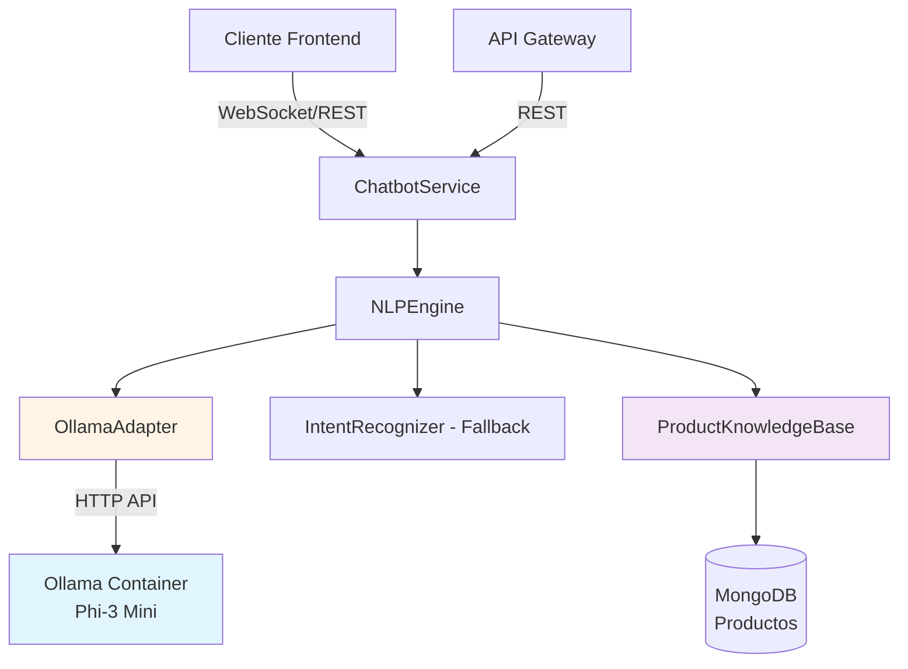
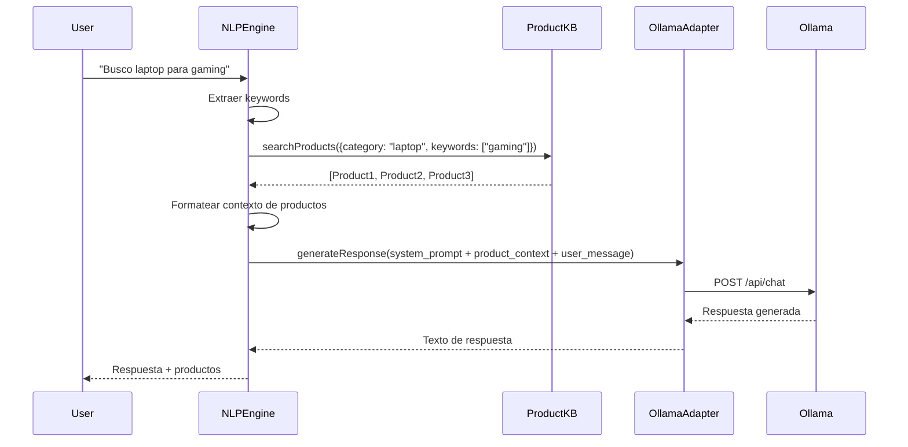

# Documento de Diseño Técnico

## Resumen

Este documento describe el diseño técnico para actualizar el chatbot de TechNovaStore desde un sistema basado en palabras clave (spaCy + IntentRecognizer) a un chatbot conversacional impulsado por Ollama con Phi-3 Mini. El diseño implementa RAG (Retrieval Augmented Generation) para especialización en e-commerce, mantiene compatibilidad con la arquitectura existente, y está optimizado para sistemas con 8GB RAM.

## Arquitectura General

### Diagrama de Arquitectura



### Componentes Principales

1. **OllamaAdapter** (NUEVO)
   - Maneja comunicación HTTP con Ollama
   - Implementa streaming de respuestas
   - Gestiona health checks y reintentos
   - Formatea prompts y contexto

2. **NLPEngine** (MODIFICADO)
   - Orquesta entre OllamaAdapter y fallback
   - Implementa lógica RAG
   - Mantiene contexto conversacional
   - Decide cuándo usar LLM vs fallback

3. **ChatbotService** (MODIFICADO)
   - Añade soporte para streaming via Socket.IO
   - Gestiona sesiones con historial conversacional
   - Expone nuevos endpoints de monitoreo

4. **ProductKnowledgeBase** (SIN CAMBIOS)
   - Mantiene funcionalidad actual
   - Proporciona datos para RAG

5. **SimpleFallbackRecognizer** (NUEVO)
   - Sistema de fallback simple basado en librería 'natural' de Node.js
   - NO depende de Python/spaCy
   - Usado cuando Ollama no está disponible
   - Reconocimiento básico de intenciones por patrones de texto

## Diseño Detallado por Componente

### 1. OllamaAdapter

**Responsabilidades:**
- Comunicación con API de Ollama
- Formateo de prompts con system prompt + contexto RAG
- Manejo de streaming de respuestas
- Health checks y gestión de errores

**Interfaz:**

```typescript
interface OllamaConfig {
  host: string;
  model: string;
  timeout: number;
  temperature: number;
  maxTokens: number;
}

interface OllamaMessage {
  role: 'system' | 'user' | 'assistant';
  content: string;
}

interface OllamaRequest {
  model: string;
  messages: OllamaMessage[];
  stream: boolean;
  options?: {
    temperature?: number;
    num_predict?: number;
  };
}

interface OllamaResponse {
  message: {
    role: string;
    content: string;
  };
  done: boolean;
}

class OllamaAdapter {
  constructor(config: OllamaConfig);
  
  // Generar respuesta completa (no streaming)
  async generateResponse(
    messages: OllamaMessage[]
  ): Promise<string>;
  
  // Generar respuesta con streaming
  async generateStreamingResponse(
    messages: OllamaMessage[],
    onChunk: (chunk: string) => void
  ): Promise<void>;
  
  // Health check
  async checkHealth(): Promise<boolean>;
  
  // Verificar si modelo está cargado
  async isModelLoaded(): Promise<boolean>;
}
```

**Detalles de Implementación:**

1. **Comunicación HTTP:**
   - Endpoint: `POST http://ollama:11434/api/chat`
   - Timeout: 30 segundos (configurable)
   - Reintentos: 2 intentos con backoff exponencial

2. **Streaming:**
   - Usa `stream: true` en request
   - Procesa respuesta línea por línea (NDJSON)
   - Emite chunks via callback

3. **Health Check:**
   - Endpoint: `GET http://ollama:11434/api/tags`
   - Verifica que modelo `phi3:mini` esté en lista
   - Cache de 30 segundos para evitar checks excesivos

### 2. System Prompt Especializado

**Diseño del Prompt:**

```
Eres un asistente de ventas experto y profesional de TechNovaStore, una tienda online especializada en tecnología e informática (ordenadores, componentes, periféricos, software).

TU OBJETIVO:
- Informar sobre productos con precisión técnica
- Responder preguntas técnicas sobre compatibilidad y especificaciones
- Comparar productos cuando se solicite
- Guiar al cliente en el proceso de compra
- Mantener un tono amigable pero profesional

REGLAS ESTRICTAS:
1. NUNCA inventes nombres de productos, precios o especificaciones
2. USA SOLO la información proporcionada en el contexto de productos
3. Si no tienes información específica, indica al cliente que consulte la página del producto o contacte soporte
4. Responde SIEMPRE en español
5. Usa terminología técnica apropiada para el nicho de tecnología
6. NO respondas preguntas fuera del dominio de e-commerce y tecnología

FORMATO DE RESPUESTA:
- Sé conciso pero completo
- Usa listas cuando compares múltiples productos
- Incluye precios y disponibilidad cuando estén disponibles
- Sugiere productos alternativos cuando sea relevante

CONTEXTO DE PRODUCTOS:
{product_context}

HISTORIAL DE CONVERSACIÓN:
{conversation_history}
```

**Variables Dinámicas:**
- `{product_context}`: Información de productos recuperada via RAG
- `{conversation_history}`: Últimos 10 intercambios de la sesión

### 3. Implementación RAG

**Flujo RAG:**



**Formateo de Contexto de Productos:**

```typescript
function formatProductContext(products: ProductInfo[]): string {
  if (products.length === 0) {
    return "No hay productos disponibles en el contexto actual.";
  }
  
  let context = "PRODUCTOS DISPONIBLES:\n\n";
  
  products.forEach((product, index) => {
    context += `${index + 1}. ${product.name}\n`;
    context += `   - SKU: ${product.sku}\n`;
    context += `   - Marca: ${product.brand}\n`;
    context += `   - Precio: €${product.price}\n`;
    context += `   - Disponibilidad: ${product.availability ? 'En stock' : 'Agotado'}\n`;
    
    if (product.description) {
      context += `   - Descripción: ${product.description.substring(0, 200)}...\n`;
    }
    
    // Especificaciones técnicas clave
    if (product.specifications) {
      context += `   - Especificaciones:\n`;
      Object.entries(product.specifications).slice(0, 5).forEach(([key, value]) => {
        context += `     * ${key}: ${value}\n`;
      });
    }
    
    context += "\n";
  });
  
  return context;
}
```

**Estrategia de Recuperación:**

1. **Extracción de Keywords:**
   - Usar NLPProcessor existente para extraer keywords del mensaje
   - Identificar entidades (marcas, categorías, especificaciones)

2. **Consulta a ProductKnowledgeBase:**
   - Búsqueda por categoría si se detecta
   - Búsqueda por marca si se menciona
   - Búsqueda por texto libre como fallback
   - Limitar a 5 productos para no exceder límite de tokens

3. **Priorización:**
   - Productos en stock primero
   - Ordenar por relevancia (precio, popularidad)
   - Incluir especificaciones técnicas completas

### 4. Gestión de Contexto Conversacional

**Estructura de Contexto:**

```typescript
interface ConversationMessage {
  role: 'user' | 'assistant';
  content: string;
  timestamp: Date;
  products?: ProductInfo[]; // Productos mencionados
}

interface EnhancedChatContext extends ChatContext {
  conversationHistory: ConversationMessage[];
  lastProductQuery?: string;
  lastProducts?: ProductInfo[];
}
```

**Gestión de Historial:**

1. **Almacenamiento:**
   - Mantener últimos 10 intercambios (20 mensajes)
   - Almacenar en sesión del ChatbotService
   - Limpiar automáticamente después de 24 horas

2. **Formateo para Ollama:**
   ```typescript
   function formatConversationHistory(
     history: ConversationMessage[]
   ): OllamaMessage[] {
     return history.map(msg => ({
       role: msg.role,
       content: msg.content
     }));
   }
   ```

3. **Gestión de Tokens:**
   - Estimar tokens: ~4 caracteres = 1 token
   - Límite total: 2048 tokens para Phi-3 Mini
   - Reservar: 1000 tokens para respuesta
   - Disponible para contexto: ~1000 tokens
   - Si excede, eliminar mensajes más antiguos

### 5. Streaming de Respuestas

**Implementación Socket.IO:**

```typescript
// En ChatbotService
socket.on('chat_message_stream', async (data) => {
  const { message, sessionId, userId } = data;
  
  try {
    // Indicar que el bot está "escribiendo"
    socket.emit('bot_typing', { typing: true });
    
    // Procesar con streaming
    await this.nlpEngine.processUserInputStreaming(
      message,
      session.context,
      (chunk: string) => {
        // Emitir cada chunk al cliente
        socket.emit('chat_stream_chunk', {
          sessionId,
          chunk,
          timestamp: new Date()
        });
      }
    );
    
    // Indicar fin del streaming
    socket.emit('chat_stream_end', {
      sessionId,
      timestamp: new Date()
    });
    
    socket.emit('bot_typing', { typing: false });
  } catch (error) {
    socket.emit('chat_stream_error', {
      error: 'Error procesando mensaje'
    });
  }
});
```

**Eventos Socket.IO:**

- `chat_message_stream`: Cliente envía mensaje para respuesta streaming
- `bot_typing`: Indica que el bot está procesando
- `chat_stream_chunk`: Chunk de respuesta parcial
- `chat_stream_end`: Fin de la respuesta
- `chat_stream_error`: Error durante streaming

### 6. Sistema de Fallback

**IMPORTANTE:** El sistema actual IntentRecognizer depende de spaCy (Python), lo cual queremos eliminar. El nuevo fallback será completamente JavaScript usando la librería 'natural'.

**SimpleFallbackRecognizer:**

```typescript
import natural from 'natural';

interface SimpleFallbackIntent {
  name: string;
  confidence: number;
  entities: { [key: string]: string };
}

class SimpleFallbackRecognizer {
  private tokenizer: natural.WordTokenizer;
  private intentPatterns: Map<string, string[]>;
  
  constructor() {
    this.tokenizer = new natural.WordTokenizer();
    this.intentPatterns = this.loadPatterns();
  }
  
  private loadPatterns(): Map<string, string[]> {
    return new Map([
      ['product_search', ['busco', 'buscar', 'quiero', 'comprar', 'necesito', 'laptop', 'móvil', 'tablet']],
      ['product_info', ['información', 'características', 'especificaciones', 'detalles', 'precio']],
      ['greeting', ['hola', 'buenos', 'buenas', 'saludos']],
      ['goodbye', ['adiós', 'hasta', 'luego', 'chao', 'gracias']],
      ['support_request', ['ayuda', 'problema', 'soporte', 'contactar', 'humano']]
    ]);
  }
  
  recognizeIntent(text: string): SimpleFallbackIntent {
    const textLower = text.toLowerCase();
    const tokens = this.tokenizer.tokenize(textLower);
    
    let bestMatch = { name: 'unknown', confidence: 0 };
    
    for (const [intent, keywords] of this.intentPatterns) {
      const matches = keywords.filter(kw => 
        tokens.some(token => token.includes(kw) || kw.includes(token))
      );
      
      const confidence = matches.length / keywords.length;
      
      if (confidence > bestMatch.confidence) {
        bestMatch = { name: intent, confidence };
      }
    }
    
    return {
      ...bestMatch,
      entities: this.extractSimpleEntities(textLower, tokens)
    };
  }
  
  private extractSimpleEntities(text: string, tokens: string[]): { [key: string]: string } {
    const entities: { [key: string]: string } = {};
    
    // Detectar categorías de productos
    const categories = ['laptop', 'móvil', 'tablet', 'auriculares', 'teclado', 'monitor'];
    const foundCategory = tokens.find(t => categories.includes(t));
    if (foundCategory) entities['PRODUCT_TYPE'] = foundCategory;
    
    // Detectar marcas
    const brands = ['apple', 'samsung', 'sony', 'lg', 'hp', 'dell', 'asus'];
    const foundBrand = tokens.find(t => brands.includes(t));
    if (foundBrand) entities['BRAND'] = foundBrand;
    
    return entities;
  }
}
```

**Lógica de Decisión:**

```typescript
async processUserInput(
  userInput: string,
  context: ChatContext
): Promise<ChatResponse> {
  // 1. Verificar salud de Ollama
  const ollamaAvailable = await this.ollamaAdapter.checkHealth();
  
  if (!ollamaAvailable) {
    console.warn('Ollama no disponible, usando fallback simple');
    return this.useSimpleFallback(userInput, context);
  }
  
  try {
    // 2. Intentar con Ollama
    return await this.processWithOllama(userInput, context);
  } catch (error) {
    console.error('Error con Ollama:', error);
    
    // 3. Fallback automático
    return this.useSimpleFallback(userInput, context);
  }
}

private async useSimpleFallback(
  userInput: string,
  context: ChatContext
): Promise<ChatResponse> {
  // Usar SimpleFallbackRecognizer (sin Python/spaCy)
  const intent = this.simpleFallbackRecognizer.recognizeIntent(userInput);
  const response = await this.generateFallbackResponse(intent, userInput, context);
  
  return {
    ...response,
    usingFallback: true,
    message: response.message + '\n\n_Nota: Modo básico activo. Algunas funciones limitadas._'
  };
}
```

**Indicadores de Fallback:**

- Agregar campo `usingFallback: boolean` en ChatResponse
- Mostrar mensaje discreto al usuario: "Modo básico activo"
- Registrar en logs para monitoreo
- Respuestas más simples y directas

### 7. Configuración Docker

**Nuevo Servicio Ollama:**

```yaml
ollama:
  image: ollama/ollama:latest
  container_name: technovastore-ollama
  restart: unless-stopped
  ports:
    - "11434:11434"
  environment:
    - OLLAMA_HOST=0.0.0.0
  volumes:
    - ollama_data:/root/.ollama
  deploy:
    resources:
      limits:
        memory: 3G  # Límite para 8GB RAM total
      reservations:
        memory: 2G
  networks:
    - technovastore-network
  healthcheck:
    test: ["CMD", "curl", "-f", "http://localhost:11434/api/tags"]
    interval: 30s
    timeout: 10s
    retries: 3
    start_period: 60s
```

**Script de Inicialización:**

```bash
#!/bin/bash
# init-ollama.sh

echo "Esperando a que Ollama esté listo..."
until curl -f http://localhost:11434/api/tags; do
  sleep 2
done

echo "Descargando modelo Phi-3 Mini..."
curl -X POST http://localhost:11434/api/pull -d '{
  "name": "phi3:mini"
}'

echo "Modelo Phi-3 Mini listo"
```

**Actualización del Servicio Chatbot:**

```yaml
chatbot:
  build:
    context: ./ai-services/chatbot
    dockerfile: Dockerfile
  container_name: technovastore-chatbot
  restart: unless-stopped
  ports:
    - "3009:3001"
  environment:
    NODE_ENV: development
    CHATBOT_PORT: 3001
    MONGODB_URI: mongodb://REDACTED_DB_PASSWORD@mongodb:27017/technovastore?authSource=admin
    FRONTEND_URL: http://localhost:3011
    TICKET_SERVICE_URL: http://ticket-service:3005
    # Nuevas variables Ollama
    OLLAMA_HOST: http://ollama:11434
    OLLAMA_MODEL: phi3:mini
    OLLAMA_TIMEOUT: 30000
    OLLAMA_TEMPERATURE: 0.7
    OLLAMA_MAX_TOKENS: 1000
    USE_OLLAMA: true
  depends_on:
    ollama:
      condition: service_healthy
    mongodb:
      condition: service_started
  networks:
    - technovastore-network
```

### 8. Gestión de Dependencias

**Nuevas Dependencias (package.json):**

```json
{
  "dependencies": {
    "express": "^4.18.2",
    "mongoose": "^8.0.3",
    "socket.io": "^4.7.2",
    "cors": "^2.8.5",
    "helmet": "^7.1.0",
    "dotenv": "^16.3.1",
    "axios": "^1.6.8",
    "natural": "^6.12.0"
  },
  "devDependencies": {
    "@types/express": "^4.17.21",
    "@types/cors": "^2.8.17",
    "@types/node": "^20.12.7",
    "@types/natural": "^5.1.5",
    "nodemon": "^3.1.0",
    "ts-node": "^10.9.2",
    "typescript": "^5.4.5",
    "jest": "^29.7.0",
    "@types/jest": "^29.5.12"
  }
}
```

**Dependencias Eliminadas:**
- `@tensorflow/tfjs-node`: No necesario con Ollama
- `python-shell`: Eliminado completamente (no más Python)
- `compromise`: Eliminado (usamos 'natural' en su lugar)

**Dependencias Mantenidas:**
- `natural`: CRÍTICO para sistema de fallback sin Python
- `mongoose`: Para ProductKnowledgeBase (ya funciona bien)
- `socket.io`: Para streaming de respuestas

**IMPORTANTE:** El sistema actual usa spaCy (Python) en IntentRecognizer. Lo reemplazaremos completamente con SimpleFallbackRecognizer basado en 'natural' (JavaScript puro).

### 9. Monitoreo y Métricas

**Métricas a Rastrear:**

```typescript
interface OllamaMetrics {
  totalRequests: number;
  successfulRequests: number;
  failedRequests: number;
  averageResponseTime: number;
  fallbackUsageCount: number;
  streamingRequestsCount: number;
  lastHealthCheck: Date;
  isHealthy: boolean;
}

class MetricsCollector {
  private metrics: OllamaMetrics;
  
  recordRequest(success: boolean, responseTime: number): void;
  recordFallback(): void;
  recordStreamingRequest(): void;
  updateHealthStatus(isHealthy: boolean): void;
  getMetrics(): OllamaMetrics;
  resetMetrics(): void;
}
```

**Endpoints de Monitoreo:**

1. `GET /api/chat/ollama/health`
   ```json
   {
     "status": "healthy",
     "model": "phi3:mini",
     "modelLoaded": true,
     "lastCheck": "2024-10-24T10:30:00Z"
   }
   ```

2. `GET /api/chat/stats`
   ```json
   {
     "ollama": {
       "totalRequests": 1523,
       "successRate": 0.98,
       "averageResponseTime": 2.3,
       "fallbackUsage": 0.02,
       "isHealthy": true
     },
     "sessions": {
       "active": 45,
       "total": 1200
     }
   }
   ```

### 10. Manejo de Errores

**Estrategia de Errores:**

```typescript
class OllamaError extends Error {
  constructor(
    message: string,
    public code: string,
    public retryable: boolean
  ) {
    super(message);
  }
}

// Tipos de errores
const ErrorCodes = {
  CONNECTION_FAILED: 'OLLAMA_CONNECTION_FAILED',
  TIMEOUT: 'OLLAMA_TIMEOUT',
  MODEL_NOT_LOADED: 'OLLAMA_MODEL_NOT_LOADED',
  INVALID_RESPONSE: 'OLLAMA_INVALID_RESPONSE',
  RATE_LIMIT: 'OLLAMA_RATE_LIMIT'
};

// Manejo
try {
  const response = await ollamaAdapter.generateResponse(messages);
} catch (error) {
  if (error instanceof OllamaError) {
    if (error.retryable && retryCount < MAX_RETRIES) {
      // Reintentar
      return await this.retryRequest(messages, retryCount + 1);
    } else {
      // Usar fallback
      return await this.useFallbackSystem(userInput, context);
    }
  }
  throw error;
}
```

## Expectativas Realistas sobre Phi-3 Mini

### Capacidades y Limitaciones

**✅ Lo que Phi-3 Mini PUEDE hacer bien:**
- Entender lenguaje natural conversacional en español
- Mantener contexto de conversación (últimos 10 intercambios)
- Responder preguntas sobre productos usando información del contexto RAG
- Comparar productos basándose en especificaciones proporcionadas
- Mantener tono profesional y amigable
- Seguir instrucciones del system prompt consistentemente

**⚠️ Limitaciones esperadas:**
- **Inteligencia:** Menos capaz que GPT-4/Claude, pero MUCHO mejor que sistema actual de keywords
- **Latencia:** Primera respuesta ~2-5 segundos, siguientes ~1-3 segundos (con streaming se percibe más rápido)
- **Conocimiento:** Solo sabe lo que le proporcionamos en el contexto (RAG). NO tiene conocimiento general de productos
- **Creatividad:** Respuestas más directas y menos "creativas" que modelos grandes
- **Errores:** Puede ocasionalmente malinterpretar consultas muy complejas o ambiguas

**🎯 Comparación realista:**
- **vs Sistema actual (spaCy + keywords):** 5-10x mejor en comprensión de lenguaje natural
- **vs ChatGPT/GPT-4:** 60-70% de la calidad, pero gratis y local
- **vs Gemini:** Similar a Gemini Nano, inferior a Gemini Pro

### Estrategia de Ajuste Iterativo

El system prompt necesitará ajustes basados en uso real:

1. **Fase inicial:** Desplegar con prompt conservador
2. **Monitoreo:** Revisar logs de conversaciones problemáticas
3. **Ajuste:** Refinar instrucciones del prompt cada semana
4. **Temperatura:** Empezar con 0.7, ajustar entre 0.5-0.9 según resultados

**Métricas de éxito:**
- Tasa de fallback < 5%
- Tiempo promedio de respuesta < 3 segundos
- Satisfacción de usuario (escalaciones) < 10%

## Consideraciones de Rendimiento

### Optimización para 8GB RAM

1. **Límites de Memoria:**
   - Ollama: 3GB máximo
   - Chatbot Service: 512MB
   - Otros servicios: 4GB
   - Sistema: 512MB buffer

2. **Optimizaciones:**
   - Limitar contexto conversacional a 10 intercambios
   - Limitar productos en RAG a 5 máximo
   - Cache de respuestas comunes (100 entradas)
   - Limpiar sesiones inactivas cada hora

3. **Monitoreo de Recursos:**
   - Alertas si memoria > 90%
   - Throttling de requests si necesario
   - Logs de uso de memoria

### Optimización de Latencia

1. **Streaming:**
   - Respuesta percibida más rápida
   - Chunks de ~50 caracteres
   - Actualización UI en tiempo real

2. **Cache:**
   - Respuestas a preguntas frecuentes
   - Información de productos populares
   - TTL: 1 hora

3. **Paralelización:**
   - Consulta a ProductKB en paralelo con preparación de prompt
   - Health checks asíncronos

## Estrategia de Testing

### Tests Unitarios

1. **OllamaAdapter:**
   - Mock de HTTP requests
   - Test de formateo de prompts
   - Test de streaming
   - Test de health checks

2. **NLPEngine:**
   - Test de lógica RAG
   - Test de fallback
   - Test de gestión de contexto

### Tests de Integración

1. **Chatbot + Ollama:**
   - Test end-to-end con Ollama real
   - Test de streaming
   - Test de fallback cuando Ollama falla

2. **RAG Pipeline:**
   - Test de recuperación de productos
   - Test de formateo de contexto
   - Test de respuestas con productos

### Tests de Carga

1. **Concurrencia:**
   - 10 usuarios simultáneos
   - Medir latencia y throughput
   - Verificar uso de memoria

2. **Estrés:**
   - Aumentar carga hasta fallo
   - Identificar límites del sistema

## Plan de Migración

### Fase 1: Preparación (Sin Downtime)

1. Agregar OllamaAdapter sin usarlo
2. Agregar configuración Ollama
3. Desplegar con `USE_OLLAMA=false`

### Fase 2: Testing Paralelo

1. Activar Ollama en entorno de desarrollo
2. Comparar respuestas Ollama vs fallback
3. Ajustar system prompt basado en resultados

### Fase 3: Rollout Gradual

1. Activar para 10% de usuarios
2. Monitorear métricas
3. Incrementar gradualmente a 100%

### Fase 4: Limpieza

1. Remover código spaCy si no se usa
2. Optimizar dependencias
3. Documentar sistema final

## Seguridad

### Aislamiento de Ollama

1. **Red Docker:**
   - Ollama solo accesible desde chatbot service
   - No exponer puerto 11434 externamente

2. **Rate Limiting:**
   - Máximo 10 requests por usuario por minuto
   - Prevenir abuso de recursos

3. **Validación de Input:**
   - Sanitizar mensajes de usuario
   - Limitar longitud de mensajes (1000 caracteres)
   - Filtrar contenido malicioso

### Protección de Datos

1. **No almacenar conversaciones sensibles:**
   - Limpiar historial después de 24 horas
   - No registrar información personal en logs

2. **Encriptación:**
   - HTTPS para comunicación cliente-servidor
   - Comunicación interna via red Docker privada

## Integración con Frontend

### Requisitos del Frontend

**CRÍTICO:** El frontend actual necesita verificación/actualización para soportar:

1. **Socket.IO para Streaming:**
   ```typescript
   // El frontend debe conectarse a Socket.IO
   import { io } from 'socket.io-client';
   
   const socket = io('http://localhost:3009');
   
   // Escuchar chunks de streaming
   socket.on('chat_stream_chunk', (data) => {
     // Agregar chunk al mensaje en pantalla
     appendToMessage(data.chunk);
   });
   
   socket.on('chat_stream_end', () => {
     // Finalizar animación de "escribiendo"
     stopTypingIndicator();
   });
   ```

2. **Indicador de "Escribiendo":**
   - Mostrar animación cuando bot está procesando
   - Actualizar en tiempo real con chunks de streaming
   - Ocultar cuando termina respuesta

3. **Manejo de Fallback:**
   - Detectar campo `usingFallback: true` en respuesta
   - Mostrar badge discreto "Modo básico" si está en fallback
   - No alarmar al usuario, solo informar

### Tareas de Frontend (si no existen)

**Si el frontend NO tiene Socket.IO:**
- [ ] Instalar socket.io-client
- [ ] Crear hook useChat para manejar conexión Socket.IO
- [ ] Implementar componente ChatMessage con soporte para streaming
- [ ] Agregar indicador de "escribiendo" animado
- [ ] Manejar reconexión automática si se pierde conexión

**Si el frontend YA tiene Socket.IO:**
- [ ] Verificar que escucha eventos correctos
- [ ] Actualizar para manejar nuevos eventos (chat_stream_chunk, chat_stream_end)
- [ ] Probar streaming end-to-end

### Ejemplo de Componente React

```typescript
import { useEffect, useState } from 'react';
import { io, Socket } from 'socket.io-client';

export function useChat(sessionId: string) {
  const [socket, setSocket] = useState<Socket | null>(null);
  const [messages, setMessages] = useState<Message[]>([]);
  const [isTyping, setIsTyping] = useState(false);
  const [currentStreamingMessage, setCurrentStreamingMessage] = useState('');
  
  useEffect(() => {
    const newSocket = io('http://localhost:3009');
    
    newSocket.on('connect', () => {
      newSocket.emit('join_session', sessionId);
    });
    
    newSocket.on('bot_typing', (data) => {
      setIsTyping(data.typing);
    });
    
    newSocket.on('chat_stream_chunk', (data) => {
      setCurrentStreamingMessage(prev => prev + data.chunk);
    });
    
    newSocket.on('chat_stream_end', () => {
      setMessages(prev => [...prev, {
        role: 'assistant',
        content: currentStreamingMessage
      }]);
      setCurrentStreamingMessage('');
      setIsTyping(false);
    });
    
    setSocket(newSocket);
    
    return () => {
      newSocket.close();
    };
  }, [sessionId]);
  
  const sendMessage = (message: string) => {
    if (!socket) return;
    
    setMessages(prev => [...prev, {
      role: 'user',
      content: message
    }]);
    
    socket.emit('chat_message_stream', {
      message,
      sessionId,
      userId: 'user123'
    });
  };
  
  return {
    messages,
    isTyping,
    currentStreamingMessage,
    sendMessage
  };
}
```

## Documentación

### Para Desarrolladores

1. **README actualizado:**
   - Instrucciones de setup con Ollama
   - Variables de entorno
   - Troubleshooting común

2. **API Documentation:**
   - Nuevos endpoints
   - Eventos Socket.IO
   - Ejemplos de uso

### Para Usuarios

1. **Guía de uso:**
   - Cómo interactuar con el chatbot
   - Ejemplos de consultas
   - Limitaciones conocidas

2. **FAQ:**
   - ¿Por qué a veces responde diferente?
   - ¿Qué hacer si el chatbot no responde?
   - ¿Cómo escalar a soporte humano?
