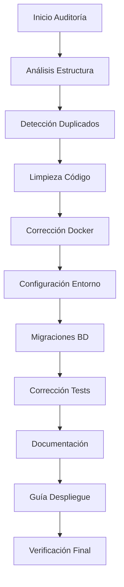

# Diseño - Auditoría Completa y Configuración del Proyecto

## Visión General

Este diseño establece un proceso sistemático para auditar, limpiar y configurar completamente el proyecto TechNovaStore. El proceso se divide en fases secuenciales que abordan desde la limpieza de código hasta la creación de guías completas de despliegue.

## Arquitectura del Proceso de Auditoría



## Componentes y Interfaces

### 1. Analizador de Estructura del Proyecto

**Propósito:** Mapear completamente la estructura del proyecto e identificar inconsistencias.

**Funcionalidades:**
- Escaneo recursivo de directorios
- Identificación de patrones de archivos
- Detección de configuraciones duplicadas
- Análisis de dependencias entre servicios

**Archivos a analizar:**
- Todos los `package.json` y sus dependencias
- Archivos `Dockerfile` y `docker-compose*.yml`
- Configuraciones `.env.example` y variables de entorno
- Archivos de documentación `.md`
- Scripts de configuración y despliegue

### 2. Detector de Duplicaciones

**Propósito:** Identificar y eliminar código, configuraciones y archivos duplicados.

**Algoritmo de detección:**
1. **Hash de contenido:** Comparar archivos por contenido exacto
2. **Análisis semántico:** Detectar configuraciones similares con diferentes formatos
3. **Patrones de código:** Identificar funciones y estructuras duplicadas
4. **Configuraciones redundantes:** Encontrar variables de entorno duplicadas

**Criterios de eliminación:**
- Mantener la versión más reciente o completa
- Preservar configuraciones específicas de entorno
- Documentar cambios realizados

### 3. Corrector de Configuraciones Docker

**Propósito:** Resolver problemas de contenedores unhealthy y optimizar configuraciones.

**Problemas identificados y soluciones:**

#### 3.1 Healthchecks Fallidos
```dockerfile
# Problema: curl no disponible en node:18-alpine
HEALTHCHECK --interval=30s --timeout=3s --start-period=5s --retries=3 \
  CMD curl -f http://localhost:3000/health || exit 1

# Solución: Instalar curl o usar alternativa Node.js
RUN apk add --no-cache curl
# O usar Node.js nativo:
HEALTHCHECK --interval=30s --timeout=3s --start-period=5s --retries=3 \
  CMD node -e "require('http').get('http://localhost:3000/health', (res) => process.exit(res.statusCode === 200 ? 0 : 1)).on('error', () => process.exit(1))"
```

#### 3.2 Errores de Compilación TypeScript
```json
// Problema: Dependencias @types faltantes
// Solución: Actualizar package.json
{
  "devDependencies": {
    "@types/cors": "^2.8.17",
    "@types/morgan": "^1.9.9",
    "@types/node": "^18.19.0"
  }
}
```

#### 3.3 Errores de Migraciones PostgreSQL
```typescript
// Problema: Conflictos en tipos ENUM
// Solución: Migraciones idempotentes
await queryInterface.sequelize.query(`
  DO $$ BEGIN
    CREATE TYPE enum_orders_status AS ENUM('pending', 'confirmed', 'processing', 'shipped', 'delivered', 'cancelled', 'refunded');
  EXCEPTION
    WHEN duplicate_object THEN null;
  END $$;
`);
```

### 4. Gestor de Variables de Entorno

**Propósito:** Crear y validar todas las configuraciones de entorno necesarias.

**Estructura de configuración:**
```
.env.example → .env (desarrollo)
.env.prod.example → .env.prod (producción)
.env.staging.example → .env.staging (staging)
```

**Variables críticas identificadas:**
- **Base de datos:** `MONGODB_URI`, `POSTGRES_URL`, `REDIS_URL`
- **Autenticación:** `JWT_SECRET`, `API_KEYS`
- **Servicios externos:** `STRIPE_SECRET_KEY`, `SENDGRID_API_KEY`
- **Configuración:** `NODE_ENV`, `PORT`, `LOG_LEVEL`

### 5. Orquestador de Migraciones

**Propósito:** Gestionar la inicialización y migración de todas las bases de datos.

**Bases de datos identificadas:**
- **MongoDB:** Productos, usuarios, logs
- **PostgreSQL:** Órdenes, pagos, transacciones
- **Redis:** Cache, sesiones, colas

**Orden de inicialización:**
1. PostgreSQL (estructura base)
2. MongoDB (datos de productos)
3. Redis (configuración cache)
4. Datos de prueba y configuración inicial

### 6. Validador de Tests

**Propósito:** Ejecutar y corregir toda la suite de pruebas del proyecto.

**Tipos de tests identificados:**
- **Unit tests:** Jest para lógica de negocio
- **Integration tests:** APIs y servicios
- **E2E tests:** Playwright para frontend
- **Load tests:** Artillery para rendimiento

**Estrategia de corrección:**
1. Ejecutar tests por servicio
2. Identificar fallos y sus causas
3. Corregir código o actualizar tests
4. Verificar cobertura mínima (80%)

## Modelos de Datos

### Registro de Auditoría
```typescript
interface AuditLog {
  timestamp: Date;
  action: 'delete' | 'modify' | 'create' | 'move';
  filePath: string;
  oldContent?: string;
  newContent?: string;
  reason: string;
  category: 'duplication' | 'docker' | 'env' | 'docs' | 'tests';
}
```

### Configuración de Servicio
```typescript
interface ServiceConfig {
  name: string;
  type: 'api' | 'automation' | 'ai' | 'frontend';
  port: number;
  dependencies: string[];
  envVars: EnvironmentVariable[];
  healthcheck: HealthcheckConfig;
  databases: DatabaseConnection[];
}
```

### Estado de Verificación
```typescript
interface VerificationStatus {
  service: string;
  status: 'healthy' | 'unhealthy' | 'unknown';
  lastCheck: Date;
  errors: string[];
  endpoints: EndpointStatus[];
}
```

## Manejo de Errores

### Estrategias por Tipo de Error

1. **Errores de Compilación:**
   - Instalar dependencias faltantes
   - Corregir imports y tipos
   - Actualizar configuraciones TypeScript

2. **Errores de Base de Datos:**
   - Recrear migraciones conflictivas
   - Limpiar datos inconsistentes
   - Verificar conexiones y credenciales

3. **Errores de Docker:**
   - Reconstruir imágenes desde cero
   - Corregir healthchecks
   - Optimizar configuraciones de red

4. **Errores de Tests:**
   - Actualizar mocks y fixtures
   - Corregir assertions obsoletas
   - Sincronizar con cambios de API

## Estrategia de Testing

### Fases de Verificación

1. **Tests Unitarios por Servicio:**
   ```bash
   # Ejecutar tests de cada microservicio
   cd services/product && npm test
   cd services/order && npm test
   cd services/user && npm test
   ```

2. **Tests de Integración:**
   ```bash
   # Tests de APIs y comunicación entre servicios
   npm run test:integration
   ```

3. **Tests E2E:**
   ```bash
   # Tests completos de flujo de usuario
   cd frontend && npm run test:e2e
   ```

4. **Tests de Carga:**
   ```bash
   # Verificar rendimiento bajo carga
   npm run test:load
   ```

### Métricas de Éxito
- **Cobertura de código:** Mínimo 80% por servicio
- **Tests pasando:** 100% de tests críticos
- **Tiempo de respuesta:** < 200ms para APIs principales
- **Disponibilidad:** 99.9% uptime en healthchecks

## Documentación y Guías

### Estructura de Documentación Final

```
docs/
├── README.md (español, completo)
├── INSTALACION.md (guía paso a paso)
├── CONFIGURACION.md (variables de entorno)
├── DESPLIEGUE.md (Docker y producción)
├── DESARROLLO.md (guía para desarrolladores)
├── TESTING.md (ejecutar y crear tests)
├── TROUBLESHOOTING.md (solución de problemas)
└── API.md (documentación de endpoints)
```

### Contenido de Guía de Instalación

1. **Prerrequisitos del Sistema:**
   - Node.js 18+
   - Docker y Docker Compose
   - Git
   - Herramientas adicionales por SO

2. **Configuración Inicial:**
   - Clonado del repositorio
   - Configuración de variables de entorno
   - Inicialización de bases de datos
   - Construcción de contenedores

3. **Verificación del Despliegue:**
   - Comandos de health check
   - URLs de verificación
   - Logs a revisar
   - Indicadores de éxito

4. **Solución de Problemas Comunes:**
   - Servicios unhealthy
   - Errores de conexión a BD
   - Problemas de permisos
   - Conflictos de puertos

## Seguridad y GitHub

### Configuración Segura para GitHub

1. **Archivo .gitignore actualizado:**
   ```gitignore
   # Variables de entorno
   .env
   .env.local
   .env.prod
   .env.staging
   
   # Credenciales
   *.key
   *.pem
   secrets/
   
   # Logs sensibles
   logs/*.log
   ```

2. **Plantillas de configuración:**
   - Crear `.env.template` con valores de ejemplo
   - Documentar cada variable requerida
   - Incluir valores por defecto seguros

3. **GitHub Secrets recomendados:**
   - `MONGODB_URI`
   - `POSTGRES_URL`
   - `JWT_SECRET`
   - `STRIPE_SECRET_KEY`
   - `SENDGRID_API_KEY`

4. **Configuración de CI/CD:**
   - Actions para tests automáticos
   - Verificación de seguridad
   - Despliegue automatizado

## Cronograma de Implementación

### Fase 1: Análisis y Limpieza (2-3 días)
- Mapeo completo del proyecto
- Identificación de duplicaciones
- Limpieza de código y archivos

### Fase 2: Corrección Docker (1-2 días)
- Arreglo de healthchecks
- Resolución de errores de compilación
- Optimización de configuraciones

### Fase 3: Configuración de Entorno (1 día)
- Creación de archivos .env
- Configuración de bases de datos
- Validación de conexiones

### Fase 4: Tests y Validación (2 días)
- Corrección de suite de tests
- Verificación de cobertura
- Tests de integración

### Fase 5: Documentación (1 día)
- Traducción al español
- Creación de guías completas
- Verificación de enlaces y referencias

**Total estimado: 7-9 días de trabajo**