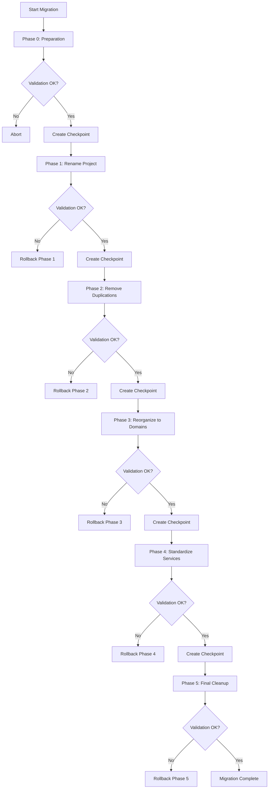

# Design Document

## Overview

Este documento describe el diseño técnico para la refactorización completa del proyecto TechNovaStore hacia Screaming Architecture. La refactorización se realizará en fases incrementales con validación continua para asegurar que nada se rompa durante el proceso.

### Objetivos Principales

1. **Screaming Architecture**: Estructura que refleja el dominio del negocio
2. **Eliminación de Duplicaciones**: Código y configuración únicos
3. **Consistencia**: Nombres y estructura estandarizados
4. **Seguridad**: Validación continua sin romper funcionalidad
5. **Documentación**: Cambios completamente documentados

### Principios de Diseño

- **Incremental**: Cambios pequeños y validados
- **Reversible**: Cada fase puede revertirse con Git
- **Validado**: Tests automáticos en cada paso
- **Documentado**: Log detallado de todos los cambios

## Architecture

### Estructura Actual vs Nueva Estructura

#### Estructura Actual (Tecnología-Céntrica)

```
TechNovaStore/
├── services/              # Organizado por tecnología
│   ├── product/
│   ├── order/
│   ├── user/
│   ├── payment/
│   ├── notification/
│   └── ticket/
├── domains/               # Nueva estructura de dominios
│   ├── support/
│   │   ├── chatbot-service/
│   │   └── ticket-service/
│   └── catalog/
│       └── recommender-service/
├── automation/            # Separado artificialmente
│   ├── sync-engine/
│   ├── auto-purchase/
│   └── shipment-tracker/
├── frontend/
├── shared/
├── infrastructure/
├── docs/
├── scripts/
└── [50+ archivos en raíz]  # Desorganizado
```

#### Nueva Estructura (Dominio-Céntrico - Screaming Architecture)

```
TechNovaStore/
├── domains/                           # GRITA: Dominios de negocio
│   ├── catalog/                       # Gestión de catálogo
│   │   ├── product-service/
│   │   ├── sync-engine/
│   │   └── recommender-service/
│   ├── commerce/                      # Comercio y transacciones
│   │   ├── order-service/
│   │   ├── payment-service/
│   │   └── auto-purchase-service/
│   ├── customer/                      # Gestión de clientes
│   │   ├── user-service/
│   │   └── notification-service/
│   ├── support/                       # Soporte al cliente
│   │   ├── ticket-service/
│   │   ├── chatbot-service/
│   │   └── shipment-tracker/
│   └── platform/                      # Plataforma y gateway
│       ├── api-gateway/
│       └── frontend/
├── shared/                            # Código compartido
│   ├── domain/                        # Lógica de dominio compartida
│   ├── infrastructure/                # Utilidades de infraestructura
│   └── types/                         # Tipos compartidos
├── infrastructure/                    # Configuración de infraestructura
│   ├── docker/
│   ├── kubernetes/
│   ├── monitoring/
│   └── ci-cd/
├── tests/                             # Tests de integración E2E
│   ├── integration/
│   └── e2e/
├── docs/                              # Documentación centralizada
│   ├── architecture/
│   ├── api/
│   └── deployment/
├── scripts/                           # Scripts organizados
│   ├── deployment/
│   ├── testing/
│   └── utilities/
└── [Solo 5 archivos esenciales]      # Raíz limpia
```


### Mapeo de Dominios

| Dominio | Servicios Incluidos | Propósito |
|---------|-------------------|-----------|
| **catalog** | product-service, sync-engine, recommender-service | Gestión de productos, sincronización con proveedores, recomendaciones ML |
| **commerce** | order-service, payment-service, auto-purchase-service | Procesamiento de pedidos, pagos, compras automáticas |
| **customer** | user-service, notification-service | Gestión de usuarios, autenticación, notificaciones |
| **support** | ticket-service, chatbot-service, shipment-tracker | Soporte al cliente, asistente IA, seguimiento de envíos |
| **platform** | api-gateway, frontend | Punto de entrada, interfaz de usuario |

## Components and Interfaces

### 1. Sistema de Migración Segura

#### MigrationOrchestrator

**Responsabilidad**: Coordinar todo el proceso de migración en fases

**Métodos**:
- `executeMigration()`: Ejecuta la migración completa
- `executePhase(phaseId)`: Ejecuta una fase específica
- `rollbackPhase(phaseId)`: Revierte una fase
- `validatePhase(phaseId)`: Valida una fase completada

**Fases de Migración**:
1. **Phase 0**: Preparación y análisis
2. **Phase 1**: Renombrado de proyecto
3. **Phase 2**: Eliminación de duplicaciones
4. **Phase 3**: Reorganización a dominios
5. **Phase 4**: Estandarización de microservicios
6. **Phase 5**: Limpieza final y documentación

#### PhaseValidator

**Responsabilidad**: Validar que cada fase se completó correctamente

**Métodos**:
- `validateDockerServices()`: Verifica que todos los contenedores inicien
- `validateImports()`: Verifica que no hay imports rotos
- `validateTests()`: Ejecuta suite de tests
- `validateBuild()`: Verifica compilación TypeScript
- `createCheckpoint()`: Crea checkpoint de Git

### 2. Analizador de Duplicaciones

#### DuplicationAnalyzer

**Responsabilidad**: Identificar archivos y configuraciones duplicadas

**Métodos**:
- `findDuplicateEnvFiles()`: Encuentra archivos .env duplicados
- `findDuplicateConfigs()`: Encuentra configuraciones redundantes
- `findDuplicateDocs()`: Encuentra documentación duplicada
- `findTemporaryFiles()`: Encuentra archivos temporales
- `generateConsolidationPlan()`: Genera plan de consolidación

**Salida**:
```typescript
interface DuplicationReport {
  envFiles: DuplicateGroup[];
  configs: DuplicateGroup[];
  docs: DuplicateGroup[];
  temporaryFiles: string[];
  consolidationPlan: ConsolidationAction[];
}
```

### 3. Actualizador de Referencias

#### ReferenceUpdater

**Responsabilidad**: Actualizar todas las referencias cuando se mueven archivos

**Métodos**:
- `updateImports(oldPath, newPath)`: Actualiza imports en código
- `updateDockerPaths(oldPath, newPath)`: Actualiza paths en Docker
- `updateConfigPaths(oldPath, newPath)`: Actualiza paths en configs
- `updateDocumentation(oldPath, newPath)`: Actualiza docs

**Estrategia**:
1. Buscar todas las referencias al archivo/carpeta
2. Actualizar referencias en orden de dependencia
3. Validar que no quedan referencias rotas
4. Ejecutar tests de verificación

### 4. Organizador de Dominios

#### DomainOrganizer

**Responsabilidad**: Reorganizar servicios en dominios de negocio

**Métodos**:
- `createDomainStructure()`: Crea estructura de carpetas de dominios
- `moveServiceToDomain(service, domain)`: Mueve servicio a dominio
- `updateServiceReferences(service)`: Actualiza referencias del servicio
- `validateDomainStructure()`: Valida estructura de dominios

**Mapeo de Servicios a Dominios**:
```typescript
const serviceToDomain = {
  'product-service': 'catalog',
  'sync-engine': 'catalog',
  'recommender': 'catalog',
  'order-service': 'commerce',
  'payment-service': 'commerce',
  'auto-purchase': 'commerce',
  'user-service': 'customer',
  'notification-service': 'customer',
  'ticket-service': 'support',
  'chatbot': 'support',
  'shipment-tracker': 'support',
  'api-gateway': 'platform',
  'frontend': 'platform'
};
```


### 5. Estandarizador de Microservicios

#### ServiceStandardizer

**Responsabilidad**: Estandarizar estructura interna de microservicios

**Estructura Estándar**:
```
service-name/
├── src/
│   ├── domain/              # Lógica de dominio
│   │   ├── entities/
│   │   ├── value-objects/
│   │   └── repositories/
│   ├── application/         # Casos de uso
│   │   ├── use-cases/
│   │   └── services/
│   ├── infrastructure/      # Implementaciones técnicas
│   │   ├── database/
│   │   ├── http/
│   │   └── external/
│   └── presentation/        # Controladores y rutas
│       ├── controllers/
│       ├── routes/
│       └── middleware/
├── tests/
│   ├── unit/
│   ├── integration/
│   └── e2e/
├── config/
│   ├── development.ts
│   ├── production.ts
│   └── test.ts
├── docs/
│   ├── README.md
│   └── API.md
├── Dockerfile
├── package.json
└── tsconfig.json
```

**Métodos**:
- `analyzeServiceStructure(service)`: Analiza estructura actual
- `generateMigrationPlan(service)`: Genera plan de migración
- `migrateServiceStructure(service)`: Migra a estructura estándar
- `validateServiceStructure(service)`: Valida estructura

## Data Models

### MigrationState

```typescript
interface MigrationState {
  currentPhase: number;
  phases: PhaseState[];
  startTime: Date;
  lastUpdate: Date;
  status: 'in_progress' | 'completed' | 'failed' | 'rolled_back';
}

interface PhaseState {
  id: number;
  name: string;
  status: 'pending' | 'in_progress' | 'completed' | 'failed';
  startTime?: Date;
  endTime?: Date;
  checkpointCommit?: string;
  changes: ChangeRecord[];
  validationResults?: ValidationResult;
}

interface ChangeRecord {
  type: 'move' | 'rename' | 'delete' | 'create' | 'update';
  oldPath?: string;
  newPath?: string;
  description: string;
  timestamp: Date;
}

interface ValidationResult {
  dockerServices: boolean;
  imports: boolean;
  tests: boolean;
  build: boolean;
  errors: string[];
}
```

### DomainMapping

```typescript
interface DomainMapping {
  domains: Domain[];
  services: ServiceMapping[];
}

interface Domain {
  name: string;
  description: string;
  services: string[];
  sharedCode: string[];
}

interface ServiceMapping {
  serviceName: string;
  currentPath: string;
  targetDomain: string;
  targetPath: string;
  dependencies: string[];
}
```

### ConsolidationPlan

```typescript
interface ConsolidationPlan {
  duplicateGroups: DuplicateGroup[];
  actions: ConsolidationAction[];
}

interface DuplicateGroup {
  type: 'env' | 'config' | 'doc' | 'code';
  files: string[];
  similarity: number;
  recommendation: string;
}

interface ConsolidationAction {
  action: 'merge' | 'delete' | 'move';
  sourceFiles: string[];
  targetFile?: string;
  reason: string;
}
```

## Error Handling

### Estrategia de Manejo de Errores

1. **Validación Preventiva**: Validar antes de cada cambio
2. **Rollback Automático**: Revertir cambios si falla validación
3. **Checkpoints de Git**: Crear commits en cada fase
4. **Logs Detallados**: Registrar todos los cambios y errores
5. **Notificación de Errores**: Reportar errores con contexto

### Tipos de Errores

#### CriticalError
- **Cuándo**: Fallo que impide continuar
- **Acción**: Detener migración, rollback automático
- **Ejemplos**: Servicios Docker no inician, tests fallan

#### RecoverableError
- **Cuándo**: Fallo que puede recuperarse
- **Acción**: Reintentar o saltar paso
- **Ejemplos**: Archivo no encontrado, referencia opcional

#### ValidationError
- **Cuándo**: Validación falla
- **Acción**: Reportar y esperar corrección manual
- **Ejemplos**: Import roto, configuración inválida

### Manejo de Rollback

```typescript
class RollbackManager {
  async rollbackPhase(phaseId: number): Promise<void> {
    const phase = this.getPhase(phaseId);
    
    // 1. Revertir a checkpoint de Git
    await this.gitCheckout(phase.checkpointCommit);
    
    // 2. Restaurar archivos modificados
    for (const change of phase.changes.reverse()) {
      await this.revertChange(change);
    }
    
    // 3. Validar estado
    await this.validateRollback();
    
    // 4. Actualizar estado
    phase.status = 'rolled_back';
  }
}
```


## Testing Strategy

### Niveles de Testing

#### 1. Tests de Verificación Temporales

**Propósito**: Validar cada cambio durante la migración

**Tipos**:
- **Docker Verification Tests**: Verifican que contenedores inician
- **Import Verification Tests**: Verifican que no hay imports rotos
- **Build Verification Tests**: Verifican compilación TypeScript
- **Service Health Tests**: Verifican que servicios responden

**Ciclo de Vida**:
1. Crear antes de cada fase
2. Ejecutar después de cada cambio
3. Eliminar al completar la migración

**Ejemplo**:
```typescript
// tests/migration/verify-docker-services.test.ts
describe('Docker Services Verification', () => {
  it('should start all core services', async () => {
    const services = ['mongodb', 'postgresql', 'redis'];
    for (const service of services) {
      const isRunning = await checkDockerService(service);
      expect(isRunning).toBe(true);
    }
  });
});
```

#### 2. Tests Existentes

**Estrategia**: Mantener todos los tests existentes funcionando

**Validación**:
- Ejecutar suite completa después de cada fase
- 100% de tests deben pasar
- No se permite degradación de cobertura

#### 3. Tests de Integración

**Propósito**: Validar que servicios se comunican correctamente

**Cobertura**:
- Comunicación entre microservicios
- Integración con bases de datos
- Flujos end-to-end críticos

### Estrategia de Validación por Fase

#### Phase 0: Preparación
- ✅ Análisis de duplicaciones completo
- ✅ Plan de migración generado
- ✅ Backup de proyecto creado

#### Phase 1: Renombrado
- ✅ Todos los docker-compose actualizados
- ✅ Todos los package.json actualizados
- ✅ Contenedores inician con nuevo nombre
- ✅ Tests existentes pasan

#### Phase 2: Eliminación de Duplicaciones
- ✅ Archivos duplicados eliminados
- ✅ Configuraciones consolidadas
- ✅ Referencias actualizadas
- ✅ Tests existentes pasan

#### Phase 3: Reorganización a Dominios
- ✅ Estructura de dominios creada
- ✅ Servicios movidos a dominios
- ✅ Referencias actualizadas
- ✅ Docker compose actualizado
- ✅ Tests existentes pasan

#### Phase 4: Estandarización
- ✅ Estructura interna estandarizada
- ✅ Imports actualizados
- ✅ Tests reorganizados
- ✅ Tests existentes pasan

#### Phase 5: Limpieza Final
- ✅ Archivos temporales eliminados
- ✅ Documentación actualizada
- ✅ Tests de verificación eliminados
- ✅ Suite completa de tests pasa

## Implementation Phases

### Phase 0: Preparación y Análisis (Duración: 1-2 horas)

**Objetivos**:
1. Analizar estructura actual
2. Identificar duplicaciones
3. Generar plan de migración
4. Crear backup completo

**Tareas**:
- Ejecutar análisis de duplicaciones
- Generar reporte de duplicaciones
- Crear plan de consolidación
- Crear backup de Git (tag)
- Documentar estado inicial

**Validación**:
- Reporte de duplicaciones generado
- Plan de migración documentado
- Backup creado y verificado

**Salida**:
- `MIGRATION_PLAN.md`: Plan detallado
- `DUPLICATION_REPORT.md`: Reporte de duplicaciones
- Git tag: `pre-migration-backup`

### Phase 1: Renombrado de Proyecto (Duración: 2-3 horas)

**Objetivos**:
1. Renombrar proyecto de "Ciberseguridad" a "TechNovaStore"
2. Actualizar todos los archivos de configuración
3. Actualizar nombres de contenedores Docker
4. Validar que todo funciona

**Tareas**:
- Buscar y reemplazar "Ciberseguridad" → "TechNovaStore"
- Buscar y reemplazar "ciberseguridad" → "technovastore"
- Actualizar docker-compose.yml (todos los archivos)
- Actualizar package.json (todos los archivos)
- Actualizar nombres de imágenes Docker
- Actualizar nombres de volúmenes Docker
- Actualizar documentación

**Validación**:
- Ejecutar búsqueda de "Ciberseguridad" (debe retornar 0)
- Iniciar todos los contenedores Docker
- Verificar que servicios responden
- Ejecutar tests existentes

**Checkpoint**: `git commit -m "Phase 1: Rename project to TechNovaStore"`

### Phase 2: Eliminación de Duplicaciones (Duración: 3-4 horas)

**Objetivos**:
1. Eliminar archivos .env duplicados
2. Consolidar configuraciones
3. Eliminar documentación duplicada
4. Eliminar archivos temporales

**Tareas**:
- Consolidar archivos .env
- Consolidar package.json duplicados
- Consolidar documentación
- Eliminar archivos .example innecesarios
- Eliminar archivos temporales
- Actualizar referencias

**Validación**:
- Verificar que no hay duplicaciones
- Servicios inician correctamente
- Tests existentes pasan

**Checkpoint**: `git commit -m "Phase 2: Remove duplications"`


### Phase 3: Reorganización a Dominios (Duración: 6-8 horas)

**Objetivos**:
1. Crear estructura de dominios
2. Mover servicios a dominios
3. Actualizar todas las referencias
4. Validar funcionamiento

**Tareas**:
- Crear carpeta `domains/` con subdominios
- Mover servicios a dominios correspondientes
- Actualizar imports en código
- Actualizar paths en docker-compose
- Actualizar paths en Dockerfiles
- Actualizar scripts de deployment
- Actualizar documentación

**Orden de Migración** (de menos a más dependencias):
1. **catalog**: product-service, sync-engine, recommender
2. **customer**: user-service, notification-service
3. **commerce**: order-service, payment-service, auto-purchase
4. **support**: ticket-service, chatbot, shipment-tracker
5. **platform**: api-gateway, frontend

**Validación por Servicio**:
- Servicio compila sin errores
- Contenedor Docker inicia
- Health check responde
- Tests del servicio pasan

**Checkpoint**: `git commit -m "Phase 3: Reorganize to domain architecture"`

### Phase 4: Estandarización de Microservicios (Duración: 8-10 horas)

**Objetivos**:
1. Estandarizar estructura interna de cada microservicio
2. Reorganizar código según Clean Architecture
3. Reorganizar tests
4. Validar funcionamiento

**Tareas por Servicio**:
- Analizar estructura actual
- Crear estructura estándar (domain, application, infrastructure, presentation)
- Mover archivos a nuevas ubicaciones
- Actualizar imports
- Reorganizar tests (unit, integration, e2e)
- Actualizar configuración
- Validar servicio

**Prioridad de Servicios**:
1. Servicios más simples primero (notification, shipment-tracker)
2. Servicios core después (product, user, order)
3. Servicios complejos al final (chatbot, api-gateway)

**Validación por Servicio**:
- Estructura cumple estándar
- Compilación sin errores
- Tests pasan
- Servicio funciona correctamente

**Checkpoint**: `git commit -m "Phase 4: Standardize microservices structure"`

### Phase 5: Limpieza Final y Documentación (Duración: 3-4 horas)

**Objetivos**:
1. Limpiar archivos temporales
2. Organizar documentación
3. Actualizar README principal
4. Eliminar tests de verificación
5. Validación final completa

**Tareas**:
- Eliminar tests de verificación temporales
- Organizar documentación en docs/
- Actualizar README.md principal
- Crear ARCHITECTURE.md
- Crear MIGRATION_SUMMARY.md
- Limpiar archivos de log
- Limpiar scripts obsoletos
- Organizar scripts en subcarpetas

**Validación Final**:
- Suite completa de tests pasa
- Todos los servicios Docker inician
- Health checks responden
- Documentación actualizada
- Estructura cumple Screaming Architecture

**Checkpoint**: `git commit -m "Phase 5: Final cleanup and documentation"`

## Detailed Component Design

### 1. MigrationOrchestrator

```typescript
class MigrationOrchestrator {
  private state: MigrationState;
  private validator: PhaseValidator;
  private logger: MigrationLogger;

  async executeMigration(): Promise<void> {
    try {
      this.logger.info('Starting migration to Screaming Architecture');
      
      // Phase 0: Preparation
      await this.executePhase(0, async () => {
        await this.analyzeCurrentStructure();
        await this.generateMigrationPlan();
        await this.createBackup();
      });

      // Phase 1: Rename Project
      await this.executePhase(1, async () => {
        await this.renameProject();
        await this.updateDockerConfigs();
        await this.updatePackageJsons();
      });

      // Phase 2: Remove Duplications
      await this.executePhase(2, async () => {
        await this.analyzeDuplications();
        await this.consolidateConfigs();
        await this.removeTemporaryFiles();
      });

      // Phase 3: Reorganize to Domains
      await this.executePhase(3, async () => {
        await this.createDomainStructure();
        await this.moveServicesToDomains();
        await this.updateReferences();
      });

      // Phase 4: Standardize Services
      await this.executePhase(4, async () => {
        await this.standardizeServiceStructures();
        await this.reorganizeTests();
      });

      // Phase 5: Final Cleanup
      await this.executePhase(5, async () => {
        await this.cleanupTemporaryFiles();
        await this.updateDocumentation();
        await this.removeVerificationTests();
      });

      this.logger.success('Migration completed successfully!');
    } catch (error) {
      this.logger.error('Migration failed', error);
      await this.handleMigrationFailure();
    }
  }

  private async executePhase(
    phaseId: number,
    phaseFunction: () => Promise<void>
  ): Promise<void> {
    const phase = this.state.phases[phaseId];
    phase.status = 'in_progress';
    phase.startTime = new Date();

    try {
      // Execute phase
      await phaseFunction();

      // Validate phase
      const validationResult = await this.validator.validatePhase(phaseId);
      phase.validationResults = validationResult;

      if (!validationResult.success) {
        throw new Error(`Phase ${phaseId} validation failed`);
      }

      // Create checkpoint
      phase.checkpointCommit = await this.createGitCheckpoint(phaseId);
      
      phase.status = 'completed';
      phase.endTime = new Date();
      
      this.logger.success(`Phase ${phaseId} completed successfully`);
    } catch (error) {
      phase.status = 'failed';
      phase.endTime = new Date();
      throw error;
    }
  }

  private async handleMigrationFailure(): Promise<void> {
    const lastCompletedPhase = this.getLastCompletedPhase();
    
    if (lastCompletedPhase) {
      this.logger.warn(`Rolling back to phase ${lastCompletedPhase.id}`);
      await this.rollbackToPhase(lastCompletedPhase.id);
    }
  }
}
```

### 2. PhaseValidator

```typescript
class PhaseValidator {
  async validatePhase(phaseId: number): Promise<ValidationResult> {
    const result: ValidationResult = {
      success: true,
      dockerServices: false,
      imports: false,
      tests: false,
      build: false,
      errors: []
    };

    try {
      // Validate Docker services
      result.dockerServices = await this.validateDockerServices();
      if (!result.dockerServices) {
        result.errors.push('Docker services validation failed');
      }

      // Validate imports
      result.imports = await this.validateImports();
      if (!result.imports) {
        result.errors.push('Import validation failed');
      }

      // Validate TypeScript build
      result.build = await this.validateBuild();
      if (!result.build) {
        result.errors.push('TypeScript build failed');
      }

      // Validate tests
      result.tests = await this.validateTests();
      if (!result.tests) {
        result.errors.push('Tests validation failed');
      }

      result.success = result.errors.length === 0;
    } catch (error) {
      result.success = false;
      result.errors.push(error.message);
    }

    return result;
  }

  private async validateDockerServices(): Promise<boolean> {
    // Check that all services start and respond to health checks
    const services = this.getRequiredServices();
    
    for (const service of services) {
      const isRunning = await this.checkDockerService(service);
      if (!isRunning) {
        return false;
      }
    }
    
    return true;
  }

  private async validateImports(): Promise<boolean> {
    // Run TypeScript compiler to check for broken imports
    const result = await this.runCommand('npx tsc --noEmit');
    return result.exitCode === 0;
  }

  private async validateTests(): Promise<boolean> {
    // Run existing test suite
    const result = await this.runCommand('npm test');
    return result.exitCode === 0;
  }
}
```


### 3. DomainOrganizer

```typescript
class DomainOrganizer {
  private domainMapping: DomainMapping;
  private referenceUpdater: ReferenceUpdater;

  async createDomainStructure(): Promise<void> {
    const domains = ['catalog', 'commerce', 'customer', 'support', 'platform'];
    
    for (const domain of domains) {
      await this.createDomainDirectory(domain);
    }
  }

  async moveServiceToDomain(
    serviceName: string,
    domain: string
  ): Promise<void> {
    const service = this.domainMapping.services.find(
      s => s.serviceName === serviceName
    );

    if (!service) {
      throw new Error(`Service ${serviceName} not found`);
    }

    // Move service directory
    await this.moveDirectory(service.currentPath, service.targetPath);

    // Update all references
    await this.referenceUpdater.updateAllReferences(
      service.currentPath,
      service.targetPath
    );

    // Update docker-compose
    await this.updateDockerCompose(service);

    // Validate service
    await this.validateService(serviceName);
  }

  private async updateDockerCompose(service: ServiceMapping): Promise<void> {
    const dockerComposeFiles = [
      'docker-compose.yml',
      'docker-compose.optimized.yml',
      'docker-compose.prod.yml',
      'docker-compose.dev.yml'
    ];

    for (const file of dockerComposeFiles) {
      await this.updateDockerComposeFile(file, service);
    }
  }
}
```

### 4. ServiceStandardizer

```typescript
class ServiceStandardizer {
  async standardizeService(serviceName: string): Promise<void> {
    const currentStructure = await this.analyzeServiceStructure(serviceName);
    const migrationPlan = this.generateMigrationPlan(currentStructure);

    // Create new structure
    await this.createStandardStructure(serviceName);

    // Move files according to plan
    for (const move of migrationPlan.moves) {
      await this.moveFile(move.from, move.to);
      await this.updateImportsInFile(move.to);
    }

    // Update imports in all files
    await this.updateAllImports(serviceName);

    // Reorganize tests
    await this.reorganizeTests(serviceName);

    // Validate service
    await this.validateService(serviceName);
  }

  private generateMigrationPlan(
    currentStructure: ServiceStructure
  ): MigrationPlan {
    const plan: MigrationPlan = { moves: [] };

    // Map current files to new structure
    for (const file of currentStructure.files) {
      const newLocation = this.determineNewLocation(file);
      plan.moves.push({
        from: file.currentPath,
        to: newLocation,
        type: file.type
      });
    }

    return plan;
  }

  private determineNewLocation(file: FileInfo): string {
    // Determine new location based on file type
    if (file.type === 'entity') {
      return `src/domain/entities/${file.name}`;
    } else if (file.type === 'controller') {
      return `src/presentation/controllers/${file.name}`;
    } else if (file.type === 'service') {
      return `src/application/services/${file.name}`;
    } else if (file.type === 'repository') {
      return `src/infrastructure/database/repositories/${file.name}`;
    }
    // ... more mappings
  }
}
```

## Migration Workflow Diagram



## Risk Mitigation

### Riesgos Identificados

| Riesgo | Probabilidad | Impacto | Mitigación |
|--------|--------------|---------|------------|
| Servicios Docker no inician | Media | Alto | Validación después de cada cambio, rollback automático |
| Imports rotos | Alta | Alto | Actualización automática de referencias, validación TypeScript |
| Tests fallan | Media | Alto | Ejecutar tests después de cada fase, no modificar lógica |
| Pérdida de datos | Baja | Crítico | Backup completo antes de iniciar, checkpoints de Git |
| Configuración incorrecta | Media | Alto | Validación de configuración, tests de integración |
| Documentación desactualizada | Alta | Medio | Actualización automática de documentación |

### Estrategias de Mitigación

1. **Backup Completo**: Crear tag de Git antes de iniciar
2. **Validación Continua**: Validar después de cada cambio
3. **Rollback Automático**: Revertir si falla validación
4. **Checkpoints Frecuentes**: Commit después de cada fase
5. **Tests Exhaustivos**: Ejecutar suite completa regularmente
6. **Documentación Automática**: Generar documentación de cambios

## Performance Considerations

### Optimizaciones

1. **Procesamiento Paralelo**: Mover servicios independientes en paralelo
2. **Cache de Validación**: Cachear resultados de validación
3. **Validación Incremental**: Solo validar lo que cambió
4. **Batch Operations**: Agrupar operaciones similares

### Estimación de Tiempos

| Fase | Duración Estimada | Servicios Afectados |
|------|-------------------|---------------------|
| Phase 0 | 1-2 horas | Todos |
| Phase 1 | 2-3 horas | Todos |
| Phase 2 | 3-4 horas | Todos |
| Phase 3 | 6-8 horas | 13 servicios |
| Phase 4 | 8-10 horas | 13 servicios |
| Phase 5 | 3-4 horas | Todos |
| **Total** | **23-31 horas** | - |

## Security Considerations

### Seguridad Durante la Migración

1. **Secretos**: No exponer secretos en logs o documentación
2. **Permisos**: Mantener permisos de archivos
3. **Backup**: Backup seguro de configuraciones sensibles
4. **Validación**: Validar que no se exponen datos sensibles

### Checklist de Seguridad

- [ ] Secretos no expuestos en logs
- [ ] Variables de entorno preservadas
- [ ] Permisos de archivos mantenidos
- [ ] Configuración de seguridad intacta
- [ ] Certificados SSL preservados
- [ ] Tokens y claves no comprometidos

## Documentation Updates

### Documentos a Crear

1. **MIGRATION_PLAN.md**: Plan detallado de migración
2. **MIGRATION_LOG.md**: Log de cambios realizados
3. **ARCHITECTURE.md**: Nueva arquitectura del sistema
4. **MIGRATION_SUMMARY.md**: Resumen de la migración
5. **DEVELOPER_GUIDE.md**: Guía para desarrolladores

### Documentos a Actualizar

1. **README.md**: Actualizar con nueva estructura
2. **CONTRIBUTING.md**: Actualizar con nuevas convenciones
3. **DEPLOYMENT.md**: Actualizar paths y comandos
4. **docs/**: Reorganizar documentación técnica

## Success Criteria

### Criterios de Éxito

1. ✅ **Estructura Screaming Architecture**: Carpetas reflejan dominio de negocio
2. ✅ **Sin Duplicaciones**: Código y configuración únicos
3. ✅ **Nombres Consistentes**: "TechNovaStore" en todo el proyecto
4. ✅ **Servicios Funcionando**: Todos los contenedores Docker inician
5. ✅ **Tests Pasando**: 100% de tests existentes pasan
6. ✅ **Documentación Actualizada**: Toda la documentación refleja nueva estructura
7. ✅ **Raíz Limpia**: Solo archivos esenciales en raíz
8. ✅ **Estructura Estándar**: Todos los microservicios siguen mismo patrón

### Métricas de Validación

- **Duplicaciones**: 0 archivos duplicados
- **Tests**: 100% de tests pasan
- **Servicios Docker**: 100% de servicios inician
- **Compilación**: 0 errores de TypeScript
- **Documentación**: 100% actualizada
- **Archivos en Raíz**: ≤ 5 archivos esenciales
