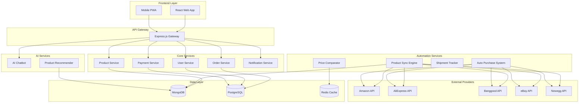
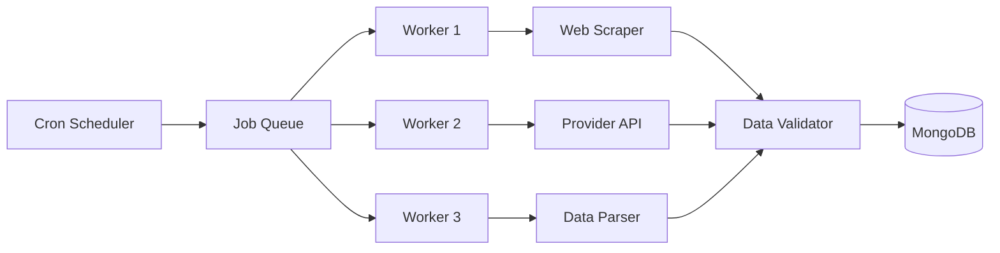
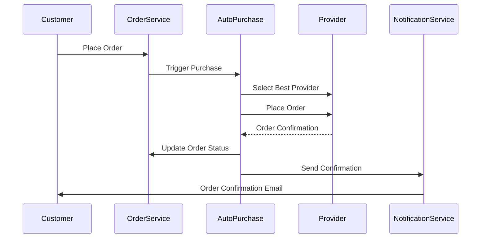

# Documento de Diseño - TechNovaStore

## Visión General

TechNovaStore es una plataforma de e-commerce automatizada construida con arquitectura de microservicios que integra múltiples proveedores externos para crear una experiencia de dropshipping completamente automatizada. El sistema utiliza tecnologías modernas como Node.js, React, MongoDB, PostgreSQL y Docker para proporcionar una solución escalable y mantenible.

## Arquitectura

### Arquitectura de Alto Nivel



### Patrones Arquitectónicos

- **Microservicios**: Cada dominio de negocio está separado en servicios independientes
- **API Gateway**: Punto único de entrada para todas las solicitudes del frontend
- **Event-Driven Architecture**: Comunicación asíncrona entre servicios usando eventos
- **CQRS (Command Query Responsibility Segregation)**: Separación de operaciones de lectura y escritura
- **Repository Pattern**: Abstracción de la capa de datos
- **Circuit Breaker**: Protección contra fallos en servicios externos

## Componentes y Interfaces

### 1. Frontend (React/Next.js)

**Componentes Principales:**
- `ProductCatalog`: Catálogo de productos con filtros y búsqueda
- `ProductDetail`: Página de detalle del producto con comparador de precios
- `ShoppingCart`: Carrito de compras con cálculo automático de precios
- `Checkout`: Proceso de compra con múltiples métodos de pago
- `OrderTracking`: Seguimiento de pedidos en tiempo real
- `ChatWidget`: Widget del chatbot integrado
- `UserDashboard`: Panel de usuario con historial de pedidos

**Tecnologías:**
- React 18 con Hooks y Context API
- Next.js para SSR y optimización SEO
- Tailwind CSS para diseño responsive
- React Query para gestión de estado del servidor
- Socket.io para actualizaciones en tiempo real

### 2. API Gateway (Express.js)

**Responsabilidades:**
- Enrutamiento de solicitudes a microservicios
- Autenticación y autorización JWT
- Rate limiting y throttling
- Logging y monitoreo
- Transformación de respuestas

**Endpoints Principales:**
```
GET /api/products - Listar productos
GET /api/products/:id - Detalle del producto
POST /api/orders - Crear pedido
GET /api/orders/:id/tracking - Seguimiento de pedido
POST /api/chat - Interacción con chatbot
GET /api/recommendations - Recomendaciones personalizadas
```

### 3. Product Service

**Funcionalidades:**
- Gestión del catálogo de productos
- Búsqueda y filtrado avanzado
- Gestión de categorías y etiquetas
- Integración con Product Sync Engine

**Base de Datos:** MongoDB
- Colección `products`: Información de productos
- Colección `categories`: Categorías y subcategorías
- Colección `product_history`: Historial de cambios de precios

### 4. Order Service

**Funcionalidades:**
- Procesamiento de pedidos
- Gestión de estados de pedido
- Integración con Auto Purchase System
- Generación de facturas

**Base de Datos:** PostgreSQL
- Tabla `orders`: Pedidos principales
- Tabla `order_items`: Items del pedido
- Tabla `invoices`: Facturas generadas
- Tabla `order_events`: Eventos del pedido

### 5. Product Sync Engine

**Arquitectura del Sincronizador:**


**Componentes:**
- `ProviderAdapter`: Adaptadores para cada proveedor
- `DataNormalizer`: Normalización de datos de productos
- `PriceCalculator`: Cálculo de precios con markup
- `InventoryManager`: Gestión de inventario
- `ConflictResolver`: Resolución de conflictos de datos

### 6. Auto Purchase System

**Flujo de Compra Automática:**


**Componentes:**
- `ProviderSelector`: Selección del mejor proveedor
- `OrderPlacer`: Colocación automática de pedidos
- `PaymentProcessor`: Procesamiento de pagos
- `ErrorHandler`: Manejo de errores y reintentos

### 7. AI Chatbot y Recommender

**Arquitectura de IA:**
- **NLP Engine**: Procesamiento de lenguaje natural usando spaCy
- **Intent Recognition**: Reconocimiento de intenciones del usuario
- **Knowledge Base**: Base de conocimientos de productos
- **Recommendation Engine**: Motor de recomendaciones usando collaborative filtering

**Algoritmos de Recomendación:**
- Content-based filtering para productos similares
- Collaborative filtering para recomendaciones personalizadas
- Hybrid approach combinando ambos métodos

## Modelos de Datos

### MongoDB (Productos y Catálogo)

```javascript
// Colección: products
{
  _id: ObjectId,
  sku: String,
  name: String,
  description: String,
  category: String,
  subcategory: String,
  brand: String,
  specifications: Object,
  images: [String],
  providers: [{
    name: String,
    price: Number,
    availability: Boolean,
    shipping_cost: Number,
    delivery_time: Number,
    last_updated: Date
  }],
  our_price: Number,
  markup_percentage: Number,
  is_active: Boolean,
  created_at: Date,
  updated_at: Date
}

// Colección: categories
{
  _id: ObjectId,
  name: String,
  slug: String,
  parent_id: ObjectId,
  description: String,
  image: String,
  is_active: Boolean
}
```

### PostgreSQL (Transacciones y Usuarios)

```sql
-- Tabla: users
CREATE TABLE users (
  id SERIAL PRIMARY KEY,
  email VARCHAR(255) UNIQUE NOT NULL,
  password_hash VARCHAR(255) NOT NULL,
  first_name VARCHAR(100),
  last_name VARCHAR(100),
  phone VARCHAR(20),
  address JSONB,
  is_active BOOLEAN DEFAULT true,
  created_at TIMESTAMP DEFAULT CURRENT_TIMESTAMP,
  updated_at TIMESTAMP DEFAULT CURRENT_TIMESTAMP
);

-- Tabla: orders
CREATE TABLE orders (
  id SERIAL PRIMARY KEY,
  user_id INTEGER REFERENCES users(id),
  order_number VARCHAR(50) UNIQUE NOT NULL,
  status VARCHAR(50) NOT NULL,
  total_amount DECIMAL(10,2) NOT NULL,
  shipping_address JSONB NOT NULL,
  billing_address JSONB NOT NULL,
  payment_method VARCHAR(50),
  payment_status VARCHAR(50),
  provider_order_id VARCHAR(100),
  tracking_number VARCHAR(100),
  estimated_delivery DATE,
  created_at TIMESTAMP DEFAULT CURRENT_TIMESTAMP,
  updated_at TIMESTAMP DEFAULT CURRENT_TIMESTAMP
);

-- Tabla: order_items
CREATE TABLE order_items (
  id SERIAL PRIMARY KEY,
  order_id INTEGER REFERENCES orders(id),
  product_sku VARCHAR(100) NOT NULL,
  product_name VARCHAR(255) NOT NULL,
  quantity INTEGER NOT NULL,
  unit_price DECIMAL(10,2) NOT NULL,
  total_price DECIMAL(10,2) NOT NULL,
  provider_name VARCHAR(100),
  provider_item_id VARCHAR(100)
);
```

## Manejo de Errores

### Estrategias de Resilencia

1. **Circuit Breaker Pattern**: Para APIs de proveedores externos
2. **Retry Logic**: Reintentos exponenciales con jitter
3. **Fallback Mechanisms**: Mecanismos de respaldo para servicios críticos
4. **Health Checks**: Monitoreo de salud de servicios
5. **Graceful Degradation**: Degradación elegante de funcionalidades

### Tipos de Errores y Respuestas

- **Provider API Failures**: Cambio automático a proveedor alternativo
- **Payment Processing Errors**: Notificación inmediata y reintento
- **Inventory Sync Errors**: Marcado temporal como no disponible
- **Shipping Tracking Errors**: Notificación al cliente con disculpas

## Estrategia de Testing

### Niveles de Testing

1. **Unit Tests**: Jest para lógica de negocio individual
2. **Integration Tests**: Supertest para APIs y servicios
3. **End-to-End Tests**: Playwright para flujos completos de usuario
4. **Load Tests**: Artillery para pruebas de carga
5. **Contract Tests**: Pact para contratos entre servicios

### Cobertura de Testing

- **Servicios Core**: 90% cobertura mínima
- **Automation Services**: 85% cobertura mínima
- **Frontend Components**: 80% cobertura mínima
- **API Endpoints**: 95% cobertura mínima

### Testing de Integración con Proveedores

- **Mock Servers**: Simulación de APIs de proveedores
- **Sandbox Environments**: Entornos de prueba de proveedores
- **Contract Testing**: Validación de contratos de API
- **Chaos Engineering**: Pruebas de fallos simulados

## Seguridad

### Medidas de Seguridad

1. **Autenticación**: JWT con refresh tokens
2. **Autorización**: RBAC (Role-Based Access Control)
3. **Encriptación**: TLS 1.3 para todas las comunicaciones
4. **Validación de Datos**: Sanitización y validación estricta
5. **Rate Limiting**: Protección contra ataques DDoS
6. **SQL Injection Prevention**: Uso de prepared statements
7. **XSS Protection**: Sanitización de contenido HTML
8. **CSRF Protection**: Tokens CSRF para formularios

### Compliance y Regulaciones

- **GDPR**: Cumplimiento de protección de datos europeos
- **PCI DSS**: Estándares de seguridad para pagos
- **LOPD**: Ley Orgánica de Protección de Datos española
- **Facturación Electrónica**: Cumplimiento fiscal español

## Despliegue y DevOps

### Containerización

```yaml
# docker-compose.yml estructura
version: '3.8'
services:
  api-gateway:
    build: ./api-gateway
    ports:
      - "3000:3000"
  
  product-service:
    build: ./services/product
    depends_on:
      - mongodb
  
  order-service:
    build: ./services/order
    depends_on:
      - postgresql
  
  sync-engine:
    build: ./services/sync
    depends_on:
      - mongodb
      - redis
  
  mongodb:
    image: mongo:6.0
    volumes:
      - mongo_data:/data/db
  
  postgresql:
    image: postgres:15
    volumes:
      - postgres_data:/var/lib/postgresql/data
  
  redis:
    image: redis:7-alpine
```

### CI/CD Pipeline

1. **Source Control**: Git con GitFlow branching strategy
2. **Build**: Docker multi-stage builds
3. **Testing**: Automated testing en cada commit
4. **Security Scanning**: Análisis de vulnerabilidades
5. **Deployment**: Blue-green deployment strategy
6. **Monitoring**: Prometheus + Grafana + ELK Stack

### Escalabilidad

- **Horizontal Scaling**: Auto-scaling basado en métricas
- **Load Balancing**: NGINX como load balancer
- **Database Sharding**: Particionamiento de datos por región
- **CDN**: CloudFlare para contenido estático
- **Caching**: Redis para cache distribuido