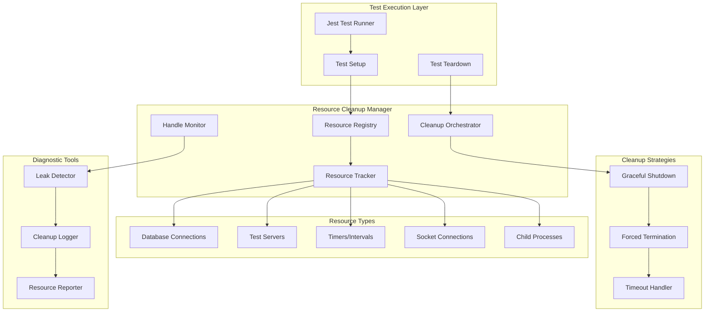
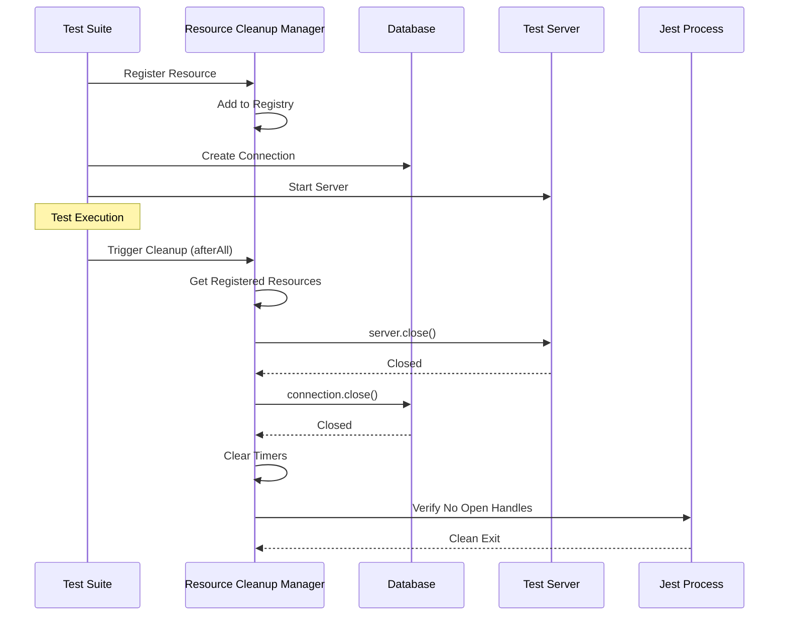

# Documento de Diseño - Limpieza de Recursos en Pruebas

## Visión General

El sistema de limpieza de recursos para pruebas implementa una arquitectura centralizada que gestiona automáticamente el ciclo de vida de todos los recursos utilizados durante la ejecución de pruebas. La solución aborda específicamente el problema intermitente de Jest donde los procesos no se cierran correctamente debido a recursos no liberados, especialmente en pruebas de integración.

## Arquitectura

### Arquitectura del Sistema de Limpieza



### Flujo de Limpieza de Recursos



## Componentes y Interfaces

### 1. Resource Cleanup Manager (Core)

**Archivo:** `shared/utils/test/resourceCleanupManager.ts`

```typescript
interface ResourceCleanupManager {
  // Registro de recursos
  registerResource(resource: CleanupResource): void;
  registerCleanupFunction(cleanup: CleanupFunction): void;
  
  // Limpieza
  cleanup(): Promise<void>;
  forceCleanup(): Promise<void>;
  
  // Monitoreo
  getActiveResources(): CleanupResource[];
  detectOpenHandles(): OpenHandle[];
  
  // Configuración
  setTimeout(timeout: number): void;
  setRetryAttempts(attempts: number): void;
}

interface CleanupResource {
  id: string;
  type: ResourceType;
  resource: any;
  cleanup: CleanupFunction;
  priority: number;
  timeout?: number;
}

type ResourceType = 'database' | 'server' | 'timer' | 'socket' | 'process' | 'custom';
type CleanupFunction = () => Promise<void> | void;
```

### 2. Database Connection Manager

**Archivo:** `shared/utils/test/databaseCleanup.ts`

```typescript
class DatabaseCleanupManager {
  private connections: Map<string, DatabaseConnection> = new Map();
  
  async registerConnection(name: string, connection: any, type: 'mongodb' | 'postgresql'): Promise<void> {
    this.connections.set(name, { connection, type, createdAt: Date.now() });
    
    // Registrar en el Resource Cleanup Manager
    resourceCleanupManager.registerResource({
      id: `db-${name}`,
      type: 'database',
      resource: connection,
      cleanup: () => this.closeConnection(name),
      priority: 1 // Alta prioridad para bases de datos
    });
  }
  
  async closeConnection(name: string): Promise<void> {
    const conn = this.connections.get(name);
    if (!conn) return;
    
    try {
      if (conn.type === 'mongodb') {
        await conn.connection.close();
      } else if (conn.type === 'postgresql') {
        await conn.connection.end();
      }
      this.connections.delete(name);
    } catch (error) {
      console.warn(`Failed to close ${conn.type} connection ${name}:`, error);
      // Forzar cierre si es necesario
      if (conn.connection.destroy) {
        conn.connection.destroy();
      }
    }
  }
  
  async closeAllConnections(): Promise<void> {
    const closePromises = Array.from(this.connections.keys()).map(name => 
      this.closeConnection(name)
    );
    await Promise.allSettled(closePromises);
  }
}
```

### 3. Test Server Manager

**Archivo:** `shared/utils/test/serverCleanup.ts`

```typescript
class TestServerManager {
  private servers: Map<string, ServerInstance> = new Map();
  
  async startServer(name: string, app: any, port?: number): Promise<ServerInstance> {
    const server = app.listen(port || 0);
    const actualPort = server.address()?.port;
    
    const serverInstance: ServerInstance = {
      server,
      port: actualPort,
      startedAt: Date.now()
    };
    
    this.servers.set(name, serverInstance);
    
    // Registrar para limpieza automática
    resourceCleanupManager.registerResource({
      id: `server-${name}`,
      type: 'server',
      resource: server,
      cleanup: () => this.stopServer(name),
      priority: 2,
      timeout: 5000 // 5 segundos para cierre graceful
    });
    
    return serverInstance;
  }
  
  async stopServer(name: string): Promise<void> {
    const serverInstance = this.servers.get(name);
    if (!serverInstance) return;
    
    return new Promise((resolve, reject) => {
      const timeout = setTimeout(() => {
        // Forzar cierre si no responde
        serverInstance.server.destroy();
        reject(new Error(`Server ${name} forced to close after timeout`));
      }, 5000);
      
      serverInstance.server.close((error) => {
        clearTimeout(timeout);
        if (error) {
          reject(error);
        } else {
          this.servers.delete(name);
          resolve();
        }
      });
    });
  }
}
```

### 4. Timer Cleanup Manager

**Archivo:** `shared/utils/test/timerCleanup.ts`

```typescript
class TimerCleanupManager {
  private timers: Set<NodeJS.Timeout | NodeJS.Timer> = new Set();
  private intervals: Set<NodeJS.Timeout | NodeJS.Timer> = new Set();
  
  // Wrapper para setTimeout que se auto-registra
  setTimeout(callback: () => void, delay: number): NodeJS.Timeout {
    const timer = setTimeout(() => {
      this.timers.delete(timer);
      callback();
    }, delay);
    
    this.timers.add(timer);
    return timer;
  }
  
  // Wrapper para setInterval que se auto-registra
  setInterval(callback: () => void, delay: number): NodeJS.Timer {
    const interval = setInterval(callback, delay);
    this.intervals.add(interval);
    return interval;
  }
  
  clearAllTimers(): void {
    // Limpiar timeouts
    this.timers.forEach(timer => {
      clearTimeout(timer);
    });
    this.timers.clear();
    
    // Limpiar intervals
    this.intervals.forEach(interval => {
      clearInterval(interval);
    });
    this.intervals.clear();
  }
  
  getActiveTimersCount(): number {
    return this.timers.size + this.intervals.size;
  }
}
```

### 5. Open Handle Detector

**Archivo:** `shared/utils/test/handleDetector.ts`

```typescript
class OpenHandleDetector {
  private baselineHandles: any[] = [];
  
  captureBaseline(): void {
    // Capturar handles activos al inicio
    this.baselineHandles = this.getActiveHandles();
  }
  
  detectLeaks(): OpenHandleLeak[] {
    const currentHandles = this.getActiveHandles();
    const leaks: OpenHandleLeak[] = [];
    
    currentHandles.forEach(handle => {
      if (!this.isInBaseline(handle)) {
        leaks.push({
          type: this.getHandleType(handle),
          description: this.getHandleDescription(handle),
          stack: this.getCreationStack(handle)
        });
      }
    });
    
    return leaks;
  }
  
  private getActiveHandles(): any[] {
    // Usar API interna de Node.js para detectar handles
    return (process as any)._getActiveHandles?.() || [];
  }
  
  private getHandleType(handle: any): string {
    if (handle.constructor) {
      return handle.constructor.name;
    }
    return 'Unknown';
  }
  
  private getHandleDescription(handle: any): string {
    // Intentar extraer información útil del handle
    if (handle.address) {
      return `${handle.constructor.name} on ${handle.address().address}:${handle.address().port}`;
    }
    if (handle.path) {
      return `${handle.constructor.name} at ${handle.path}`;
    }
    return handle.constructor.name || 'Unknown Handle';
  }
}
```

## Modelos de Datos

### Configuración de Limpieza

```typescript
interface CleanupConfig {
  // Timeouts
  gracefulTimeout: number; // 5000ms por defecto
  forceTimeout: number;    // 10000ms por defecto
  
  // Reintentos
  maxRetries: number;      // 3 por defecto
  retryDelay: number;      // 1000ms por defecto
  
  // Logging
  logLevel: 'error' | 'warn' | 'info' | 'debug';
  logToFile: boolean;
  logFilePath?: string;
  
  // Detección de handles
  detectHandles: boolean;
  handleDetectionTimeout: number; // 2000ms por defecto
  
  // Estrategias específicas
  databaseStrategy: 'graceful' | 'force' | 'hybrid';
  serverStrategy: 'graceful' | 'force' | 'hybrid';
}
```

### Reporte de Limpieza

```typescript
interface CleanupReport {
  startTime: number;
  endTime: number;
  duration: number;
  
  resources: {
    total: number;
    cleaned: number;
    failed: number;
    forced: number;
  };
  
  byType: Record<ResourceType, {
    count: number;
    success: number;
    failed: number;
    avgTime: number;
  }>;
  
  errors: CleanupError[];
  warnings: string[];
  
  openHandles: {
    before: number;
    after: number;
    leaks: OpenHandleLeak[];
  };
}
```

## Manejo de Errores

### Estrategias de Recuperación

1. **Graceful First**: Intentar cierre elegante primero
2. **Force on Timeout**: Forzar cierre si excede timeout
3. **Continue on Error**: No detener limpieza por un error
4. **Comprehensive Logging**: Registrar todos los errores para diagnóstico

### Tipos de Errores y Respuestas

```typescript
enum CleanupErrorType {
  TIMEOUT = 'TIMEOUT',
  CONNECTION_REFUSED = 'CONNECTION_REFUSED',
  RESOURCE_BUSY = 'RESOURCE_BUSY',
  PERMISSION_DENIED = 'PERMISSION_DENIED',
  UNKNOWN = 'UNKNOWN'
}

class CleanupError extends Error {
  constructor(
    public type: CleanupErrorType,
    public resourceId: string,
    public resourceType: ResourceType,
    message: string,
    public originalError?: Error
  ) {
    super(message);
  }
}
```

## Estrategia de Testing

### Setup de Pruebas Mejorado

```typescript
// shared/utils/test/testSetup.ts
export async function setupIntegrationTest(): Promise<TestContext> {
  // Capturar baseline de handles
  openHandleDetector.captureBaseline();
  
  // Configurar limpieza automática
  resourceCleanupManager.setTimeout(10000);
  
  // Registrar limpieza global
  afterAll(async () => {
    await resourceCleanupManager.cleanup();
    
    // Verificar handles después de limpieza
    const leaks = openHandleDetector.detectLeaks();
    if (leaks.length > 0) {
      console.warn('Resource leaks detected:', leaks);
    }
  });
  
  return {
    dbManager: new DatabaseCleanupManager(),
    serverManager: new TestServerManager(),
    timerManager: new TimerCleanupManager()
  };
}
```

### Utilidades de Testing

```typescript
// shared/utils/test/testUtils.ts
export function createTestDatabase(): Promise<DatabaseConnection> {
  // Crear conexión de prueba con limpieza automática
}

export function createTestServer(app: any): Promise<ServerInstance> {
  // Crear servidor de prueba con limpieza automática
}

export function withTimeout<T>(promise: Promise<T>, timeout: number): Promise<T> {
  // Wrapper con timeout automático
}
```

## Integración con Jest

### Configuración de Jest

```javascript
// jest.config.js
module.exports = {
  // Configuración existente...
  
  // Setup files
  setupFilesAfterEnv: [
    '<rootDir>/shared/utils/test/jestSetup.ts'
  ],
  
  // Detectar handles abiertos en CI
  detectOpenHandles: process.env.CI === 'true',
  
  // Timeout global aumentado para permitir limpieza
  testTimeout: 30000,
  
  // Forzar salida después de limpieza
  forceExit: false // Dejar que nuestro sistema maneje la limpieza
};
```

### Jest Setup Global

```typescript
// shared/utils/test/jestSetup.ts
import { resourceCleanupManager } from './resourceCleanupManager';

// Configurar limpieza global para todos los tests
beforeAll(() => {
  // Configuración inicial
  resourceCleanupManager.setTimeout(10000);
});

afterAll(async () => {
  // Limpieza final
  await resourceCleanupManager.cleanup();
});

// Manejo de errores no capturados
process.on('unhandledRejection', (reason, promise) => {
  console.error('Unhandled Rejection at:', promise, 'reason:', reason);
});

process.on('uncaughtException', (error) => {
  console.error('Uncaught Exception:', error);
});
```

## Monitoreo y Diagnóstico

### Logging Estructurado

```typescript
interface CleanupLogEntry {
  timestamp: number;
  level: 'info' | 'warn' | 'error';
  resourceId: string;
  resourceType: ResourceType;
  action: 'register' | 'cleanup' | 'force' | 'error';
  duration?: number;
  error?: string;
  metadata?: Record<string, any>;
}
```

### Métricas de Rendimiento

- Tiempo promedio de limpieza por tipo de recurso
- Tasa de éxito de limpieza graceful vs forzada
- Número de handles abiertos por suite de pruebas
- Tiempo total de ejecución de pruebas antes/después de la mejora

### Herramientas de Diagnóstico

1. **Resource Inspector**: Herramienta CLI para inspeccionar recursos activos
2. **Cleanup Reporter**: Generador de reportes de limpieza
3. **Handle Analyzer**: Analizador de handles abiertos con stack traces
4. **Performance Profiler**: Perfilador de rendimiento de limpieza

## Despliegue y Configuración

### Variables de Entorno

```bash
# Configuración de limpieza de recursos
TEST_CLEANUP_TIMEOUT=10000
TEST_CLEANUP_LOG_LEVEL=info
TEST_CLEANUP_DETECT_HANDLES=true
TEST_CLEANUP_FORCE_EXIT=false

# Configuración específica para CI
CI_CLEANUP_TIMEOUT=15000
CI_CLEANUP_LOG_TO_FILE=true
CI_CLEANUP_STRICT_MODE=true
```

### Configuración por Entorno

```typescript
// config/test.ts
export const testConfig = {
  cleanup: {
    timeout: parseInt(process.env.TEST_CLEANUP_TIMEOUT || '10000'),
    logLevel: process.env.TEST_CLEANUP_LOG_LEVEL || 'info',
    detectHandles: process.env.TEST_CLEANUP_DETECT_HANDLES === 'true',
    strictMode: process.env.CI === 'true'
  }
};
```

Esta arquitectura proporciona una solución robusta y sistemática para el problema de limpieza de recursos en Jest, abordando específicamente los casos que mencionaste como las conexiones de base de datos, servidores de prueba y temporizadores.