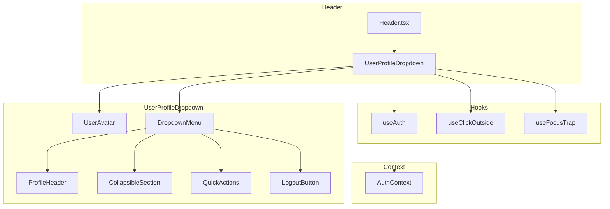
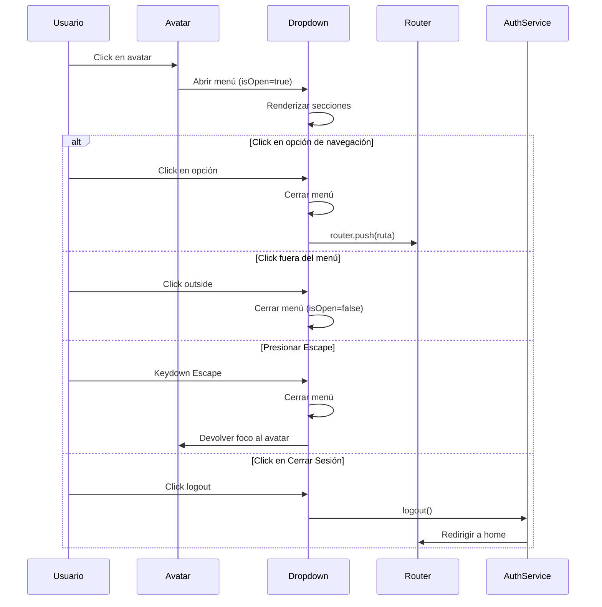

# Documento de Diseño - Menú Desplegable de Perfil de Usuario

> **⚠️ IMPORTANTE**: Antes de implementar cualquier tarea, SIEMPRE leer el archivo `Header.tsx` actual completo (`domains/platform/frontend/src/shared/components/layout/Header.tsx`) para entender la estructura existente y no romper funcionalidades. El Header ya tiene lógica de autenticación, carrito, notificaciones y menú móvil que debe mantenerse intacta.

## Overview

Este documento describe el diseño técnico para implementar un menú desplegable moderno de perfil de usuario en el Header de TechNovaStore. El componente se inspira en la experiencia de usuario de Google (avatar con iniciales, diseño limpio) y PCComponentes (secciones organizadas por categoría), adaptado al estilo visual de la plataforma.

El componente `UserProfileDropdown` reemplazará el enlace directo actual al dashboard de usuario, proporcionando acceso rápido a las funcionalidades más utilizadas sin necesidad de navegar al dashboard completo.

## Architecture

### Diagrama de Componentes



### Flujo de Interacción



## Components and Interfaces

### 1. UserProfileDropdown (Componente Principal)

```typescript
// Ubicación: domains/platform/frontend/src/shared/components/layout/UserProfileDropdown.tsx

interface UserProfileDropdownProps {
  /** Clase CSS adicional para el contenedor */
  className?: string;
}

// Estado interno del componente
interface DropdownState {
  isOpen: boolean;
  expandedSections: Set<string>;
}
```

### 2. UserAvatar (Subcomponente)

```typescript
// Componente interno de UserProfileDropdown

interface UserAvatarProps {
  user: User;
  size: 'sm' | 'md' | 'lg'; // sm=32px, md=40px, lg=64px
  onClick?: () => void;
  className?: string;
}
```

### 3. CollapsibleSection (Subcomponente)

```typescript
// Componente para secciones expandibles/colapsables

interface CollapsibleSectionProps {
  id: string;
  title: string;
  icon: React.ReactNode;
  isExpanded: boolean;
  onToggle: (id: string) => void;
  children: React.ReactNode;
}
```

### 4. MenuOption (Subcomponente)

```typescript
// Componente para cada opción del menú

interface MenuOptionProps {
  label: string;
  href?: string;
  onClick?: () => void;
  icon?: React.ReactNode;
  badge?: number | string;
  className?: string;
}
```

### 5. Configuración de Secciones

```typescript
// Configuración de las secciones del menú

interface MenuSection {
  id: string;
  title: string;
  icon: string; // Nombre del icono de Lucide
  defaultExpanded: boolean;
  options: MenuOption[];
}

interface MenuOption {
  label: string;
  href: string;
  icon?: string;
  badge?: 'notifications' | 'orders'; // Tipo de badge dinámico
}

// Configuración estática de secciones
const MENU_SECTIONS: MenuSection[] = [
  {
    id: 'orders',
    title: 'Pedidos y Devoluciones',
    icon: 'Package',
    defaultExpanded: true,
    options: [
      { label: 'Pedidos, devoluciones y facturas', href: '/dashboard/usuario/pedidos' },
      { label: 'Pedidos cancelados', href: '/dashboard/usuario/pedidos?estado=cancelado' },
      { label: 'Historial de devoluciones', href: '/dashboard/usuario/devoluciones' },
    ]
  },
  {
    id: 'account',
    title: 'Mi Cuenta',
    icon: 'User',
    defaultExpanded: false,
    options: [
      { label: 'Mis datos', href: '/dashboard/usuario/perfil' },
      { label: 'Mis direcciones', href: '/dashboard/usuario/direcciones' },
      { label: 'Mis suscripciones', href: '/dashboard/usuario/suscripciones' },
      { label: 'Mis documentos', href: '/dashboard/usuario/documentos' },
      { label: 'Lista de deseos', href: '/dashboard/usuario/lista-deseos' },
      { label: 'Mis configuraciones', href: '/dashboard/usuario/configuracion' },
      { label: 'Mensajes', href: '/dashboard/usuario/mensajes' },
      { label: 'Opiniones', href: '/dashboard/usuario/opiniones' },
    ]
  },
  {
    id: 'payment',
    title: 'Pago',
    icon: 'CreditCard',
    defaultExpanded: false,
    options: [
      { label: 'Métodos de pago', href: '/dashboard/usuario/metodos-pago' },
      { label: 'Historial de pagos', href: '/dashboard/usuario/historial-pagos' },
    ]
  },
  {
    id: 'help',
    title: '¿Necesitas ayuda?',
    icon: 'HelpCircle',
    defaultExpanded: false,
    options: [
      { label: 'Centro de ayuda', href: '/soporte' },
      { label: 'Mis tickets', href: '/dashboard/usuario/tickets' },
      { label: 'Contactar soporte', href: '#chat', icon: 'MessageCircle' },
      { label: 'Preguntas frecuentes', href: '/faq' },
    ]
  }
];
```

## Data Models

### User (del contexto de autenticación)

```typescript
// Ya definido en: domains/platform/frontend/src/features/customer/types/auth.types.ts

interface User {
  id: string;
  email: string;
  firstName: string;
  lastName: string;
  phone?: string;
  avatar?: string; // URL de la foto de perfil (Google OAuth)
  role: 'user' | 'admin';
  emailVerified: boolean;
  createdAt: Date;
  updatedAt: Date;
  authMethods: AuthMethod[];
}
```

### Funciones de Utilidad

```typescript
/**
 * Genera las iniciales del usuario a partir de su nombre
 * @param firstName - Nombre del usuario
 * @param lastName - Apellido del usuario
 * @returns Iniciales en mayúsculas (máximo 2 caracteres)
 */
function getUserInitials(firstName: string, lastName: string): string {
  const firstInitial = firstName?.charAt(0)?.toUpperCase() || '';
  const lastInitial = lastName?.charAt(0)?.toUpperCase() || '';
  return `${firstInitial}${lastInitial}`;
}

/**
 * Genera un color de fondo consistente basado en el nombre del usuario
 * @param name - Nombre completo del usuario
 * @returns Clase de Tailwind para el color de fondo
 */
function getAvatarColor(name: string): string {
  const colors = [
    'bg-primary-500',
    'bg-emerald-500',
    'bg-amber-500',
    'bg-rose-500',
    'bg-violet-500',
    'bg-cyan-500',
  ];
  const hash = name.split('').reduce((acc, char) => acc + char.charCodeAt(0), 0);
  return colors[hash % colors.length];
}
```

## Error Handling

### Errores de Autenticación

| Error | Causa | Manejo |
|-------|-------|--------|
| Usuario no autenticado | Token expirado o inválido | Mostrar botón "Iniciar Sesión" en lugar del dropdown |
| Error al cerrar sesión | Fallo de red o servidor | Mostrar toast de error, permitir reintentar |
| Datos de usuario incompletos | API retorna datos parciales | Usar valores por defecto para campos faltantes |

### Errores de Navegación

| Error | Causa | Manejo |
|-------|-------|--------|
| Ruta no encontrada | Página no existe | Redirigir a 404 con mensaje amigable |
| Error de red | Sin conexión | Mostrar toast de error de conexión |

### Valores por Defecto

```typescript
const DEFAULT_USER_VALUES = {
  firstName: 'Usuario',
  lastName: '',
  email: '',
  avatar: undefined,
};
```


