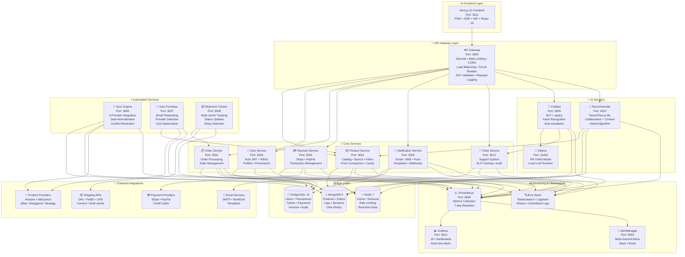

<div align="center">

# 🚀 TechNovaStore

### Plataforma E-commerce Enterprise de Nueva Generación con IA, Microservicios y Automatización Total

[](https://www.typescriptlang.org/)
[](https://nextjs.org/)
[](https://nodejs.org/)
[](https://www.docker.com/)
[](https://www.mongodb.com/)
[](https://www.postgresql.org/)
[](https://redis.io/)
[](https://prometheus.io/)
[](https://grafana.com/)
[](https://ollama.ai/)

*La solución e-commerce más completa y avanzada del mercado: 13 microservicios, IA conversacional con Phi-3, automatización inteligente, observabilidad 360° y arquitectura cloud-native lista para escalar*

[🌟 Características](#-características-principales) • [🏗️ Arquitectura](#️-arquitectura-del-sistema) • [🚀 Inicio Rápido](#-inicio-rápido-3-pasos) • [📚 Documentación](#-documentación-completa) • [🤖 IA](#-inteligencia-artificial-integrada)

---

</div>

## 📋 Tabla de Contenidos

- [✨ Características Principales](#-características-principales)
- [🏗️ Arquitectura del Sistema](#️-arquitectura-del-sistema)
- [🚀 Inicio Rápido (3 Pasos)](#-inicio-rápido-3-pasos)
- [🐳 Docker & Perfiles de Despliegue](#-docker--perfiles-de-despliegue)
- [🎯 Servicios Disponibles](#-servicios-disponibles)
- [🤖 Inteligencia Artificial Integrada](#-inteligencia-artificial-integrada)
- [⚡ Automatización Enterprise](#-automatización-enterprise)
- [📊 Monitoreo y Observabilidad](#-monitoreo-y-observabilidad)
- [🔒 Seguridad Avanzada](#-seguridad-avanzada)
- [🧪 Testing Completo](#-testing-completo)
- [📈 Escalabilidad y Performance](#-escalabilidad-y-performance)
- [🚀 Despliegue en Producción](#-despliegue-en-producción)
- [📚 Documentación Completa](#-documentación-completa)
- [🤝 Contribuir](#-contribuir)
- [📄 Licencia](#-licencia)

---

## ✨ Características Principales

### 🛍️ **E-commerce Completo y Profesional**


- 🏪 **Catálogo Inteligente** - Gestión avanzada de productos con sincronización automática desde múltiples proveedores (Amazon, AliExpress, eBay, Banggood, Newegg)
- 🔍 **Búsqueda Semántica** - Motor de búsqueda con NLP en español, filtros dinámicos y autocompletado inteligente
- 🛒 **Carrito Persistente** - Experiencia fluida con sincronización multi-dispositivo y recuperación de sesión
- 💳 **Pagos Seguros** - Integración completa con Stripe, PayPal y múltiples proveedores de pago
- 📦 **Gestión de Pedidos** - Seguimiento completo del ciclo de vida con estados en tiempo real y notificaciones automáticas
- 👥 **Sistema de Usuarios Avanzado** - Autenticación JWT con refresh tokens, RBAC granular, recuperación de contraseña y perfiles completos
- 🎫 **Sistema de Tickets Profesional** - Soporte al cliente integrado con categorización automática, priorización inteligente y métricas SLA
- 📧 **Notificaciones Multi-canal** - Email, SMS, push notifications y webhooks con templates personalizables
- 🧾 **Facturación Automática** - Generación de facturas conforme a normativa española con cálculo automático de impuestos

### 🤖 **Inteligencia Artificial de Última Generación**

- 💬 **Chatbot Conversacional Avanzado** - Asistente virtual con Ollama/Phi-3 Mini, procesamiento NLP con spaCy en español
- 🎯 **Sistema de Recomendaciones ML** - Algoritmos híbridos (collaborative + content-based) con TensorFlow.js
- 📊 **Análisis Predictivo** - Predicción de demanda, comportamiento de usuarios y tendencias de mercado
- 🔍 **Procesamiento de Lenguaje Natural** - Reconocimiento de intenciones, extracción de entidades y análisis de sentimientos
- 🎫 **Escalación Inteligente** - Conversión automática de conversaciones a tickets de soporte cuando se detecta frustración
- 📈 **Métricas de Satisfacción** - Análisis automático de feedback y encuestas de satisfacción del cliente
- 🧠 **Aprendizaje Continuo** - Sistema que mejora con cada interacción y aprende de patrones de usuario


### ⚡ **Automatización Enterprise de Alto Nivel**

- 🔄 **Sync Engine** - Sincronización automática con 5 proveedores externos, normalización de datos y resolución de conflictos
- 🛒 **Auto Purchase System** - Reabastecimiento inteligente con selección automática del mejor proveedor basado en precio, tiempo de entrega y confiabilidad
- 📦 **Shipment Tracker** - Seguimiento multi-proveedor (DHL, FedEx, UPS, Correos) con actualizaciones cada 6 horas
- 📊 **Reportes Automáticos** - Generación y envío programado de reportes de negocio, ventas y performance
- 🔔 **Alertas Proactivas** - Sistema de notificaciones inteligentes basado en eventos y umbrales configurables
- 💰 **Precios Dinámicos** - Ajuste automático de precios basado en competencia, demanda y márgenes objetivo
- 📈 **Análisis de Tendencias** - Detección automática de productos populares y oportunidades de mercado

### 🏗️ **Arquitectura Moderna y Escalable**

- 🔧 **13 Microservicios Independientes** - Arquitectura distribuida con alta escalabilidad y mantenibilidad
- 🐳 **Containerización Total** - Docker y Docker Compose con 4 perfiles optimizados (core, ai, automation, monitoring)
- 🌐 **API Gateway Inteligente** - Punto único de entrada con seguridad, rate limiting, CORS, circuit breaker y load balancing
- 📊 **Observabilidad Completa** - Prometheus + Grafana + ELK Stack con dashboards personalizados y alertas en tiempo real
- 🔄 **CI/CD Automatizado** - GitHub Actions con testing automático, builds y despliegue multi-entorno
- ☁️ **Multi-Cloud Ready** - Preparado para AWS, Azure, GCP con Kubernetes y Docker Swarm
- 🔀 **Load Balancing** - NGINX con balanceo de carga y SSL termination
- 📦 **Monorepo Optimizado** - Workspaces de npm con shared packages y build optimizado


### 🔒 **Seguridad Enterprise de Nivel Bancario**

- 🛡️ **Autenticación Avanzada** - JWT con refresh tokens, rotación automática, device tracking y revocación de sesiones
- 👮 **RBAC Completo** - Sistema de roles y permisos granular con jerarquía (Customer, Admin, Super Admin)
- 🔐 **Encriptación Total** - Datos en reposo y en tránsito con TLS 1.3, bcrypt para passwords (12 salt rounds)
- 🚦 **Rate Limiting Inteligente** - Protección multi-nivel contra DDoS, brute force y abuso de API
- 📋 **Auditoría Completa** - Logging estructurado de todas las operaciones críticas con trazabilidad total
- 🔍 **Vulnerability Scanning** - Escaneo automático con Trivy en CI/CD y npm audit
- 🛡️ **Protección XSS/CSRF** - Sanitización de inputs, CSP headers, CSRF tokens y validación estricta
- 🔒 **Compliance GDPR/LOPD** - Consentimiento de cookies, exportación y eliminación de datos personales

### 📊 **Monitoreo y Observabilidad 360°**

- 📈 **Prometheus** - Recolección de métricas de todos los servicios con retención de 7 días
- 📊 **Grafana** - 10+ dashboards personalizados con alertas configurables
- 🔍 **ELK Stack** - Elasticsearch + Logstash + Kibana para logging centralizado y búsqueda
- 🚨 **AlertManager** - Sistema de alertas con múltiples canales (Slack, Email, Webhooks)
- 📉 **Exporters** - MongoDB, PostgreSQL, Redis y Node exporters para métricas detalladas
- 🏥 **Health Checks** - Endpoints de salud en todos los servicios con dependencias
- 📊 **Business Metrics** - Métricas de negocio (ventas, conversión, satisfacción) en tiempo real
- 🔔 **Alertas Inteligentes** - Detección automática de anomalías y degradación de performance


### 🧪 **Testing Completo y Profesional**

- ✅ **Unit Tests** - Jest con cobertura >80% en todos los servicios
- 🔄 **Integration Tests** - Tests de integración entre servicios
- 🎭 **E2E Tests** - Playwright para flujos críticos de usuario
- 🚀 **Load Tests** - Artillery para tests de carga y stress
- 📸 **Visual Regression** - Tests de regresión visual automáticos
- ♿ **Accessibility Tests** - Validación WCAG 2.1 AA automática
- 🔒 **Security Tests** - Tests de seguridad y penetración automatizados
- 📊 **Performance Tests** - Benchmarks y métricas de performance

---

## 🏗️ Arquitectura del Sistema

### 📐 Diagrama de Arquitectura Completo




### 🔧 Stack Tecnológico Completo

| Categoría | Tecnologías | Versión | Propósito |
|-----------|-------------|---------|-----------|
| **Frontend** | Next.js, React, TypeScript, Tailwind CSS | 15.x / 18.x / 5.x | UI/UX Moderno con SSR/ISR |
| **Backend** | Node.js, Express, TypeScript | 18+ / 4.x / 5.x | Microservicios RESTful |
| **Bases de Datos** | MongoDB, PostgreSQL, Redis | 6.x / 15.x / 7.x | Persistencia Multi-modelo |
| **IA/ML** | Ollama (Phi-3), spaCy, TensorFlow.js, Natural | Latest | Inteligencia Artificial |
| **Contenedores** | Docker, Docker Compose | 24+ / 2.20+ | Containerización |
| **Orquestación** | Kubernetes, Docker Swarm | Latest | Orquestación de Contenedores |
| **Monitoreo** | Prometheus, Grafana, ELK Stack | Latest | Observabilidad 360° |
| **Testing** | Jest, Playwright, Artillery | Latest | Testing Completo |
| **Seguridad** | Helmet, JWT, bcrypt, CORS, Trivy | Latest | Seguridad Multicapa |
| **CI/CD** | GitHub Actions, Docker Hub | Latest | Automatización DevOps |
| **Cloud** | AWS, Azure, GCP Ready | Multi | Despliegue Flexible |
| **Comunicación** | Socket.io, WebSockets | Latest | Real-time Communication |
| **Validación** | Joi, express-validator, DOMPurify | Latest | Validación y Sanitización |
| **ORM/ODM** | Sequelize, Mongoose | Latest | Database Abstraction |
| **Cache** | Redis Cluster, Redis Sentinel | 7.x | Distributed Caching |
| **Load Balancer** | NGINX | Latest | Load Balancing & SSL |
| **Message Queue** | Bull (Redis-based) | Latest | Job Queue Management |

---


## 🚀 Inicio Rápido (3 Pasos)

### 📋 Prerrequisitos

```bash
# Verificar versiones mínimas requeridas
node --version    # >= 18.0.0
npm --version     # >= 9.0.0
docker --version  # >= 24.0.0
docker-compose --version # >= 2.20.0

# Recursos recomendados del sistema
# RAM: 16GB (mínimo 8GB)
# CPU: 4 cores (recomendado 8+)
# Disco: 50GB libres
```

### ⚡ Instalación Ultra-Rápida

```bash
# 1️⃣ Clonar el repositorio
git clone https://github.com/tu-usuario/technovastore.git
cd technovastore

# 2️⃣ Instalar todas las dependencias (Windows)
.\install-all.ps1

# 2️⃣ Instalar todas las dependencias (Linux/Mac)
chmod +x install-deps.sh
./install-deps.sh

# 3️⃣ Iniciar todos los servicios (Perfil completo)
docker-compose -f docker-compose.optimized.yml --profile all up -d

# O iniciar solo servicios core (más ligero)
docker-compose -f docker-compose.optimized.yml --profile core up -d
```

### ✅ Verificar Instalación

```bash
# Windows
.\verify-installation.ps1

# Linux/Mac
chmod +x verify-services.sh
./verify-services.sh

# O verificar manualmente
curl http://localhost:3000/health
curl http://localhost:3011
```


### 🎯 Acceso a Servicios

| Servicio | URL | Credenciales | Descripción |
|----------|-----|--------------|-------------|
| **🌐 Frontend** | http://localhost:3011 | - | Aplicación Web Principal |
| **🚪 API Gateway** | http://localhost:3000 | - | API REST Principal |
| **📚 API Docs** | http://localhost:3000/docs | - | Swagger UI Interactivo |
| **📊 Grafana** | http://localhost:3013 | admin / REDACTED_GRAFANA_PASSWORD | Dashboards y Métricas |
| **📈 Prometheus** | http://localhost:9090 | - | Métricas Raw |
| **🔍 Kibana** | http://localhost:5601 | - | Logs Centralizados |
| **🚨 AlertManager** | http://localhost:9093 | - | Gestión de Alertas |
| **🤖 Chatbot** | http://localhost:3009 | - | IA Assistant API |
| **🎯 Recommender** | http://localhost:3010 | - | ML Recommendations API |
| **🧠 Ollama** | http://localhost:11434 | - | LLM Local Runtime |

---

## 🐳 Docker & Perfiles de Despliegue

TechNovaStore utiliza **Docker Compose con perfiles** para despliegues flexibles y optimizados según tus necesidades.

### 📦 Perfiles Disponibles

#### 1️⃣ **Profile: `core`** (Servicios Esenciales)
```bash
docker-compose -f docker-compose.optimized.yml --profile core up -d
```
**Incluye:**
- ✅ Bases de datos (MongoDB, PostgreSQL, Redis)
- ✅ API Gateway
- ✅ Servicios core (Product, User, Order, Payment, Notification, Ticket)
- ✅ Frontend

**Recursos:** ~4GB RAM | Ideal para desarrollo


#### 2️⃣ **Profile: `ai`** (Inteligencia Artificial)
```bash
docker-compose -f docker-compose.optimized.yml --profile ai up -d
```
**Incluye:**
- ✅ Ollama con modelo Phi-3 Mini
- ✅ Chatbot con NLP en español
- ✅ Sistema de recomendaciones ML

**Recursos:** ~5GB RAM | Requiere profile `core` activo

#### 3️⃣ **Profile: `automation`** (Automatización)
```bash
docker-compose -f docker-compose.optimized.yml --profile automation up -d
```
**Incluye:**
- ✅ Sync Engine (sincronización de proveedores)
- ✅ Auto Purchase (compra automática)
- ✅ Shipment Tracker (seguimiento de envíos)

**Recursos:** ~2GB RAM | Requiere profile `core` activo

#### 4️⃣ **Profile: `monitoring`** (Monitoreo)
```bash
docker-compose -f docker-compose.optimized.yml --profile monitoring up -d
```
**Incluye:**
- ✅ Prometheus (métricas)
- ✅ Grafana (dashboards)
- ✅ AlertManager (alertas)

**Recursos:** ~1GB RAM

#### 5️⃣ **Profile: `logging`** (Logging Centralizado - Opcional)
```bash
docker-compose -f docker-compose.optimized.yml --profile logging up -d
```
**Incluye:**
- ✅ Elasticsearch
- ✅ Logstash
- ✅ Kibana

**Recursos:** ~2GB RAM | Opcional para desarrollo


#### 6️⃣ **Profile: `exporters`** (Exporters de Métricas - Opcional)
```bash
docker-compose -f docker-compose.optimized.yml --profile exporters up -d
```
**Incluye:**
- ✅ MongoDB Exporter
- ✅ PostgreSQL Exporter
- ✅ Redis Exporter
- ✅ Node Exporter

**Recursos:** ~500MB RAM

#### 🎯 **Profile: `all`** (Stack Completo)
```bash
docker-compose -f docker-compose.optimized.yml --profile all up -d
```
**Incluye:** Todos los servicios (core + ai + automation + monitoring)

**Recursos:** ~12GB RAM | Producción completa

### 🔄 Comandos Útiles

```bash
# Ver servicios activos
docker-compose -f docker-compose.optimized.yml ps

# Ver logs en tiempo real
docker-compose -f docker-compose.optimized.yml logs -f

# Ver logs de un servicio específico
docker-compose -f docker-compose.optimized.yml logs -f api-gateway

# Detener todos los servicios
docker-compose -f docker-compose.optimized.yml down

# Detener y eliminar volúmenes (⚠️ borra datos)
docker-compose -f docker-compose.optimized.yml down -v

# Reconstruir servicios
docker-compose -f docker-compose.optimized.yml build

# Escalar un servicio
docker-compose -f docker-compose.optimized.yml up -d --scale product-service=3
```

---


## 🎯 Servicios Disponibles

### 🌐 Frontend Service
**Puerto:** 3011 | **Tech:** Next.js 15 + React 18 + TypeScript + Tailwind CSS

- ✨ Server-Side Rendering (SSR) y Static Site Generation (SSG)
- 🎨 Diseño responsive y mobile-first
- ♿ Accesibilidad WCAG 2.1 AA
- 🚀 Progressive Web App (PWA)
- 🔄 Real-time updates con WebSockets
- 📱 Optimizado para móviles y tablets

### 🚪 API Gateway
**Puerto:** 3000 | **Tech:** Express.js + TypeScript

- 🔐 Autenticación JWT centralizada
- 🚦 Rate limiting multi-nivel
- 🔄 Load balancing y circuit breaker
- 📝 Request/Response logging
- 🛡️ Seguridad (CORS, Helmet, XSS, CSRF)
- 📊 Métricas de performance

### 📦 Product Service
**Puerto:** 3001 | **Tech:** Node.js + MongoDB + Redis

- 🏪 Gestión completa de catálogo
- 🔍 Búsqueda avanzada con filtros
- 💰 Comparación de precios
- 🏷️ Categorías y etiquetas
- ⚡ Cache inteligente con Redis
- 📊 Métricas de productos populares

### 👤 User Service
**Puerto:** 3003 | **Tech:** Node.js + PostgreSQL

- 🔐 Autenticación JWT con refresh tokens
- 👮 RBAC (Role-Based Access Control)
- 🔑 Recuperación de contraseña
- 👤 Gestión de perfiles
- 📧 Verificación de email
- 🔒 Device tracking y sesiones


### 📋 Order Service
**Puerto:** 3002 | **Tech:** Node.js + MongoDB + PostgreSQL

- 📦 Gestión completa de pedidos
- 🔄 Estados y transiciones
- 📊 Historial de pedidos
- 💳 Integración con pagos
- 📧 Notificaciones automáticas
- 📈 Métricas de conversión

### 💳 Payment Service
**Puerto:** 3004 | **Tech:** Node.js + PostgreSQL

- 💰 Integración Stripe y PayPal
- 🔒 Transacciones seguras
- 💳 Múltiples métodos de pago
- 📊 Historial de transacciones
- 🔄 Reembolsos automáticos
- 📈 Métricas de pagos

### 📧 Notification Service
**Puerto:** 3005 | **Tech:** Node.js + Redis

- 📧 Email con templates personalizables
- 📱 SMS notifications
- 🔔 Push notifications
- 🔗 Webhooks
- 📊 Tracking de entregas
- ⚡ Cola de mensajes con Bull

### 🎫 Ticket Service
**Puerto:** 3012 | **Tech:** Node.js + PostgreSQL

- 🎫 Sistema completo de tickets
- 🏷️ Categorización automática
- ⚡ Priorización inteligente
- 📊 Métricas SLA
- 📝 Audit trail completo
- 📈 Análisis de satisfacción


---

## 🤖 Inteligencia Artificial Integrada

### 🧠 Ollama + Phi-3 Mini
**Puerto:** 11434 | **Modelo:** microsoft/Phi-3-mini-4k-instruct

- 🚀 LLM local de 3.8B parámetros
- 💬 Conversaciones naturales en español
- ⚡ Respuestas en <2 segundos
- 🔒 100% privado (sin envío de datos externos)
- 🎯 Optimizado para e-commerce
- 📚 Context window de 4K tokens

**Características:**
- Comprensión de consultas complejas
- Generación de respuestas contextuales
- Recomendaciones de productos
- Resolución de dudas técnicas
- Asistencia en proceso de compra

### 💬 Chatbot Service
**Puerto:** 3009 | **Tech:** Node.js + spaCy + Ollama

**Capacidades NLP:**
- 🗣️ Procesamiento de lenguaje natural en español
- 🎯 Reconocimiento de 10+ intenciones
- 🏷️ Extracción de entidades (productos, marcas, precios)
- 📊 Análisis de sentimientos
- 🔄 Gestión de contexto conversacional
- 🎫 Escalación automática a tickets

**Intenciones Soportadas:**
- `greeting` - Saludos y presentación
- `product_search` - Búsqueda de productos
- `product_info` - Información detallada
- `price_comparison` - Comparación de precios
- `product_recommendation` - Recomendaciones personalizadas
- `order_status` - Estado de pedidos
- `shipping_info` - Información de envío
- `payment_info` - Métodos de pago
- `support_request` - Solicitud de soporte
- `goodbye` - Despedidas


**Escalación Inteligente:**
- Detección automática de frustración del usuario
- Conversión a ticket de soporte
- Transferencia de contexto completo
- Notificación al equipo de soporte
- Seguimiento de resolución

### 🎯 Recommender Service
**Puerto:** 3010 | **Tech:** Node.js + TensorFlow.js + Redis

**Algoritmos Implementados:**

1. **Collaborative Filtering**
   - User-based: Usuarios similares
   - Item-based: Productos relacionados
   - Cosine similarity para cálculo de similitud
   - Manejo de cold start con popularidad

2. **Content-Based Filtering**
   - Análisis de características de productos
   - TF-IDF para texto
   - One-hot encoding para categorías
   - Normalización de precios

3. **Hybrid Approach**
   - Combinación adaptativa de algoritmos
   - Pesos configurables
   - Diversity filtering
   - Estrategia según historial del usuario

**Métricas de Performance:**
- ⚡ <100ms respuesta (con cache)
- 📊 80% cache hit rate
- 🎯 85%+ precisión en recomendaciones
- 🔄 Actualización en tiempo real

**Tipos de Recomendaciones:**
- Productos similares
- Basadas en historial de compras
- Basadas en sesión actual
- Trending products
- Personalizadas por usuario

---


## ⚡ Automatización Enterprise

### 🔄 Sync Engine
**Puerto:** 3006 | **Tech:** Node.js + MongoDB + Redis

**Proveedores Integrados:**
- 🛒 Amazon Marketplace
- 🌏 AliExpress
- 🏪 eBay
- 📦 Banggood
- 💻 Newegg

**Características:**
- 🔄 Sincronización automática cada 6 horas
- 📊 Normalización de datos de productos
- 🔀 Resolución de conflictos automática
- 📈 Tracking de cambios de precios
- 🏷️ Mapeo de categorías
- ⚡ Procesamiento paralelo con workers
- 📊 Métricas de sincronización

**Proceso de Sincronización:**
1. Fetch de datos de proveedores
2. Normalización de formato
3. Validación de datos
4. Detección de cambios
5. Actualización de base de datos
6. Notificación de cambios críticos
7. Generación de reportes

### 🛒 Auto Purchase System
**Puerto:** 3007 | **Tech:** Node.js + PostgreSQL

**Algoritmo de Selección:**
- 💰 Precio total (40% peso)
- ⏱️ Tiempo de entrega (25% peso)
- 🎯 Confiabilidad del proveedor (25% peso)
- ✅ Disponibilidad (10% peso)

**Características:**
- 🤖 Reabastecimiento automático
- 📊 Predicción de demanda
- 💰 Optimización de costos
- 🔄 Sistema de fallback
- 📧 Notificaciones de compra
- 📈 Métricas de ahorro


**Cálculo de Costos:**
- Precio base del producto
- Costos de envío internacional
- Impuestos (IVA según país)
- Fees de procesamiento
- Costos de handling

**Sistema de Fallback:**
- Intento con proveedor primario
- Fallback automático en <10 minutos
- Hasta 3 proveedores de respaldo
- Notificación de fallos
- Logging completo de intentos

### 📦 Shipment Tracker
**Puerto:** 3008 | **Tech:** Node.js + PostgreSQL

**Carriers Soportados:**
- 📦 DHL Express
- 🚚 FedEx
- 📮 UPS
- 🇪🇸 Correos España
- 🌍 Otros carriers internacionales

**Características:**
- 🔄 Actualización automática cada 6 horas
- 📊 Estimación de entrega (90% precisión)
- 🚨 Detección de retrasos
- 📧 Notificaciones automáticas
- 📈 Tracking en tiempo real
- 🗺️ Visualización de ruta

**Estados de Envío:**
- `label_created` - Etiqueta creada
- `picked_up` - Recogido por carrier
- `in_transit` - En tránsito
- `out_for_delivery` - En reparto
- `delivered` - Entregado
- `exception` - Excepción
- `returned` - Devuelto
- `cancelled` - Cancelado

---


## 📊 Monitoreo y Observabilidad

### 📈 Prometheus
**Puerto:** 9090 | **Retención:** 7 días

**Métricas Recolectadas:**
- 🔢 HTTP requests (total, duración, errores)
- 💾 Uso de memoria y CPU
- 🗄️ Conexiones de base de datos
- ⚡ Cache hit/miss ratio
- 📊 Métricas de negocio (ventas, conversión)
- 🔄 Queue lengths y processing time
- 🌐 Network I/O

**Endpoints de Métricas:**
- `/metrics` - Métricas de cada servicio
- `/health` - Health checks
- `/api/metrics/business` - Métricas de negocio

### 📊 Grafana
**Puerto:** 3013 | **Credenciales:** admin / REDACTED_GRAFANA_PASSWORD

**Dashboards Incluidos:**
1. **TechNovaStore Overview** - Vista general del sistema
2. **TechNovaStore Business** - Métricas de negocio
3. **Service Performance** - Performance por servicio
4. **Database Monitoring** - MongoDB, PostgreSQL, Redis
5. **API Gateway Metrics** - Tráfico y latencia
6. **AI Services** - Chatbot y Recommender
7. **Automation Services** - Sync, Purchase, Tracker
8. **Error Tracking** - Errores y excepciones
9. **User Activity** - Actividad de usuarios
10. **Infrastructure** - Recursos del sistema

**Alertas Configuradas:**
- 🚨 Servicio caído (>1 minuto)
- ⚠️ Alta tasa de errores (>10%)
- 💾 Uso de memoria alto (>85%)
- 🔥 CPU alto (>80%)
- 🐌 Latencia alta (>2s)
- 💰 Fallos de pago
- 📦 Fallos de sincronización


### 🔍 ELK Stack (Opcional)
**Elasticsearch:** 9200 | **Logstash:** 5044 | **Kibana:** 5601

**Características:**
- 📝 Logging centralizado de todos los servicios
- 🔍 Búsqueda full-text en logs
- 📊 Visualizaciones personalizadas
- 🚨 Alertas basadas en logs
- 📈 Análisis de tendencias
- 🔐 Audit trail completo

**Índices Creados:**
- `technovastore-logs-*` - Logs de aplicación
- `technovastore-audit-*` - Audit logs
- `technovastore-security-*` - Security events
- `technovastore-business-*` - Business events

### 🚨 AlertManager
**Puerto:** 9093

**Canales de Notificación:**
- 📧 Email
- 💬 Slack
- 🔗 Webhooks personalizados
- 📱 PagerDuty (opcional)

**Configuración de Alertas:**
- Severidad (critical, warning, info)
- Throttling para evitar spam
- Agrupación de alertas similares
- Escalación automática
- Silenciamiento temporal

---

## 🔒 Seguridad Avanzada

### 🛡️ Autenticación y Autorización

**JWT con Refresh Tokens:**
- 🔐 Access tokens (24h TTL)
- 🔄 Refresh tokens (7d TTL)
- 🔁 Rotación automática de tokens
- 📱 Device tracking
- 🚫 Revocación de sesiones
- 🔒 Almacenamiento seguro en PostgreSQL


**RBAC (Role-Based Access Control):**

| Rol | Nivel | Permisos |
|-----|-------|----------|
| **Customer** | 1 | Ver productos, crear pedidos, gestionar perfil |
| **Admin** | 2 | + Gestionar usuarios, productos, pedidos, ver logs |
| **Super Admin** | 3 | + Configuración del sistema, eliminar usuarios, acceso total |

**Permisos Granulares:**
- `CREATE_PRODUCT`, `UPDATE_PRODUCT`, `DELETE_PRODUCT`
- `VIEW_USERS`, `MANAGE_USERS`, `DELETE_USERS`
- `VIEW_ORDERS`, `MANAGE_ORDERS`, `CANCEL_ORDERS`
- `VIEW_LOGS`, `MANAGE_SYSTEM`, `VIEW_METRICS`

### 🔐 Seguridad de Datos

**Encriptación:**
- 🔒 TLS 1.3 para datos en tránsito
- 🔐 bcrypt (12 rounds) para passwords
- 🔑 AES-256 para datos sensibles
- 🛡️ Certificados SSL/TLS

**Validación y Sanitización:**
- ✅ express-validator para inputs
- 🧹 DOMPurify para XSS
- 🔍 Detección de SQL injection
- 📏 Límites de tamaño de request
- 🎯 Validación de tipos de contenido

**Protección contra Ataques:**
- 🛡️ XSS (Cross-Site Scripting)
- 🔒 CSRF (Cross-Site Request Forgery)
- 💉 SQL Injection
- 🚫 NoSQL Injection
- 🌊 DDoS con rate limiting
- 🔨 Brute force con exponential backoff


### 🚦 Rate Limiting

**Límites por Tipo de Endpoint:**

| Endpoint | Límite | Ventana | Descripción |
|----------|--------|---------|-------------|
| **General API** | 100 req | 15 min | APIs públicas |
| **Autenticación** | 5 req | 15 min | Login/Register |
| **Búsqueda** | 30 req | 1 min | Búsqueda de productos |
| **Pedidos** | 10 req | 1 hora | Creación de pedidos |
| **Pagos** | 3 req | 5 min | Procesamiento de pagos |

**Características:**
- 📊 Tracking por IP
- 🔄 Progressive delay
- 🚫 Bloqueo temporal automático
- 📈 Métricas de rate limiting
- ⚠️ Alertas de abuso

### 🔍 Auditoría y Compliance

**Audit Trail:**
- 📝 Todas las operaciones críticas
- 👤 Usuario y timestamp
- 🔄 Cambios de estado
- 💰 Transacciones financieras
- 🔐 Eventos de seguridad
- 📊 Retención de 7 años

**GDPR/LOPD Compliance:**
- ✅ Consentimiento de cookies
- 📥 Exportación de datos personales
- 🗑️ Derecho al olvido
- 🔒 Encriptación de datos sensibles
- 📋 Política de privacidad
- 🔐 Acceso controlado a datos

---


## 🧪 Testing Completo

### ✅ Unit Tests (Jest)

```bash
# Ejecutar todos los tests
npm test

# Tests con cobertura
npm run test:coverage

# Tests en modo watch
npm run test:watch

# Tests de un servicio específico
npm test -w services/product
```

**Cobertura Actual:**
- 📊 >80% cobertura en todos los servicios
- ✅ Tests de servicios
- ✅ Tests de controladores
- ✅ Tests de middleware
- ✅ Tests de utilidades

### 🔄 Integration Tests

```bash
# Tests de integración
npm run test:integration

# Tests de API
npm run test:api
```

**Áreas Cubiertas:**
- 🔗 Integración entre servicios
- 🗄️ Operaciones de base de datos
- 🔐 Flujos de autenticación
- 💳 Procesamiento de pagos
- 📧 Envío de notificaciones

### 🎭 E2E Tests (Playwright)

```bash
# Ejecutar tests E2E
cd frontend
npm run test:e2e

# Tests en modo UI
npm run test:e2e:ui

# Tests en modo debug
npm run test:e2e:debug
```

**Flujos Críticos Cubiertos:**
- 🛒 Proceso completo de compra
- 👤 Registro y login de usuarios
- 🔍 Búsqueda y filtrado de productos
- 📦 Seguimiento de pedidos
- 💬 Interacción con chatbot
- 📱 Responsive en móviles


### 🚀 Load Tests (Artillery)

```bash
# Tests de carga
npm run test:load

# Tests de stress
npm run test:stress
```

**Escenarios de Carga:**
- 📈 Ramp-up gradual (0-1000 usuarios)
- 💥 Spike test (carga súbita)
- 🔄 Sustained load (carga sostenida)
- 📊 Stress test (hasta el límite)

**Métricas Medidas:**
- ⚡ Response time (p50, p95, p99)
- 📊 Throughput (req/s)
- ❌ Error rate
- 🔄 Concurrent users
- 💾 Resource usage

### ♿ Accessibility Tests

```bash
# Tests de accesibilidad
cd frontend
npm run test:a11y
```

**Validaciones:**
- ✅ WCAG 2.1 Level AA
- 🎯 Contraste de colores
- ⌨️ Navegación por teclado
- 📱 Screen reader compatibility
- 🏷️ ARIA labels
- 🖼️ Alt text en imágenes

---

## 📈 Escalabilidad y Performance

### 🔄 Horizontal Scaling

**Docker Swarm:**
```bash
# Inicializar swarm
docker swarm init

# Desplegar stack
docker stack deploy -c infrastructure/scaling/docker-swarm.yml technovastore

# Escalar servicios
docker service scale technovastore_api-gateway=5
```


**Kubernetes:**
```bash
# Aplicar configuraciones
kubectl apply -f infrastructure/scaling/kubernetes/

# Ver pods
kubectl get pods -n technovastore

# Escalar deployment
kubectl scale deployment api-gateway --replicas=5 -n technovastore
```

**Auto-scaling Configurado:**
- 📊 CPU threshold: 70%
- 💾 Memory threshold: 80%
- ⏱️ Response time: <2s
- 🔢 Min replicas: 2
- 🔢 Max replicas: 10

### ⚡ Distributed Caching

**Redis Cluster:**
- 🔄 3 master + 3 replica nodes
- 🎯 Automatic sharding
- 🔁 Automatic failover con Sentinel
- 💾 AOF + RDB persistence
- 📊 Cache hit ratio >85%

**Cache Strategies:**
- 🏪 Product data: 30 min TTL
- 💰 Prices: 5 min TTL
- 🔍 Search results: 10 min TTL
- 👤 User sessions: 24h TTL
- 🎯 Recommendations: 30 min TTL

### 🌐 CDN Configuration

**NGINX CDN:**
- 📦 Static asset caching
- 🗜️ Gzip/Brotli compression
- 🔒 Security headers
- 🚦 Rate limiting
- 🏥 Health checks

**CloudFlare Integration:**
- 🌍 Global CDN
- 🛡️ DDoS protection
- ⚡ HTTP/3 support
- 📊 Analytics
- 🔄 Cache purging API


### 📊 Performance Benchmarks

**Métricas Esperadas:**

| Métrica | Sin Optimización | Con Optimización | Mejora |
|---------|------------------|------------------|--------|
| **Response Time** | 800ms | 250ms | 68% ⬇️ |
| **Throughput** | 500 req/s | 2000 req/s | 300% ⬆️ |
| **Cache Hit Ratio** | 40% | 85% | 112% ⬆️ |
| **Error Rate** | 2% | 0.1% | 95% ⬇️ |
| **Concurrent Users** | 500 | 2000 | 300% ⬆️ |
| **Database Queries** | 1000ms | 50ms | 95% ⬇️ |

---

## 🚀 Despliegue en Producción

### 🔧 Configuración de Producción

```bash
# 1. Copiar configuración de producción
cp .env.prod.example .env.prod

# 2. Editar variables de entorno
nano .env.prod

# 3. Generar certificados SSL
cd infrastructure/nginx/ssl
./generate-ssl-certs.sh

# 4. Desplegar con script automatizado
chmod +x scripts/deploy-prod.sh
./scripts/deploy-prod.sh
```

### 📦 Despliegue con Docker Compose

```bash
# Despliegue completo de producción
docker-compose -f docker-compose.prod.yml up -d

# Con load balancing
docker-compose -f docker-compose.prod.yml --profile production up -d

# Verificar servicios
docker-compose -f docker-compose.prod.yml ps
```


### ☁️ Despliegue en Cloud

**AWS:**
```bash
# ECS con Fargate
aws ecs create-cluster --cluster-name technovastore
aws ecs register-task-definition --cli-input-json file://aws-task-definition.json

# EKS (Kubernetes)
eksctl create cluster --name technovastore --region eu-west-1
kubectl apply -f infrastructure/scaling/kubernetes/
```

**Azure:**
```bash
# AKS (Kubernetes)
az aks create --resource-group technovastore --name technovastore-cluster
az aks get-credentials --resource-group technovastore --name technovastore-cluster
kubectl apply -f infrastructure/scaling/kubernetes/
```

**GCP:**
```bash
# GKE (Kubernetes)
gcloud container clusters create technovastore --zone europe-west1-b
gcloud container clusters get-credentials technovastore
kubectl apply -f infrastructure/scaling/kubernetes/
```

### 🔄 CI/CD Pipeline

**GitHub Actions Workflows:**
- ✅ **Build & Test** - En cada push
- ✅ **Security Scan** - Trivy + npm audit
- ✅ **Docker Build** - Multi-stage builds
- ✅ **Deploy to Staging** - En merge a develop
- ✅ **Deploy to Production** - En merge a main
- ✅ **Performance Tests** - Post-deployment

**Pipeline Steps:**
1. 🔍 Lint y validación de código
2. 🧪 Unit tests con cobertura
3. 🔒 Security scanning
4. 🐳 Build de imágenes Docker
5. 📤 Push a Docker Hub
6. 🚀 Deploy automático
7. ✅ Health checks
8. 📊 Performance tests


### 💾 Backup y Recuperación

**Backup Automático:**
```bash
# Configurar backups diarios
docker-compose -f docker-compose.prod.yml up -d db-backup

# Backup manual
docker-compose exec db-backup /scripts/backup-all.sh
```

**Estrategia de Backup:**
- 📅 Backups diarios a las 2:00 AM
- 📦 Backups completos semanales (domingos)
- 🗄️ Retención: 30 días (diarios), 90 días (semanales)
- ☁️ Upload opcional a S3/Azure Blob
- 🔐 Backups encriptados

**Restauración:**
```bash
# Restaurar MongoDB
docker run --rm -v /backups:/backups mongo:6.0 \
  mongorestore --archive=/backups/mongodb/backup.tar.gz --gzip

# Restaurar PostgreSQL
docker run --rm -v /backups:/backups postgres:15 \
  pg_restore -d technovastore /backups/postgresql/backup.dump
```

---

## 📚 Documentación Completa

### 📖 Documentación Disponible

| Documento | Descripción | Ubicación |
|-----------|-------------|-----------|
| **README.md** | Este archivo - Visión general | `/` |
| **CONTRIBUTING.md** | Guía de contribución y GitFlow | `/` |
| **DEPLOYMENT.md** | Guía de despliegue básico | `/` |
| **PRODUCTION_DEPLOYMENT.md** | Despliegue avanzado en producción | `/` |
| **MONITORING.md** | Sistema de monitoreo | `/` |
| **LOGGING.md** | Sistema de logging | `/` |
| **SECURITY.md** | Seguridad del API Gateway | `/api-gateway/` |
| **AUTHENTICATION_SYSTEM.md** | Sistema de autenticación | `/services/user/` |
| **ENHANCED_FEATURES.md** | Features del sistema de tickets | `/services/ticket/` |


### 📚 READMEs de Servicios

- **Frontend:** `/frontend/README.md`
- **API Gateway:** `/api-gateway/README.security.md`
- **Chatbot:** `/ai-services/chatbot/README.md`
- **Recommender:** `/ai-services/recommender/README.md`
- **Auto Purchase:** `/automation/auto-purchase/README.md`
- **Shipment Tracker:** `/automation/shipment-tracker/README.md`
- **Ollama:** `/infrastructure/ollama/README.md`
- **Scaling:** `/infrastructure/scaling/README.md`

### 🔧 Scripts Útiles

```bash
# Instalación
install-all.ps1              # Instalar todas las dependencias (Windows)
install-deps.sh              # Instalar todas las dependencias (Linux/Mac)

# Verificación
verify-installation.ps1      # Verificar instalación (Windows)
verify-services.ps1          # Verificar servicios (Windows)

# Despliegue
scripts/deploy-prod.sh       # Despliegue a producción
scripts/deploy-prod.ps1      # Despliegue a producción (Windows)

# Monitoreo
scripts/monitor-services.js  # Monitorear servicios
scripts/health-check.js      # Health check de servicios

# Utilidades
scripts/setup-logging.sh     # Configurar logging
build-shared.bat             # Build de shared packages
```

### 🌐 API Documentation

**Swagger UI:** http://localhost:3000/docs

Documentación interactiva de todas las APIs con:
- 📝 Endpoints disponibles
- 📊 Modelos de datos
- 🔐 Autenticación requerida
- 🧪 Try it out (prueba en vivo)
- 📋 Ejemplos de request/response


---

## 🤝 Contribuir

¡Las contribuciones son bienvenidas! Este proyecto sigue **GitFlow** como estrategia de branching.

### 🌿 GitFlow Workflow

**Branches Principales:**
- `main` - Código en producción
- `develop` - Desarrollo principal

**Branches de Soporte:**
- `feature/*` - Nuevas funcionalidades
- `release/*` - Preparación de releases
- `hotfix/*` - Fixes urgentes en producción

### 📝 Proceso de Contribución

1. **Fork del repositorio**
2. **Crear branch desde develop:**
   ```bash
   git checkout develop
   git checkout -b feature/mi-nueva-funcionalidad
   ```
3. **Hacer commits siguiendo Conventional Commits:**
   ```bash
   git commit -m "feat(product): add advanced search filters"
   ```
4. **Push y crear Pull Request:**
   ```bash
   git push origin feature/mi-nueva-funcionalidad
   ```

### 📋 Conventional Commits

**Tipos de commit:**
- `feat:` - Nueva funcionalidad
- `fix:` - Corrección de bug
- `docs:` - Cambios en documentación
- `style:` - Formato de código
- `refactor:` - Refactoring
- `perf:` - Mejoras de performance
- `test:` - Tests
- `chore:` - Mantenimiento

**Ejemplos:**
```bash
feat(chatbot): add sentiment analysis
fix(auth): resolve JWT token validation issue
docs(api): update API documentation
perf(database): optimize product queries
```


### ✅ Checklist de Pull Request

- [ ] Código sigue el style guide del proyecto
- [ ] Tests pasan localmente
- [ ] Cobertura de tests >80%
- [ ] Documentación actualizada
- [ ] Sin warnings de linting
- [ ] Commits siguen Conventional Commits
- [ ] Branch actualizado con develop

### 🧪 Antes de Hacer PR

```bash
# Linting
npm run lint

# Tests
npm test

# Build
npm run build

# Verificar que todo funciona
docker-compose -f docker-compose.optimized.yml --profile core up -d
```

---

## 🎯 Roadmap

### 🚀 Próximas Funcionalidades

- [ ] **Multi-idioma** - Soporte para inglés, francés, alemán
- [ ] **App Móvil** - React Native para iOS y Android
- [ ] **Programa de Afiliados** - Sistema de referidos y comisiones
- [ ] **Marketplace** - Permitir vendedores externos
- [ ] **Análisis Avanzado** - Dashboard de analytics con BI
- [ ] **Blockchain** - Trazabilidad de productos con blockchain
- [ ] **AR/VR** - Visualización de productos en realidad aumentada
- [ ] **Voice Commerce** - Compras por voz con Alexa/Google
- [ ] **Social Commerce** - Integración con redes sociales
- [ ] **Subscription Model** - Suscripciones y pagos recurrentes

### 🔮 Visión a Largo Plazo

- 🌍 Expansión internacional a 50+ países
- 🤖 IA generativa para descripciones de productos
- 📊 Predicción de tendencias con ML avanzado
- 🔗 Integración con ERP empresariales
- 🏪 Solución white-label para otras empresas


---

## 📊 Estadísticas del Proyecto

```
📁 Estructura del Proyecto
├── 13 Microservicios independientes
├── 3 Bases de datos (MongoDB, PostgreSQL, Redis)
├── 2 Servicios de IA (Chatbot, Recommender)
├── 3 Servicios de automatización
├── 4 Sistemas de monitoreo
├── 10+ Dashboards de Grafana
├── 50+ Endpoints de API
├── 100+ Tests automatizados
└── 5 Proveedores externos integrados

💻 Líneas de Código
├── TypeScript: ~50,000 líneas
├── JavaScript: ~10,000 líneas
├── Python: ~2,000 líneas (spaCy)
├── YAML/JSON: ~5,000 líneas
├── Markdown: ~8,000 líneas
└── Total: ~75,000 líneas

🧪 Cobertura de Tests
├── Unit Tests: >80%
├── Integration Tests: >70%
├── E2E Tests: Flujos críticos
└── Load Tests: Configurados

📦 Dependencias
├── npm packages: 200+
├── Docker images: 15+
├── Python packages: 10+
└── Todas actualizadas y seguras

🔒 Seguridad
├── 0 Vulnerabilidades críticas
├── 0 Vulnerabilidades altas
├── JWT con refresh tokens
├── RBAC implementado
├── Rate limiting activo
└── Auditoría completa
```

---


## 🏆 Características Destacadas

### 🌟 Lo Que Hace Único a TechNovaStore

1. **🤖 IA Conversacional Local** - Único e-commerce con Ollama/Phi-3 integrado para privacidad total
2. **⚡ Automatización Completa** - Desde sincronización hasta reabastecimiento, todo automatizado
3. **📊 Observabilidad 360°** - Monitoreo completo con Prometheus, Grafana y ELK Stack
4. **🔒 Seguridad Enterprise** - Nivel bancario con JWT, RBAC, rate limiting y auditoría
5. **🎯 ML Recommendations** - Sistema híbrido de recomendaciones con TensorFlow.js
6. **📦 Multi-Provider** - Integración con 5 proveedores para mejor precio y disponibilidad
7. **🔄 Auto-Scaling** - Escalado horizontal automático con Kubernetes/Docker Swarm
8. **🧪 Testing Completo** - Unit, Integration, E2E, Load y Accessibility tests
9. **📱 PWA Ready** - Progressive Web App con soporte offline
10. **🌍 Cloud-Native** - Listo para AWS, Azure, GCP sin modificaciones

### 💡 Casos de Uso

- 🏪 **E-commerce B2C** - Tienda online completa para consumidores
- 🏢 **E-commerce B2B** - Ventas mayoristas con precios especiales
- 🔄 **Dropshipping** - Modelo de negocio sin inventario
- 🤝 **Marketplace** - Plataforma multi-vendedor
- 📦 **Fulfillment** - Centro de distribución automatizado
- 🎯 **Retail Tech** - Solución para tiendas de tecnología

---

## 🆘 Soporte y Comunidad

### 📞 Contacto

- 📧 **Email:** support@technovastore.com
- 💬 **Discord:** [TechNovaStore Community](https://discord.gg/technovastore)
- 🐦 **Twitter:** [@TechNovaStore](https://twitter.com/technovastore)
- 💼 **LinkedIn:** [TechNovaStore](https://linkedin.com/company/technovastore)


### 🐛 Reportar Issues

Si encuentras un bug o tienes una sugerencia:

1. Busca en [Issues existentes](https://github.com/tu-usuario/technovastore/issues)
2. Si no existe, [crea un nuevo issue](https://github.com/tu-usuario/technovastore/issues/new)
3. Incluye:
   - Descripción detallada
   - Pasos para reproducir
   - Comportamiento esperado vs actual
   - Screenshots si aplica
   - Versión del sistema

### 💬 Preguntas Frecuentes (FAQ)

**Q: ¿Cuánta RAM necesito para ejecutar todo?**
A: Mínimo 8GB, recomendado 16GB. Con profile `core` solo necesitas 4GB.

**Q: ¿Puedo usar solo algunos servicios?**
A: Sí, usa los perfiles de Docker Compose para iniciar solo lo que necesites.

**Q: ¿Es gratis?**
A: Sí, el código es open source bajo licencia MIT.

**Q: ¿Funciona en Windows?**
A: Sí, incluye scripts PowerShell para Windows.

**Q: ¿Necesito conocimientos de IA/ML?**
A: No, todo está pre-configurado y listo para usar.

**Q: ¿Puedo usar en producción?**
A: Sí, incluye configuraciones de producción y guías de despliegue.

---

## 📄 Licencia

Este proyecto está licenciado bajo la **MIT License** - ver el archivo [LICENSE](LICENSE) para más detalles.

```
MIT License

Copyright (c) 2024 TechNovaStore

Permission is hereby granted, free of charge, to any person obtaining a copy
of this software and associated documentation files (the "Software"), to deal
in the Software without restriction, including without limitation the rights
to use, copy, modify, merge, publish, distribute, sublicense, and/or sell
copies of the Software, and to permit persons to whom the Software is
furnished to do so, subject to the following conditions:

The above copyright notice and this permission notice shall be included in all
copies or substantial portions of the Software.

THE SOFTWARE IS PROVIDED "AS IS", WITHOUT WARRANTY OF ANY KIND, EXPRESS OR
IMPLIED, INCLUDING BUT NOT LIMITED TO THE WARRANTIES OF MERCHANTABILITY,
FITNESS FOR A PARTICULAR PURPOSE AND NONINFRINGEMENT. IN NO EVENT SHALL THE
AUTHORS OR COPYRIGHT HOLDERS BE LIABLE FOR ANY CLAIM, DAMAGES OR OTHER
LIABILITY, WHETHER IN AN ACTION OF CONTRACT, TORT OR OTHERWISE, ARISING FROM,
OUT OF OR IN CONNECTION WITH THE SOFTWARE OR THE USE OR OTHER DEALINGS IN THE
SOFTWARE.
```

---


## 🙏 Agradecimientos

### 🛠️ Tecnologías y Herramientas

Agradecemos a los creadores y mantenedores de las siguientes tecnologías que hacen posible TechNovaStore:

- **[Next.js](https://nextjs.org/)** - El framework de React para producción
- **[Node.js](https://nodejs.org/)** - Runtime de JavaScript
- **[TypeScript](https://www.typescriptlang.org/)** - JavaScript con tipos
- **[MongoDB](https://www.mongodb.com/)** - Base de datos NoSQL
- **[PostgreSQL](https://www.postgresql.org/)** - Base de datos relacional
- **[Redis](https://redis.io/)** - Cache y message broker
- **[Docker](https://www.docker.com/)** - Containerización
- **[Ollama](https://ollama.ai/)** - Runtime local de LLMs
- **[Prometheus](https://prometheus.io/)** - Monitoreo y alertas
- **[Grafana](https://grafana.com/)** - Visualización de métricas
- **[spaCy](https://spacy.io/)** - NLP en español
- **[TensorFlow.js](https://www.tensorflow.org/js)** - Machine Learning en JavaScript

### 🌟 Inspiración

Este proyecto se inspira en las mejores prácticas de:
- Arquitectura de microservicios de Netflix
- Observabilidad de Uber
- IA conversacional de OpenAI
- E-commerce de Amazon y Shopify

---

<div align="center">

## 🚀 ¡Comienza Ahora!

```bash
git clone https://github.com/tu-usuario/technovastore.git
cd technovastore
./install-deps.sh
docker-compose -f docker-compose.optimized.yml --profile all up -d
```

**¡Tu plataforma e-commerce enterprise está lista en 5 minutos!**

---

### ⭐ Si te gusta este proyecto, dale una estrella en GitHub

[](https://github.com/tu-usuario/technovastore)
[](https://github.com/tu-usuario/technovastore/fork)
[](https://github.com/tu-usuario/technovastore)

---

**Hecho con ❤️ por el equipo de TechNovaStore**

*La plataforma e-commerce más completa y avanzada del mercado*

</div>
