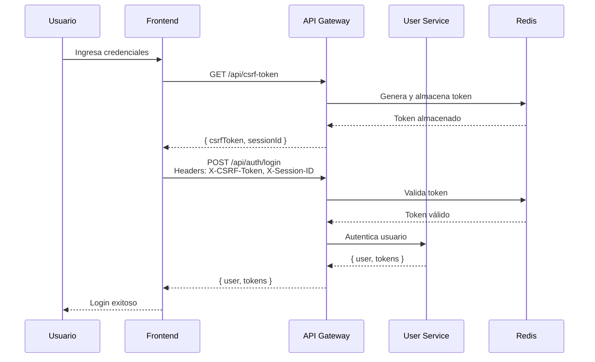
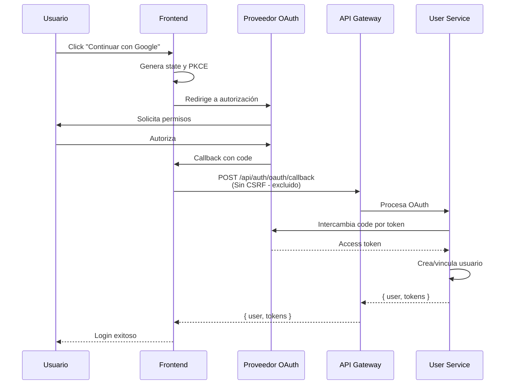

# Protección CSRF y Configuración de Cookies Seguras

## Resumen

Este documento describe la implementación de protección CSRF (Cross-Site Request Forgery) y la configuración de cookies seguras con SameSite en TechNovaStore.

## Arquitectura de Seguridad

### 1. Protección CSRF

La protección CSRF está implementada en **tres capas**:

#### Capa 1: Backend (API Gateway)
- **Ubicación**: `domains/platform/api-gateway/validate-csrf-token/ValidateCsrfToken.ts`
- **Funcionalidad**:
  - Genera tokens CSRF únicos por sesión
  - Almacena tokens en Redis con TTL de 24 horas
  - Valida tokens en todas las peticiones POST, PUT, PATCH, DELETE
  - Excluye rutas específicas: `/api/chat`, `/api/auth/oauth/callback`, `/api/auth/logout`

**Endpoint de generación de token**:
```
GET /api/csrf-token
Headers:
  X-Session-ID: <session-id>

Response:
{
  "csrfToken": "abc123...",
  "sessionId": "session_123..."
}
```

**Validación de token**:
```
POST /api/auth/login
Headers:
  X-CSRF-Token: <csrf-token>
  X-Session-ID: <session-id>
  Content-Type: application/json
```

#### Capa 2: Frontend (Servicio de Autenticación)
- **Ubicación**: `domains/platform/frontend/src/features/customer/services/auth.service.ts`
- **Funcionalidad**:
  - Obtiene token CSRF automáticamente antes de cada petición no-GET
  - Cachea el token para evitar peticiones redundantes
  - Incluye token en headers `X-CSRF-Token` y `X-Session-ID`
  - Maneja errores de token inválido/expirado

**Implementación**:
```typescript
// Interceptor de Axios que agrega CSRF token automáticamente
authAxios.interceptors.request.use(async (config) => {
  const isSafeMethod = ['get', 'head', 'options'].includes(config.method?.toLowerCase());
  
  if (!isSafeMethod) {
    const { token, sessionId } = await getCSRFToken();
    config.headers['X-CSRF-Token'] = token;
    config.headers['X-Session-ID'] = sessionId;
  }
  
  return config;
});
```

#### Capa 3: Frontend (Middleware de Next.js)
- **Ubicación**: `domains/platform/frontend/middleware.ts`
- **Funcionalidad**:
  - Configura headers de seguridad en todas las respuestas
  - Agrega header `X-CSRF-Protection: enabled` para indicar que CSRF está activo
  - Complementa la protección del backend

### 2. Configuración de Cookies SameSite

#### Backend (API Gateway)
- **Ubicación**: `domains/platform/api-gateway/shared/config/security.ts`
- **Configuración**:
```typescript
session: {
  secure: process.env.NODE_ENV === 'production',  // Solo HTTPS en producción
  httpOnly: true,                                  // No accesible desde JavaScript
  sameSite: process.env.NODE_ENV === 'production' ? 'strict' : 'lax',
}
```

**Valores de SameSite**:
- **`strict`** (Producción): La cookie solo se envía en peticiones del mismo sitio
- **`lax`** (Desarrollo): La cookie se envía en navegación top-level (permite OAuth)

#### Frontend (Next.js)
- **Ubicación**: `domains/platform/frontend/next.config.js`
- **Headers de seguridad**:
```javascript
{
  key: 'X-Frame-Options',
  value: 'SAMEORIGIN'  // Previene clickjacking
},
{
  key: 'X-Content-Type-Options',
  value: 'nosniff'  // Previene MIME sniffing
},
{
  key: 'X-XSS-Protection',
  value: '1; mode=block'  // Protección XSS
},
{
  key: 'Referrer-Policy',
  value: 'strict-origin-when-cross-origin'
},
{
  key: 'Permissions-Policy',
  value: 'geolocation=(), microphone=(), camera=()'
}
```

## Flujo de Autenticación con CSRF

### Login Normal (Email/Password)



### OAuth (Google/GitHub)



**Nota**: OAuth callback está excluido de validación CSRF porque:
1. El `state` parameter proporciona protección CSRF equivalente
2. PKCE (Proof Key for Code Exchange) agrega seguridad adicional
3. El callback viene de un dominio externo (Google/GitHub)

## Configuración de Seguridad

### Variables de Entorno

**Backend (API Gateway)**:
```env
# CSRF
CSRF_ENABLED=true
CSRF_TOKEN_EXPIRY=86400000  # 24 horas en ms
CSRF_COOKIE_NAME=csrf-token
CSRF_HEADER_NAME=x-csrf-token
CSRF_SESSION_HEADER=x-session-id

# Cookies
NODE_ENV=production  # Activa SameSite=strict y secure=true
SESSION_SECRET=<secret-key>
SESSION_MAX_AGE=86400000  # 24 horas

# CORS
CORS_ORIGINS=https://technovastore.com
```

**Frontend**:
```env
NEXT_PUBLIC_API_URL=http://localhost:3000/api
NODE_ENV=development  # o production
```

### Rutas Excluidas de CSRF

Las siguientes rutas están excluidas de validación CSRF:

1. **`/api/chat`**: WebSocket/Socket.IO usa su propio mecanismo de autenticación
2. **`/api/auth/oauth/callback`**: OAuth usa `state` parameter para CSRF
3. **`/api/auth/logout`**: Logout es idempotente y no requiere CSRF

## Testing

### Verificar CSRF Token

```bash
# 1. Obtener token CSRF
curl -X GET http://localhost:3000/api/csrf-token \
  -H "X-Session-ID: test-session-123" \
  -c cookies.txt

# 2. Intentar login sin token (debe fallar)
curl -X POST http://localhost:3000/api/auth/login \
  -H "Content-Type: application/json" \
  -d '{"email":"test@example.com","password":"password"}' \
  -b cookies.txt

# Respuesta esperada: 403 Forbidden
# { "error": "CSRF token required", "code": "CSRF_TOKEN_MISSING" }

# 3. Login con token (debe funcionar)
curl -X POST http://localhost:3000/api/auth/login \
  -H "Content-Type: application/json" \
  -H "X-CSRF-Token: <token-from-step-1>" \
  -H "X-Session-ID: test-session-123" \
  -d '{"email":"test@example.com","password":"password"}' \
  -b cookies.txt
```

### Verificar Headers de Seguridad

```bash
# Verificar headers en respuesta
curl -I http://localhost:3020/

# Headers esperados:
# X-Frame-Options: SAMEORIGIN
# X-Content-Type-Options: nosniff
# X-XSS-Protection: 1; mode=block
# Referrer-Policy: strict-origin-when-cross-origin
# Permissions-Policy: geolocation=(), microphone=(), camera=()
```

## Mejores Prácticas

### Para Desarrolladores

1. **Nunca deshabilitar CSRF en producción**
   ```typescript
   // ❌ MAL
   if (process.env.NODE_ENV === 'production') {
     // Deshabilitar CSRF
   }
   
   // ✅ BIEN
   if (securityConfig.csrf.enabled) {
     // Validar CSRF
   }
   ```

2. **Usar interceptores de Axios**
   - El servicio de autenticación ya incluye interceptores
   - No agregar tokens CSRF manualmente en cada petición
   - Dejar que el interceptor lo maneje automáticamente

3. **Manejar errores de CSRF**
   ```typescript
   try {
     await authService.login(credentials);
   } catch (error) {
     if (error.code === 'CSRF_TOKEN_INVALID') {
       // Token expirado, obtener nuevo token
       // El interceptor lo hace automáticamente
     }
   }
   ```

4. **Renovar tokens en sesiones largas**
   - Los tokens CSRF expiran en 24 horas
   - Para sesiones más largas, el interceptor obtiene nuevos tokens automáticamente

### Para Administradores

1. **Monitorear intentos de CSRF**
   - Revisar logs de `CSRF_TOKEN_MISSING` y `CSRF_TOKEN_MISMATCH`
   - Alertar si hay picos de intentos fallidos

2. **Configurar CORS correctamente**
   - Solo permitir orígenes confiables en producción
   - Nunca usar `origin: '*'` en producción

3. **Habilitar HTTPS en producción**
   - SameSite=strict requiere HTTPS
   - Configurar certificados SSL válidos

## Recursos Adicionales

- [OWASP CSRF Prevention Cheat Sheet](https://cheatsheetseries.owasp.org/cheatsheets/Cross-Site_Request_Forgery_Prevention_Cheat_Sheet.html)
- [MDN: SameSite cookies](https://developer.mozilla.org/en-US/docs/Web/HTTP/Headers/Set-Cookie/SameSite)
- [OWASP Secure Headers Project](https://owasp.org/www-project-secure-headers/)

## Changelog

- **2025-01-13**: Implementación inicial de protección CSRF y SameSite cookies
  - Configuración de CSRF en API Gateway con Redis
  - Interceptores de Axios en frontend
  - Middleware de Next.js para headers de seguridad
  - Documentación completa
