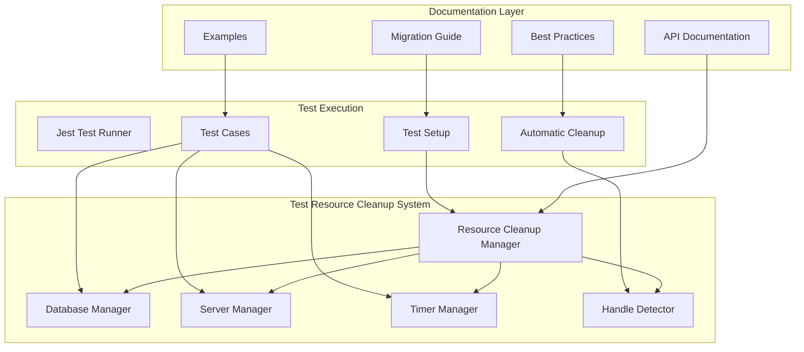

# Test Resource Cleanup System - Documentation Index

## 📚 Complete Documentation Suite

Welcome to the comprehensive documentation for the Test Resource Cleanup System. This system provides automated, reliable cleanup of resources during test execution to prevent Jest from hanging due to unclosed connections, servers, timers, and other handles.

## 🚀 Quick Start

**New to the system?** Start here:
1. [API Documentation](../README.md) - Core concepts and basic usage
2. [Examples](../EXAMPLES.md#basic-usage-examples) - Simple examples to get started
3. [Migration Guide](../MIGRATION_GUIDE.md#step-1-global-setup-integration) - Integrate with existing tests

**Need to migrate existing tests?** 
- [Migration Guide](../MIGRATION_GUIDE.md) - Step-by-step migration process

**Looking for specific examples?**
- [Examples and Patterns](../EXAMPLES.md) - Comprehensive usage examples

**Want to follow best practices?**
- [Best Practices Guide](../BEST_PRACTICES.md) - Team standards and guidelines

## 📖 Documentation Structure

### 1. [API Documentation](../README.md)
**Primary reference for developers**

- **Core Components**: ResourceCleanupManager, DatabaseCleanupManager, TestServerManager, etc.
- **Configuration**: Environment variables, programmatic setup
- **Integration**: Jest setup, test file patterns
- **Error Handling**: Error types, recovery strategies
- **Monitoring**: Reports, diagnostics, debugging
- **TypeScript Support**: Full type definitions and interfaces

**When to use**: Daily development, implementing new tests, troubleshooting issues

### 2. [Migration Guide](../MIGRATION_GUIDE.md)
**Step-by-step guide for updating existing tests**

- **Migration Strategy**: Phased approach, risk assessment
- **Before/After Examples**: Clear transformation patterns
- **Common Patterns**: Database tests, server tests, timer management
- **Troubleshooting**: Common migration issues and solutions
- **Performance**: Optimization during migration
- **Rollback Strategy**: How to revert if needed

**When to use**: Updating legacy test suites, onboarding existing projects

### 3. [Examples and Patterns](../EXAMPLES.md)
**Comprehensive usage examples and advanced patterns**

- **Basic Usage**: Simple database, server, and timer examples
- **Integration Tests**: Full E2E scenarios with multiple resources
- **Advanced Patterns**: Custom resources, conditional cleanup, resource sharing
- **Common Scenarios**: External APIs, background jobs, file operations
- **Performance Optimization**: Resource pooling, parallel execution
- **Troubleshooting**: Debug examples, performance analysis

**When to use**: Learning advanced patterns, solving complex scenarios, performance tuning

### 4. [Best Practices Guide](../BEST_PRACTICES.md)
**Team standards and operational guidelines**

- **General Principles**: Fail-safe design, explicit registration, naming conventions
- **Resource Management**: Connection lifecycle, port management, timer control
- **Performance Guidelines**: Prioritization, timeouts, parallel cleanup
- **Error Handling**: Graceful degradation, error classification
- **CI/CD Integration**: Environment-specific config, pipeline setup
- **Team Collaboration**: Shared utilities, code review guidelines
- **Monitoring**: Performance tracking, health checks, maintenance

**When to use**: Establishing team standards, code reviews, operational monitoring

## 🎯 Use Case Navigation

### I want to...

#### **Start using the system in new tests**
1. Read [API Documentation - Integration with Jest](../README.md#integration-with-jest)
2. Check [Examples - Basic Usage](../EXAMPLES.md#basic-usage-examples)
3. Follow [Best Practices - Resource Management](../BEST_PRACTICES.md#resource-management)

#### **Migrate existing tests**
1. Start with [Migration Guide - Overview](../MIGRATION_GUIDE.md#overview)
2. Follow [Migration Guide - Step-by-Step](../MIGRATION_GUIDE.md#step-by-step-migration)
3. Use [Migration Guide - Common Patterns](../MIGRATION_GUIDE.md#common-migration-patterns)

#### **Handle database connections**
1. [API Documentation - DatabaseCleanupManager](../README.md#databasecleanupmanager)
2. [Examples - Database Tests](../EXAMPLES.md#example-1-simple-database-test)
3. [Best Practices - Database Connections](../BEST_PRACTICES.md#1-database-connections)

#### **Manage test servers**
1. [API Documentation - TestServerManager](../README.md#testservermanager)
2. [Examples - API Server Tests](../EXAMPLES.md#example-2-api-server-test)
3. [Best Practices - Test Servers](../BEST_PRACTICES.md#2-test-servers)

#### **Debug hanging tests**
1. [API Documentation - OpenHandleDetector](../README.md#openhandledetector)
2. [Examples - Debug Handle Leaks](../EXAMPLES.md#debug-example-1-handle-detection)
3. [Troubleshooting - Common Issues](../README.md#troubleshooting)

#### **Optimize test performance**
1. [Examples - Performance Optimization](../EXAMPLES.md#performance-optimization)
2. [Best Practices - Performance Guidelines](../BEST_PRACTICES.md#performance-guidelines)
3. [Best Practices - Monitoring](../BEST_PRACTICES.md#monitoring-and-maintenance)

#### **Set up CI/CD integration**
1. [Best Practices - CI/CD Integration](../BEST_PRACTICES.md#cicd-integration)
2. [API Documentation - Configuration](../README.md#configuration)
3. [Migration Guide - CI Pipeline](../MIGRATION_GUIDE.md#ci-pipeline-integration)

#### **Handle custom resources**
1. [Examples - Custom Resource Cleanup](../EXAMPLES.md#example-6-custom-resource-cleanup)
2. [API Documentation - Custom Resources](../README.md#custom-resources)
3. [Best Practices - Custom Resources](../BEST_PRACTICES.md#4-custom-resources)

#### **Establish team standards**
1. [Best Practices - Team Collaboration](../BEST_PRACTICES.md#team-collaboration)
2. [Best Practices - Code Review Guidelines](../BEST_PRACTICES.md#2-code-review-guidelines)
3. [Examples - Team Utilities](../EXAMPLES.md#1-shared-test-utilities)

## 🔧 Quick Reference

### Essential Commands

```bash
# Run tests with handle detection
npm test -- --detectOpenHandles

# Run with verbose cleanup logging  
TEST_CLEANUP_LOG_LEVEL=debug npm test

# Run with extended timeouts
TEST_CLEANUP_TIMEOUT=20000 npm test

# CI mode with comprehensive monitoring
CI=true TEST_CLEANUP_DETECT_HANDLES=true npm test
```

### Key Environment Variables

```bash
TEST_CLEANUP_TIMEOUT=10000          # Cleanup timeout (ms)
TEST_CLEANUP_LOG_LEVEL=info         # Logging level
TEST_CLEANUP_DETECT_HANDLES=true    # Enable handle detection
TEST_CLEANUP_FORCE_EXIT=false       # Let cleanup system handle exit
```

### Common Imports

```typescript
// Core system
import { resourceCleanupManager } from './resourceCleanupManager';
import { setupIntegrationTest } from './testSetup';

// Specific managers
import { DatabaseCleanupManager } from './databaseCleanup';
import { TestServerManager } from './serverCleanup';
import { TimerCleanupManager } from './timerCleanup';
import { OpenHandleDetector } from './handleDetector';

// Team utilities
import { TeamTestUtils } from './teamTestUtils';
```

### Typical Test Structure

```typescript
describe('My Test Suite', () => {
  let testContext: TestContext;

  beforeAll(async () => {
    testContext = await setupIntegrationTest();
    // Resources automatically registered for cleanup
  });

  // Tests here - cleanup handled automatically

  it('should do something', async () => {
    // Use testContext.dbManager, testContext.serverManager, etc.
  });
});
```

## 📊 System Architecture Overview



## 🏷️ Document Tags and Categories

### By Audience
- **👨‍💻 Developers**: API Documentation, Examples (Basic Usage)
- **🔧 DevOps/CI**: Best Practices (CI/CD), Migration Guide (Performance)
- **👥 Team Leads**: Best Practices (Team Collaboration), Migration Guide (Strategy)
- **🐛 Debuggers**: Examples (Troubleshooting), API Documentation (Diagnostics)

### By Complexity
- **🟢 Beginner**: API Documentation (Overview), Examples (Basic Usage)
- **🟡 Intermediate**: Migration Guide, Examples (Integration Tests)
- **🔴 Advanced**: Best Practices (Performance), Examples (Advanced Patterns)

### By Use Case
- **🆕 New Implementation**: API Documentation, Examples, Best Practices (Principles)
- **🔄 Migration**: Migration Guide, Examples (Before/After)
- **🚀 Optimization**: Best Practices (Performance), Examples (Optimization)
- **🔍 Troubleshooting**: API Documentation (Troubleshooting), Examples (Debug)
- **👥 Team Setup**: Best Practices (Team Collaboration), Migration Guide (Timeline)

## 📝 Contributing to Documentation

### Documentation Standards
- **Clarity**: Use clear, concise language
- **Examples**: Include working code examples
- **Cross-references**: Link between related sections
- **Maintenance**: Keep examples up-to-date with system changes

### When to Update Documentation
- **New Features**: Update API documentation and add examples
- **Bug Fixes**: Update troubleshooting sections
- **Performance Changes**: Update best practices and optimization guides
- **Team Process Changes**: Update collaboration guidelines

### Documentation Review Process
1. **Technical Accuracy**: Verify all code examples work
2. **Completeness**: Ensure all features are documented
3. **Usability**: Test documentation with new team members
4. **Consistency**: Maintain consistent style and terminology

## 🔗 External Resources

### Related Jest Documentation
- [Jest Configuration](https://jestjs.io/docs/configuration)
- [Jest CLI Options](https://jestjs.io/docs/cli)
- [Jest Troubleshooting](https://jestjs.io/docs/troubleshooting)

### Node.js Resources
- [Node.js Process Documentation](https://nodejs.org/api/process.html)
- [Node.js Timers](https://nodejs.org/api/timers.html)
- [Node.js Events](https://nodejs.org/api/events.html)

### Testing Best Practices
- [Testing Library Best Practices](https://testing-library.com/docs/guiding-principles)
- [Jest Best Practices](https://github.com/goldbergyoni/javascript-testing-best-practices)

---

**Need help?** Start with the [API Documentation](../README.md) for core concepts, then explore the specific guides based on your use case. Each document includes practical examples and cross-references to related topics.